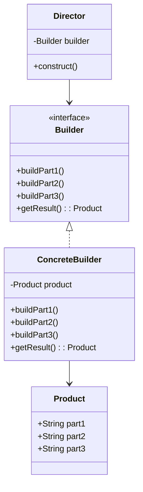

## 介绍

建造者模式（Builder Pattern）是一种设计模式，旨在解决复杂对象的创建问题。它通过将对象的构建过程与其表示分离，使得相同的构建过程可以创建不同的表示。这种模式特别适用于需要分步骤构建对象的场景。

建造者模式的核心思想是将对象的构建过程分解为多个步骤，并通过一个“建造者”类来管理这些步骤。最终，通过一个“指挥者”类来协调建造者的工作，生成最终的对象。

## 建造者模式的结构

建造者模式通常包含以下几个角色：

1. **产品（Product）**：最终要构建的复杂对象。
2. **建造者（Builder）**：定义构建产品的各个步骤的接口。
3. **具体建造者（Concrete Builder）**：实现建造者接口，提供具体的构建步骤。
4. **指挥者（Director）**：负责调用建造者的步骤，控制构建过程。



## 代码示例

以下是一个简单的建造者模式示例，展示了如何构建一个包含多个部分的复杂对象。

```python
# 产品类
class Product:
    def __init__(self):
        self.part1 = None
        self.part2 = None
        self.part3 = None

    def __str__(self):
        return f"Part1: {self.part1}, Part2: {self.part2}, Part3: {self.part3}"

# 建造者接口
class Builder:
    def build_part1(self):
        pass

    def build_part2(self):
        pass

    def build_part3(self):
        pass

    def get_result(self):
        pass

# 具体建造者
class ConcreteBuilder(Builder):
    def __init__(self):
        self.product = Product()

    def build_part1(self):
        self.product.part1 = "Part 1 built"

    def build_part2(self):
        self.product.part2 = "Part 2 built"

    def build_part3(self):
        self.product.part3 = "Part 3 built"

    def get_result(self):
        return self.product

# 指挥者
class Director:
    def __init__(self, builder):
        self.builder = builder

    def construct(self):
        self.builder.build_part1()
        self.builder.build_part2()
        self.builder.build_part3()

# 客户端代码
builder = ConcreteBuilder()
director = Director(builder)
director.construct()
product = builder.get_result()

print(product)
```

**输出：**
```
Part1: Part 1 built, Part2: Part 2 built, Part3: Part 3 built
```

## 实际应用场景

建造者模式在现实世界中有许多应用场景，特别是在需要构建复杂对象的系统中。以下是一些常见的应用场景：

1. **构建复杂文档**：例如，HTML文档的生成器可以使用建造者模式来逐步构建文档的各个部分。
2. **构建复杂UI组件**：在图形用户界面（GUI）开发中，建造者模式可以用于构建复杂的UI组件，如对话框、表单等。
3. **构建复杂数据结构**：例如，构建一个复杂的树形结构或图结构时，建造者模式可以帮助分步骤构建各个节点。

:::tip
建造者模式特别适用于那些需要分步骤构建对象的场景，尤其是当构建过程复杂且需要灵活控制时。
:::

## 总结

建造者模式是一种强大的设计模式，它通过将对象的构建过程与其表示分离，使得相同的构建过程可以创建不同的表示。这种模式特别适用于需要分步骤构建复杂对象的场景。

通过使用建造者模式，你可以更灵活地控制对象的构建过程，并且可以轻松地扩展和修改构建步骤，而不会影响到最终的产品。

## 附加资源与练习

- **练习**：尝试实现一个建造者模式来构建一个包含多个部分的汽车对象。每个部分可以包括引擎、车轮、车身等。
- **进一步阅读**：你可以阅读《设计模式：可复用面向对象软件的基础》一书，深入了解建造者模式及其与其他设计模式的关系。

:::note
建造者模式与工厂模式有些相似，但它们的主要区别在于建造者模式更关注于分步骤构建复杂对象，而工厂模式则更关注于创建单一的对象。
:::