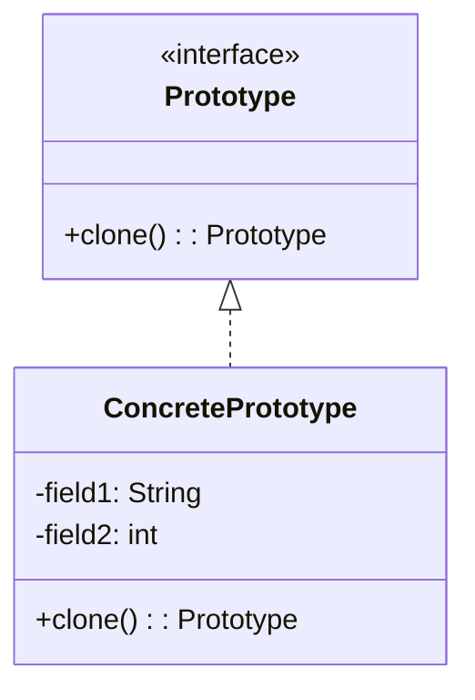

# 原型模式

原型模式（Prototype Pattern）是一种创建型设计模式，它允许通过复制现有对象来创建新对象，而不是通过实例化类。这种模式特别适用于创建成本较高的对象，或者当对象的创建过程复杂时。通过原型模式，我们可以避免重复初始化对象的开销，同时保持代码的灵活性。

## 什么是原型模式？

原型模式的核心思想是通过克隆（复制）现有对象来创建新对象，而不是通过调用构造函数。这种方式可以避免重复执行复杂的初始化逻辑，同时也能动态地创建对象。

在原型模式中，通常有一个原型接口或抽象类，定义了克隆方法。具体的原型类实现这个接口或继承这个抽象类，并提供克隆的具体实现。

## 原型模式的结构

我们可以通过以下类图来理解原型模式的结构：



- **Prototype**：原型接口或抽象类，定义了克隆方法 `clone()`。
- **ConcretePrototype**：具体的原型类，实现了 `clone()` 方法，并包含实际的克隆逻辑。

## 代码示例

以下是一个简单的原型模式的代码示例，展示了如何通过克隆来创建新对象。

```java
// 原型接口
interface Prototype {
    Prototype clone();
}

// 具体的原型类
class ConcretePrototype implements Prototype {
    private String field1;
    private int field2;

    public ConcretePrototype(String field1, int field2) {
        this.field1 = field1;
        this.field2 = field2;
    }

    @Override
    public Prototype clone() {
        return new ConcretePrototype(this.field1, this.field2);
    }

    @Override
    public String toString() {
        return "ConcretePrototype{field1='" + field1 + "', field2=" + field2 + "}";
    }
}

// 客户端代码
public class Client {
    public static void main(String[] args) {
        ConcretePrototype original = new ConcretePrototype("Hello", 123);
        ConcretePrototype cloned = (ConcretePrototype) original.clone();

        System.out.println("Original: " + original);
        System.out.println("Cloned: " + cloned);
    }
}
```

**输出：**
```
Original: ConcretePrototype{field1='Hello', field2=123}
Cloned: ConcretePrototype{field1='Hello', field2=123}
```

在这个示例中，`ConcretePrototype` 类实现了 `Prototype` 接口，并提供了 `clone()` 方法的具体实现。通过调用 `clone()` 方法，我们可以创建一个与原始对象完全相同的新对象。

## 原型模式的应用场景

原型模式在以下场景中非常有用：

1. **创建成本较高的对象**：如果对象的创建过程非常复杂或耗时，使用原型模式可以避免重复执行这些操作。
2. **动态创建对象**：当需要在运行时动态创建对象时，原型模式提供了一种灵活的方式。
3. **避免构造函数调用**：某些情况下，构造函数可能包含复杂的逻辑或依赖，使用原型模式可以绕过这些逻辑。

:::tip
原型模式特别适用于需要频繁创建相似对象的场景，例如游戏开发中的敌人生成、文档编辑中的模板复制等。
:::

## 实际案例

假设我们正在开发一个游戏，游戏中有多种类型的敌人。每种敌人都有复杂的初始化逻辑，例如加载资源、设置属性等。为了避免每次创建敌人都重复执行这些操作，我们可以使用原型模式。

```java
// 敌人原型接口
interface EnemyPrototype {
    EnemyPrototype clone();
}

// 具体的敌人原型类
class Goblin implements EnemyPrototype {
    private String name;
    private int health;

    public Goblin(String name, int health) {
        this.name = name;
        this.health = health;
        // 复杂的初始化逻辑
    }

    @Override
    public EnemyPrototype clone() {
        return new Goblin(this.name, this.health);
    }

    @Override
    public String toString() {
        return "Goblin{name='" + name + "', health=" + health + "}";
    }
}

// 客户端代码
public class Game {
    public static void main(String[] args) {
        Goblin originalGoblin = new Goblin("Goblin Warrior", 100);
        Goblin clonedGoblin = (Goblin) originalGoblin.clone();

        System.out.println("Original Goblin: " + originalGoblin);
        System.out.println("Cloned Goblin: " + clonedGoblin);
    }
}
```

**输出：**
```
Original Goblin: Goblin{name='Goblin Warrior', health=100}
Cloned Goblin: Goblin{name='Goblin Warrior', health=100}
```

在这个案例中，我们通过原型模式快速创建了与原始敌人相同的新敌人，避免了重复执行复杂的初始化逻辑。

## 总结

原型模式是一种非常有用的设计模式，它通过克隆现有对象来创建新对象，避免了重复执行复杂的初始化逻辑。这种模式特别适用于创建成本较高的对象或需要动态创建对象的场景。

通过本文的学习，你应该已经掌握了原型模式的基本概念、实现方式以及实际应用场景。希望你能在自己的项目中灵活运用原型模式，提升代码的效率和可维护性。

## 附加资源与练习

- **练习**：尝试在你的项目中实现一个原型模式，例如复制一个复杂的配置对象或游戏中的角色。
- **进一步学习**：阅读更多关于其他创建型设计模式（如工厂模式、单例模式）的内容，了解它们与原型模式的区别和适用场景。

:::caution
在使用原型模式时，需要注意深拷贝和浅拷贝的区别。如果对象包含引用类型的字段，确保在克隆时正确处理这些字段。
:::