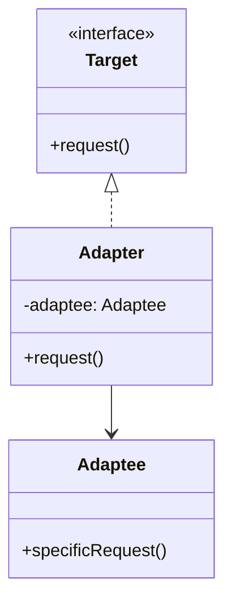

## 介绍

适配器模式（Adapter Pattern）是一种结构型设计模式，它通过将一个类的接口转换成客户端期望的另一个接口，使得原本由于接口不兼容而无法一起工作的类能够协同工作。适配器模式通常用于以下场景：

- 当你需要使用一个现有的类，但其接口与你的代码不兼容时。
- 当你希望创建一个可复用的类，该类可以与多个不相关的类协同工作。

适配器模式的核心思想是**封装**：通过创建一个适配器类，将不兼容的接口转换为兼容的接口。

## 适配器模式的结构

适配器模式通常包含以下角色：

1. **目标接口（Target）**：客户端期望的接口。
2. **适配器（Adapter）**：将不兼容的接口转换为目标接口的类。
3. **被适配者（Adaptee）**：需要被适配的类，其接口与目标接口不兼容。

以下是一个简单的类图，展示了适配器模式的结构：



## 代码示例

假设我们有一个现有的类 `Adaptee`，它有一个方法 `specificRequest`，但我们需要使用一个接口 `Target`，该接口定义了一个方法 `request`。我们可以通过创建一个适配器类 `Adapter` 来实现接口转换。

```python
# 目标接口
class Target:
    def request(self):
        pass

# 被适配者
class Adaptee:
    def specificRequest(self):
        return "Adaptee's specific request"

# 适配器
class Adapter(Target):
    def __init__(self, adaptee):
        self.adaptee = adaptee

    def request(self):
        return self.adaptee.specificRequest()

# 客户端代码
def client_code(target):
    print(target.request())

if __name__ == "__main__":
    adaptee = Adaptee()
    adapter = Adapter(adaptee)
    client_code(adapter)
```

**输出：**

```
Adaptee's specific request
```

在这个示例中，`Adapter` 类将 `Adaptee` 的 `specificRequest` 方法适配为 `Target` 接口的 `request` 方法，从而使得客户端代码可以正常工作。

## 实际应用场景

适配器模式在现实世界中有许多应用场景。以下是一些常见的例子：

1. **第三方库集成**：当你需要使用一个第三方库，但其接口与你的代码不兼容时，可以通过适配器模式将其集成到你的系统中。
2. **遗留系统升级**：在升级遗留系统时，可能需要将旧的接口适配为新的接口，以便新系统能够与旧系统协同工作。
3. **多平台支持**：在开发跨平台应用时，可能需要为不同的平台提供不同的实现，适配器模式可以帮助统一接口。

## 总结

适配器模式是一种非常有用的设计模式，它通过将一个类的接口转换为客户端期望的另一个接口，使得原本不兼容的类能够协同工作。适配器模式的核心思想是封装，通过创建一个适配器类来实现接口转换。

在实际开发中，适配器模式可以帮助我们更好地集成第三方库、升级遗留系统以及支持多平台开发。掌握适配器模式将使你在面对接口不兼容的问题时更加得心应手。

## 附加资源与练习

- **练习**：尝试为一个现有的类创建一个适配器，使其能够与另一个不兼容的接口协同工作。
- **进一步阅读**：你可以阅读《设计模式：可复用面向对象软件的基础》一书，深入了解适配器模式及其应用场景。

:::tip
适配器模式与装饰器模式、代理模式等结构型设计模式有相似之处，但它们解决的问题不同。适配器模式主要用于接口转换，而装饰器模式用于动态添加功能，代理模式用于控制访问。
:::