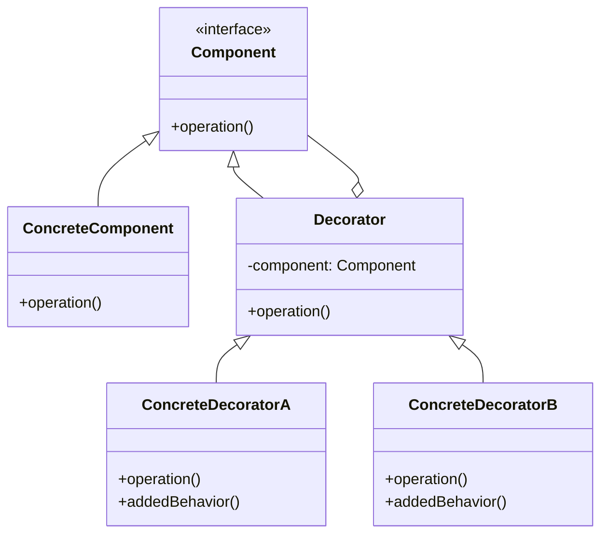

## 介绍

装饰器模式（Decorator Pattern）是一种结构型设计模式，它允许你动态地为对象添加新的行为，而无需修改其原始类。这种模式通过将对象放入包含行为的特殊封装对象中来实现功能的扩展。装饰器模式的核心思想是“组合优于继承”，它提供了一种灵活的方式来扩展对象的功能，而不会导致类爆炸。

:::note
装饰器模式的核心思想是“组合优于继承”，它提供了一种灵活的方式来扩展对象的功能，而不会导致类爆炸。
:::

## 装饰器模式的结构

为了更好地理解装饰器模式，我们可以通过一个简单的类图来展示其结构：



在这个类图中：

- `Component` 是一个接口或抽象类，定义了所有具体组件和装饰器的共同操作。
- `ConcreteComponent` 是具体的组件类，实现了 `Component` 接口。
- `Decorator` 是一个抽象类，它持有一个 `Component` 对象的引用，并实现了 `Component` 接口。
- `ConcreteDecoratorA` 和 `ConcreteDecoratorB` 是具体的装饰器类，它们扩展了 `Decorator` 类，并添加了新的行为。

## 代码示例

让我们通过一个简单的代码示例来理解装饰器模式。假设我们有一个 `Coffee` 类，它代表一杯咖啡。我们可以通过装饰器模式来动态地为咖啡添加不同的配料，如牛奶、糖等。

```python
# 定义 Component 接口
class Coffee:
    def cost(self):
        pass

# 定义 ConcreteComponent 类
class SimpleCoffee(Coffee):
    def cost(self):
        return 5

# 定义 Decorator 类
class CoffeeDecorator(Coffee):
    def __init__(self, coffee):
        self._coffee = coffee

    def cost(self):
        return self._coffee.cost()

# 定义 ConcreteDecorator 类
class MilkDecorator(CoffeeDecorator):
    def cost(self):
        return self._coffee.cost() + 2

class SugarDecorator(CoffeeDecorator):
    def cost(self):
        return self._coffee.cost() + 1

# 使用装饰器模式
coffee = SimpleCoffee()
print(f"Cost of simple coffee: {coffee.cost()}")  # 输出: Cost of simple coffee: 5

milk_coffee = MilkDecorator(coffee)
print(f"Cost of milk coffee: {milk_coffee.cost()}")  # 输出: Cost of milk coffee: 7

sugar_milk_coffee = SugarDecorator(milk_coffee)
print(f"Cost of sugar milk coffee: {sugar_milk_coffee.cost()}")  # 输出: Cost of sugar milk coffee: 8
```

在这个示例中，`SimpleCoffee` 是一个具体的组件类，而 `MilkDecorator` 和 `SugarDecorator` 是具体的装饰器类。通过装饰器模式，我们可以动态地为咖啡添加牛奶和糖，而不需要修改 `SimpleCoffee` 类。

## 实际应用场景

装饰器模式在实际开发中有很多应用场景，以下是一些常见的例子：

1. **图形界面组件**：在图形界面库中，装饰器模式可以用于动态地为组件添加边框、滚动条等功能。
2. **日志记录**：在日志系统中，装饰器模式可以用于为日志记录器添加额外的功能，如时间戳、日志级别等。
3. **数据流处理**：在数据流处理中，装饰器模式可以用于为数据流添加压缩、加密等功能。

:::tip
装饰器模式非常适合在需要动态地为对象添加功能，而又不希望修改原始类的情况下使用。
:::

## 总结

装饰器模式是一种强大的设计模式，它允许你动态地为对象添加新的行为，而无需修改其原始类。通过使用装饰器模式，你可以避免类爆炸问题，并且可以灵活地组合对象的行为。

## 附加资源与练习

- **练习**：尝试实现一个装饰器模式的应用场景，例如为一个文本编辑器添加不同的文本格式化功能（如加粗、斜体、下划线等）。
- **进一步阅读**：你可以阅读《设计模式：可复用面向对象软件的基础》一书，了解更多关于装饰器模式和其他设计模式的详细信息。

通过学习和实践装饰器模式，你将能够更好地理解如何在不修改现有代码的情况下扩展对象的功能。