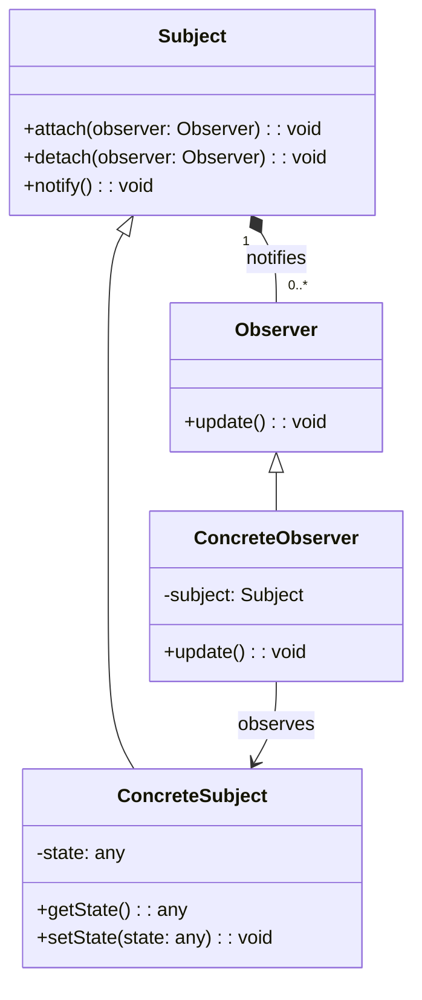

## 介绍

观察者模式（Observer Pattern）是一种行为设计模式，它定义了对象之间的一对多依赖关系。当一个对象（称为**主题**或**被观察者**）的状态发生变化时，所有依赖它的对象（称为**观察者**）都会收到通知并自动更新。这种模式通常用于实现事件处理系统、发布-订阅系统等场景。

观察者模式的核心思想是**解耦**：主题和观察者之间不需要直接了解彼此的具体实现，只需要遵循一定的接口规范即可。

## 观察者模式的结构

观察者模式通常由以下几个角色组成：

1. **Subject（主题）**：维护一个观察者列表，并提供注册、移除和通知观察者的方法。
2. **Observer（观察者）**：定义一个更新接口，用于在主题状态变化时接收通知。
3. **ConcreteSubject（具体主题）**：实现主题接口，存储具体状态，并在状态变化时通知观察者。
4. **ConcreteObserver（具体观察者）**：实现观察者接口，定义具体的更新逻辑。

以下是一个简单的类图，展示了观察者模式的结构：



## 代码示例

下面是一个简单的观察者模式实现示例。假设我们有一个天气站（`WeatherStation`），它会通知多个显示设备（`DisplayDevice`）当前温度的变化。

```python
# 观察者接口
class Observer:
    def update(self, temperature):
        pass

# 具体观察者：显示设备
class DisplayDevice(Observer):
    def __init__(self, name):
        self.name = name

    def update(self, temperature):
        print(f"{self.name} 收到更新：当前温度为 {temperature}°C")

# 主题：天气站
class WeatherStation:
    def __init__(self):
        self._observers = []
        self._temperature = 0

    def attach(self, observer):
        self._observers.append(observer)

    def detach(self, observer):
        self._observers.remove(observer)

    def notify(self):
        for observer in self._observers:
            observer.update(self._temperature)

    def set_temperature(self, temperature):
        self._temperature = temperature
        self.notify()

# 客户端代码
if __name__ == "__main__":
    weather_station = WeatherStation()

    display1 = DisplayDevice("显示设备1")
    display2 = DisplayDevice("显示设备2")

    weather_station.attach(display1)
    weather_station.attach(display2)

    weather_station.set_temperature(25)
    weather_station.set_temperature(30)
```

**输出：**
```
显示设备1 收到更新：当前温度为 25°C
显示设备2 收到更新：当前温度为 25°C
显示设备1 收到更新：当前温度为 30°C
显示设备2 收到更新：当前温度为 30°C
```

:::tip
在上面的示例中，`WeatherStation` 是主题，`DisplayDevice` 是观察者。当温度变化时，`WeatherStation` 会通知所有注册的 `DisplayDevice`。
:::

## 实际应用场景

观察者模式在实际开发中有广泛的应用，以下是一些常见的场景：

1. **GUI 事件处理**：在图形用户界面中，按钮点击、鼠标移动等事件通常会触发观察者的更新。
2. **发布-订阅系统**：消息队列、事件总线等系统通常基于观察者模式实现。
3. **数据绑定**：在前端框架（如 Vue.js、React）中，数据变化会自动更新视图，这背后也使用了观察者模式。

## 总结

观察者模式通过解耦主题和观察者，使得系统更加灵活和可扩展。它适用于以下场景：
- 当一个对象的改变需要同时改变其他对象时。
- 当对象之间的依赖关系需要动态调整时。

:::caution
需要注意的是，观察者模式可能会导致性能问题，尤其是在观察者数量较多或更新逻辑复杂的情况下。因此，在设计时需要谨慎使用。
:::

## 附加资源与练习

1. **阅读更多**：
   - [设计模式：可复用面向对象软件的基础](https://www.amazon.com/Design-Patterns-Elements-Reusable-Object-Oriented/dp/0201633612)（经典书籍）
   - [观察者模式 - Refactoring Guru](https://refactoring.guru/design-patterns/observer)

2. **练习**：
   - 实现一个简单的股票市场系统，当股票价格变化时，通知所有订阅的投资者。
   - 扩展天气站示例，支持湿度、气压等其他气象数据的更新。

通过学习和实践，你将能够更好地掌握观察者模式，并将其应用到实际项目中。