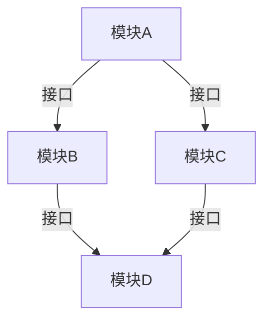

# 系统设计基本原则

系统设计是构建复杂软件系统的核心技能之一。无论是开发一个小型应用还是一个大型分布式系统，理解系统设计的基本原则都是至关重要的。本文将带你逐步了解系统设计的基本原则，并通过实际案例帮助你更好地掌握这些概念。

## 什么是系统设计？

系统设计是指为满足特定需求而规划和构建软件系统的过程。它涉及多个方面，包括架构设计、组件选择、数据流设计、性能优化等。系统设计的目标是构建一个高效、可扩展、可靠且易于维护的系统。

## 系统设计的基本原则

### 1. 模块化设计

模块化设计是将系统分解为多个独立模块的过程。每个模块负责完成特定的功能，并且可以独立开发、测试和维护。模块化设计有助于提高代码的可读性、可维护性和可重用性。

:::tip
模块化设计的一个常见例子是微服务架构，其中每个服务都是一个独立的模块，负责处理特定的业务逻辑。
:::

### 2. 高内聚低耦合

高内聚低耦合是系统设计中的一个重要原则。**高内聚**意味着模块内部的各个部分紧密相关，共同完成一个明确的任务。**低耦合**意味着模块之间的依赖关系尽可能少，模块之间的交互通过清晰的接口进行。

:::note
高内聚低耦合的设计使得系统更易于扩展和维护，因为修改一个模块不会对其他模块产生太大影响。
:::

### 3. 可扩展性

可扩展性是指系统能够在不影响现有功能的情况下，通过增加资源或组件来应对更多的用户或数据。可扩展性通常分为**垂直扩展**（增加单个节点的资源）和**水平扩展**（增加更多的节点）。

:::caution
在设计系统时，必须考虑未来的增长需求。一个不可扩展的系统在面对用户量激增时可能会崩溃。
:::

### 4. 可靠性

可靠性是指系统在出现故障时能够继续正常运行的能力。为了提高系统的可靠性，通常会采用以下策略：

- **冗余设计**：通过增加备份组件来防止单点故障。
- **故障恢复**：设计系统能够在故障发生后自动恢复。
- **监控和报警**：实时监控系统状态，及时发现并处理问题。

### 5. 性能优化

性能优化是系统设计中的一个关键目标。性能优化的目标是减少系统的响应时间、提高吞吐量和降低资源消耗。常见的性能优化策略包括：

- **缓存**：通过缓存频繁访问的数据来减少数据库查询。
- **负载均衡**：将请求均匀分配到多个服务器上，避免单个服务器过载。
- **异步处理**：通过异步处理任务来提高系统的并发能力。

:::warning
性能优化需要在系统设计的早期阶段就进行考虑，而不是在系统上线后才开始优化。
:::

### 6. 安全性

安全性是系统设计中不可忽视的一个方面。系统设计必须考虑如何保护用户数据、防止未经授权的访问以及应对潜在的安全威胁。常见的安全措施包括：

- **身份验证和授权**：确保只有经过验证的用户才能访问系统资源。
- **数据加密**：对敏感数据进行加密，防止数据泄露。
- **日志记录和审计**：记录系统的操作日志，便于事后审计和追踪。

## 实际案例：设计一个简单的社交媒体系统

让我们通过一个简单的社交媒体系统来应用上述原则。假设我们需要设计一个系统，用户可以发布帖子、关注其他用户并查看他们的动态。

### 模块化设计

我们将系统分解为以下几个模块：

- **用户管理模块**：负责用户的注册、登录和身份验证。
- **帖子管理模块**：负责用户发布、编辑和删除帖子。
- **关注模块**：负责用户之间的关注关系。
- **动态流模块**：负责生成和显示用户的动态流。

### 高内聚低耦合

每个模块都有明确的职责，并且通过清晰的接口进行交互。例如，用户管理模块通过接口提供用户信息，帖子管理模块通过接口发布和获取帖子。

### 可扩展性

我们使用水平扩展的策略，将用户和帖子数据分布到多个数据库节点上。当用户量增加时，我们可以通过增加更多的数据库节点来应对。

### 可靠性

我们为每个模块设计了冗余备份，并实现了自动故障恢复机制。例如，如果帖子管理模块的某个节点出现故障，系统会自动切换到备用节点。

### 性能优化

我们使用缓存来存储用户的动态流数据，减少数据库查询的次数。同时，我们使用负载均衡器将用户请求均匀分配到多个服务器上。

### 安全性

我们使用OAuth 2.0进行身份验证，并对用户的敏感数据进行加密存储。此外，我们记录了所有用户操作的日志，便于后续审计。

## 总结

系统设计是一个复杂但至关重要的过程。通过遵循模块化设计、高内聚低耦合、可扩展性、可靠性、性能优化和安全性等基本原则，你可以构建出高效、可扩展和可靠的系统。

## 附加资源与练习

- **资源**：
  - [《系统设计面试指南》](https://example.com)
  - [《微服务架构设计模式》](https://example.com)
- **练习**：
  - 设计一个简单的电商系统，应用本文介绍的系统设计原则。
  - 思考如何优化一个现有的系统，使其更具可扩展性和可靠性。

通过不断实践和学习，你将逐步掌握系统设计的精髓，并能够设计出更加优秀的系统。