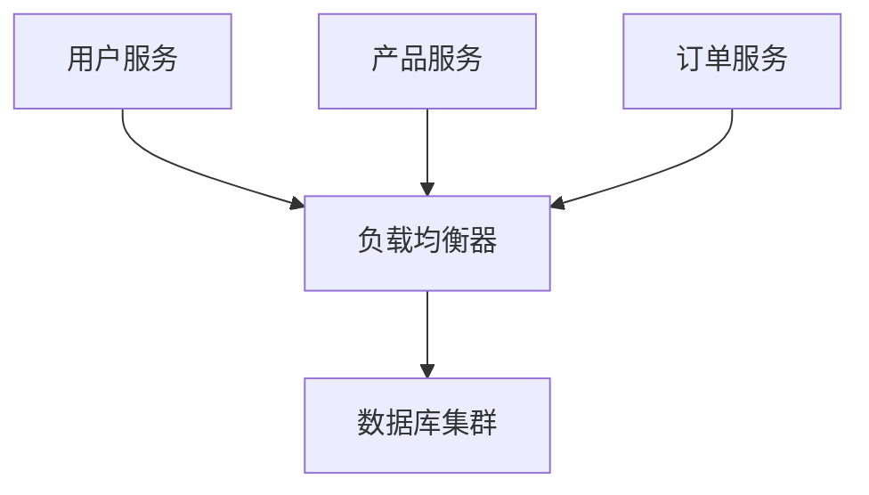

# 可扩展性设计

## 介绍

在系统设计中，**可扩展性**是指系统能够在不显著影响性能的情况下，通过增加资源（如服务器、存储或网络带宽）来应对不断增长的需求。一个可扩展的系统能够随着用户数量、数据量或业务需求的增加而灵活扩展，而无需完全重新设计。

可扩展性设计的目标是确保系统在未来的增长中保持高效、稳定和可靠。它通常分为两种类型：
1. **垂直扩展（Scale Up）**：通过增加单个节点的资源（如 CPU、内存）来提升性能。
2. **水平扩展（Scale Out）**：通过增加更多的节点（如服务器）来分担负载。

## 为什么可扩展性设计重要？

随着互联网应用的快速发展，用户数量和数据量可能呈指数级增长。如果系统设计时没有考虑可扩展性，可能会导致以下问题：
- 性能下降：系统无法处理高并发请求。
- 单点故障：单个节点的故障可能导致整个系统崩溃。
- 资源浪费：无法有效利用资源，导致成本增加。

通过可扩展性设计，我们可以避免这些问题，确保系统能够适应未来的需求。

---

## 可扩展性设计的关键原则

### 1. 模块化设计
将系统拆分为多个独立的模块或服务，每个模块可以独立扩展。例如，使用微服务架构将系统拆分为多个小型服务。

### 2. 无状态设计
确保服务是无状态的，即不依赖于特定的服务器或节点。这样，请求可以被任何可用的节点处理，从而实现水平扩展。

### 3. 负载均衡
使用负载均衡器将流量分发到多个服务器，避免单个服务器过载。

### 4. 数据分区
将数据分散到多个数据库或存储系统中，避免单个数据库成为瓶颈。

### 5. 缓存
使用缓存（如 Redis 或 Memcached）来减少数据库的负载，提高系统的响应速度。

---

## 实际案例：电商网站的可扩展性设计

假设我们正在设计一个电商网站，以下是可扩展性设计的实际应用：

### 1. 模块化设计
将系统拆分为多个微服务，例如：
- 用户服务：管理用户注册和登录。
- 产品服务：管理产品信息。
- 订单服务：处理订单。



### 2. 无状态设计
每个服务都是无状态的，用户请求可以被任何可用的服务实例处理。

### 3. 负载均衡
使用负载均衡器将流量分发到多个服务实例。

```javascript
// 示例：使用 Nginx 作为负载均衡器
http {
    upstream backend {
        server backend1.example.com;
        server backend2.example.com;
    }

    server {
        location / {
            proxy_pass http://backend;
        }
    }
}
```

### 4. 数据分区
将用户数据分散到多个数据库中，例如按用户 ID 进行分区。

```sql
-- 示例：按用户 ID 分区
CREATE TABLE users (
    user_id INT PRIMARY KEY,
    username VARCHAR(50)
) PARTITION BY HASH(user_id) PARTITIONS 4;
```

### 5. 缓存
使用 Redis 缓存热门产品信息，减少数据库查询。

```python
import redis

# 连接 Redis
cache = redis.Redis(host='localhost', port=6379, db=0)

# 获取产品信息
def get_product(product_id):
    product = cache.get(f"product:{product_id}")
    if not product:
        product = db.query("SELECT * FROM products WHERE id = ?", product_id)
        cache.set(f"product:{product_id}", product)
    return product
```

---

## 总结

可扩展性设计是系统设计中至关重要的一部分。通过模块化设计、无状态服务、负载均衡、数据分区和缓存等技术，我们可以构建一个能够应对未来增长的系统。

:::tip 提示
在设计系统时，始终考虑未来的扩展需求，并选择适合的技术栈和架构。
:::

---

## 附加资源与练习

### 资源
- [《Designing Data-Intensive Applications》](https://dataintensive.net/)：深入探讨可扩展性和分布式系统的经典书籍。
- [Google Cloud Architecture Framework](https://cloud.google.com/architecture/framework)：了解如何设计可扩展的云架构。

### 练习
1. 尝试设计一个简单的博客系统，并考虑如何实现水平扩展。
2. 使用 Redis 缓存实现一个热门文章列表功能。
3. 研究一个开源项目（如 Kubernetes）的可扩展性设计，并总结其关键点。

通过学习和实践，你将能够掌握可扩展性设计的核心概念，并将其应用到实际项目中。