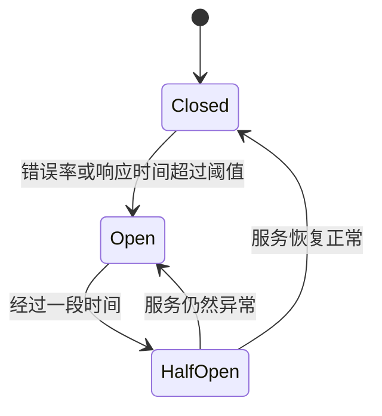

# 熔断与降级

在现代分布式系统中，服务之间的依赖关系变得越来越复杂。当一个服务出现故障或响应缓慢时，可能会导致整个系统的连锁反应，甚至引发雪崩效应。为了避免这种情况，系统设计中引入了**熔断**与**降级**机制。本文将详细介绍这两种机制的概念、工作原理以及实际应用场景。

## 什么是熔断与降级？

### 熔断（Circuit Breaker）
熔断机制类似于电路中的保险丝。当某个服务出现故障或响应时间过长时，熔断器会自动“断开”对该服务的请求，避免进一步的资源浪费和系统崩溃。熔断器会在一定时间后尝试恢复连接，以检测服务是否恢复正常。

### 降级（Fallback）
降级机制是指在系统资源不足或服务不可用时，系统自动切换到备用方案或简化流程，以保证核心功能的可用性。降级通常通过返回缓存数据、默认值或简化版的服务来实现。

## 熔断与降级的工作原理

### 熔断器的工作流程
熔断器通常有三种状态：
1. **关闭状态（Closed）**：正常处理请求。
2. **打开状态（Open）**：当错误率或响应时间超过阈值时，熔断器打开，停止向目标服务发送请求。
3. **半开状态（Half-Open）**：熔断器尝试恢复，允许少量请求通过以检测服务是否恢复正常。



### 降级的工作流程
降级机制通常在以下场景中触发：
1. **服务不可用**：当依赖的服务无法响应时，系统切换到备用方案。
2. **资源不足**：当系统资源（如CPU、内存）达到上限时，系统自动简化流程或返回缓存数据。

## 代码示例

以下是一个简单的熔断器实现示例（使用Python和`circuitbreaker`库）：

```python
from circuitbreaker import circuit

@circuit(failure_threshold=3, recovery_timeout=10)
def call_external_service():
    # 模拟调用外部服务
    response = requests.get("https://example.com/api")
    if response.status_code != 200:
        raise Exception("Service unavailable")
    return response.json()

try:
    result = call_external_service()
    print(result)
except Exception as e:
    print("Fallback: Using cached data")
    # 返回缓存数据或默认值
```

**输入**：调用外部服务。  
**输出**：如果服务正常，返回服务数据；如果服务异常，返回缓存数据或默认值。

## 实际应用场景

### 场景1：电商网站的支付服务
在电商网站中，支付服务是关键功能之一。如果支付服务出现故障，可能会导致用户无法完成订单。通过熔断机制，当支付服务不可用时，系统可以自动切换到备用支付通道或提示用户稍后重试。

### 场景2：社交媒体的推荐系统
社交媒体的推荐系统通常依赖于多个外部服务（如用户画像、内容分析等）。如果某个服务响应缓慢，系统可以通过降级机制返回简化版的推荐内容，避免影响用户体验。

## 总结

熔断与降级是分布式系统中非常重要的容错机制。通过熔断器，系统可以快速隔离故障服务，避免雪崩效应；通过降级机制，系统可以在资源不足或服务不可用时，保证核心功能的可用性。掌握这两种机制，可以帮助你设计出更加稳定和可靠的系统。

## 附加资源与练习

- **推荐阅读**：
  - 《微服务设计模式》：深入讲解熔断器、降级等微服务设计模式。
  - 《分布式系统：概念与设计》：了解分布式系统中的容错机制。
- **练习**：
  - 尝试在你的项目中实现一个简单的熔断器。
  - 模拟一个服务不可用的场景，测试降级机制的效果。

:::tip
在实际项目中，熔断与降级的配置需要根据具体业务场景进行调整。建议通过监控和日志分析，不断优化阈值和策略。
:::