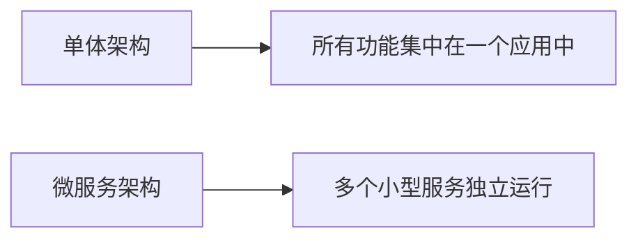
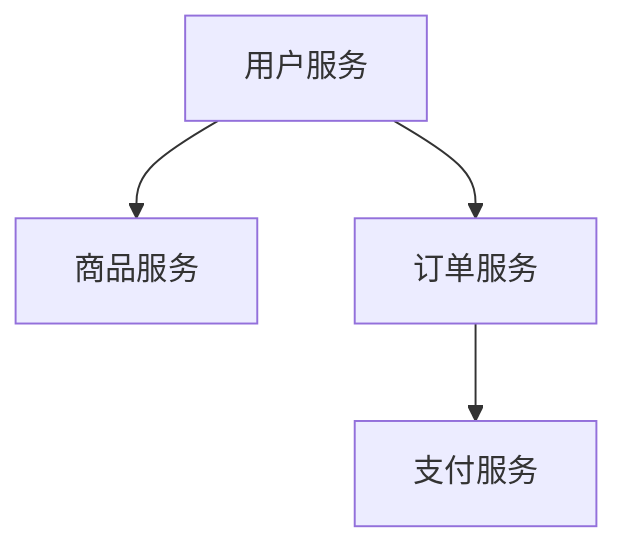

# 微服务架构

## 介绍

微服务架构（Microservices Architecture）是一种将应用程序拆分为多个小型、独立服务的软件设计方法。每个服务都运行在自己的进程中，并通过轻量级的通信机制（如 HTTP 或消息队列）与其他服务交互。与传统的单体架构（Monolithic Architecture）相比，微服务架构提供了更高的灵活性、可扩展性和可维护性。

:::note
微服务架构的核心思想是“分而治之”，通过将复杂系统拆分为多个小型服务，简化开发和维护过程。
:::

## 微服务架构的特点

1. **独立性**：每个微服务都是独立的，可以独立开发、部署和扩展。
2. **松耦合**：服务之间通过定义良好的接口进行通信，减少了依赖。
3. **技术多样性**：不同的微服务可以使用不同的编程语言、框架和数据库。
4. **可扩展性**：可以根据需求单独扩展某个服务，而不需要扩展整个应用。
5. **容错性**：一个服务的故障不会直接影响其他服务。

## 微服务架构 vs 单体架构

### 单体架构
在单体架构中，所有功能模块都集中在一个应用程序中。虽然开发简单，但随着应用规模的增长，单体架构会变得难以维护和扩展。

### 微服务架构
微服务架构将应用拆分为多个小型服务，每个服务专注于一个特定的业务功能。这种方式更适合大型、复杂的应用。



## 微服务架构的优势

1. **灵活的开发与部署**：团队可以独立开发和部署各自的服务。
2. **技术栈自由**：每个服务可以选择最适合的技术栈。
3. **更好的可扩展性**：可以根据需求单独扩展某个服务。
4. **容错性**：一个服务的故障不会影响整个系统。

## 微服务架构的挑战

1. **复杂性**：管理多个服务增加了系统的复杂性。
2. **数据一致性**：分布式系统中的数据一致性更难保证。
3. **网络延迟**：服务之间的通信可能引入延迟。
4. **监控与调试**：需要更复杂的工具来监控和调试分布式系统。

## 微服务架构的实际应用

### 案例：电商平台
假设我们正在设计一个电商平台，可以将其拆分为以下微服务：

1. **用户服务**：负责用户注册、登录和个人信息管理。
2. **商品服务**：管理商品信息、库存和分类。
3. **订单服务**：处理订单的创建、支付和状态更新。
4. **支付服务**：处理支付请求和交易记录。



### 代码示例：用户服务
以下是一个简单的用户服务的代码示例，使用 Node.js 和 Express 框架：

```javascript
const express = require('express');
const app = express();
app.use(express.json());

let users = [];

// 创建用户
app.post('/users', (req, res) => {
    const user = req.body;
    users.push(user);
    res.status(201).send(user);
});

// 获取用户
app.get('/users/:id', (req, res) => {
    const userId = req.params.id;
    const user = users.find(u => u.id === userId);
    if (user) {
        res.send(user);
    } else {
        res.status(404).send('User not found');
    }
});

app.listen(3000, () => {
    console.log('User service is running on port 3000');
});
```

:::tip
在实际开发中，微服务之间通常通过 REST API 或消息队列进行通信。
:::

## 总结

微服务架构通过将应用程序拆分为多个小型、独立的服务，提供了更高的灵活性、可扩展性和可维护性。尽管它带来了额外的复杂性，但对于大型、复杂的应用来说，微服务架构是一个强大的工具。

## 附加资源与练习

1. **资源**：
   - [微服务架构模式](https://microservices.io/)
   - [Martin Fowler 的微服务文章](https://martinfowler.com/articles/microservices.html)
2. **练习**：
   - 尝试将一个小型单体应用拆分为多个微服务。
   - 使用 Docker 容器化你的微服务，并尝试部署到 Kubernetes 集群中。

:::caution
在实践微服务架构时，务必注意服务之间的通信和数据一致性问题。
:::