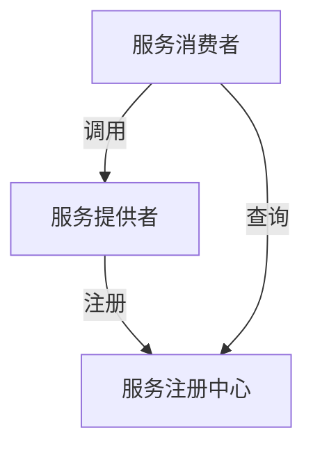

# 服务发现

在现代分布式系统中，服务发现（Service Discovery）是一个至关重要的概念。它帮助系统中的各个服务找到彼此，从而实现高效的通信和协作。本文将详细介绍服务发现的概念、工作原理以及实际应用场景。

## 什么是服务发现？

服务发现是一种机制，允许分布式系统中的服务动态地找到彼此。在传统的单体应用中，服务之间的通信通常是通过硬编码的地址或配置文件来实现的。然而，在分布式系统中，服务的数量和位置可能会频繁变化，因此需要一种更灵活的方式来管理服务之间的通信。

服务发现的核心思想是：当一个服务启动时，它会向服务注册中心注册自己的信息（如IP地址、端口号等）。其他服务可以通过查询服务注册中心来获取所需服务的位置信息，从而实现通信。

## 服务发现的工作原理

服务发现通常涉及以下几个组件：

1. **服务注册中心（Service Registry）**：这是一个集中式的存储系统，用于存储所有服务的信息。常见的服务注册中心包括Consul、Eureka和Zookeeper等。

2. **服务提供者（Service Provider）**：这是实际提供服务的实例。当服务提供者启动时，它会向服务注册中心注册自己的信息。

3. **服务消费者（Service Consumer）**：这是需要调用其他服务的实例。服务消费者会从服务注册中心获取所需服务的信息，然后发起调用。

### 服务发现的流程

1. **服务注册**：服务提供者启动时，向服务注册中心注册自己的信息。
2. **服务发现**：服务消费者需要调用某个服务时，向服务注册中心查询该服务的信息。
3. **服务调用**：服务消费者根据获取到的服务信息，发起实际的调用。



## 代码示例

以下是一个简单的服务发现示例，使用Python和Consul作为服务注册中心。

### 服务提供者

```python
import consul

# 连接到Consul
c = consul.Consul()

# 注册服务
service_id = 'my-service-1'
service_name = 'my-service'
service_address = '127.0.0.1'
service_port = 5000

c.agent.service.register(
    service_name,
    service_id=service_id,
    address=service_address,
    port=service_port
)

print(f"Service {service_name} registered with ID {service_id}")
```

### 服务消费者

```python
import consul

# 连接到Consul
c = consul.Consul()

# 查询服务
service_name = 'my-service'
index, services = c.health.service(service_name, passing=True)

if services:
    service = services[0]
    service_address = service['Service']['Address']
    service_port = service['Service']['Port']
    print(f"Found service at {service_address}:{service_port}")
else:
    print("Service not found")
```

### 输出示例

```plaintext
Service my-service registered with ID my-service-1
Found service at 127.0.0.1:5000
```

## 实际应用场景

### 微服务架构

在微服务架构中，服务发现是必不可少的。每个微服务都可以独立部署和扩展，服务发现机制确保这些服务能够动态地找到彼此，从而实现高效的通信。

### 容器编排

在容器编排平台（如Kubernetes）中，服务发现用于管理容器的动态IP地址。Kubernetes通过内置的DNS服务来实现服务发现，使得容器之间可以通过服务名称进行通信，而不需要关心具体的IP地址。

## 总结

服务发现是分布式系统中的关键组件，它使得服务之间的通信更加灵活和高效。通过服务注册中心，服务提供者和消费者可以动态地发现和调用彼此，从而适应不断变化的环境。

:::tip
在实际应用中，选择合适的服务注册中心非常重要。常见的服务注册中心包括Consul、Eureka和Zookeeper等，每种工具都有其优缺点，需要根据具体需求进行选择。
:::

## 附加资源

- [Consul官方文档](https://www.consul.io/docs)
- [Eureka官方文档](https://github.com/Netflix/eureka/wiki)
- [Zookeeper官方文档](https://zookeeper.apache.org/doc/current/)

## 练习

1. 使用Consul或其他服务注册中心，实现一个简单的服务发现系统。
2. 在Kubernetes中部署一个微服务应用，并观察服务发现机制的工作原理。
3. 比较Consul、Eureka和Zookeeper的优缺点，并撰写一篇短文。

通过本文的学习，你应该对服务发现有了初步的了解。希望你能在实际项目中应用这些知识，进一步提升你的系统设计能力。