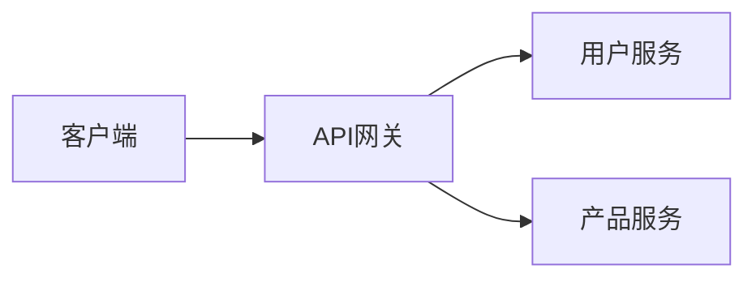
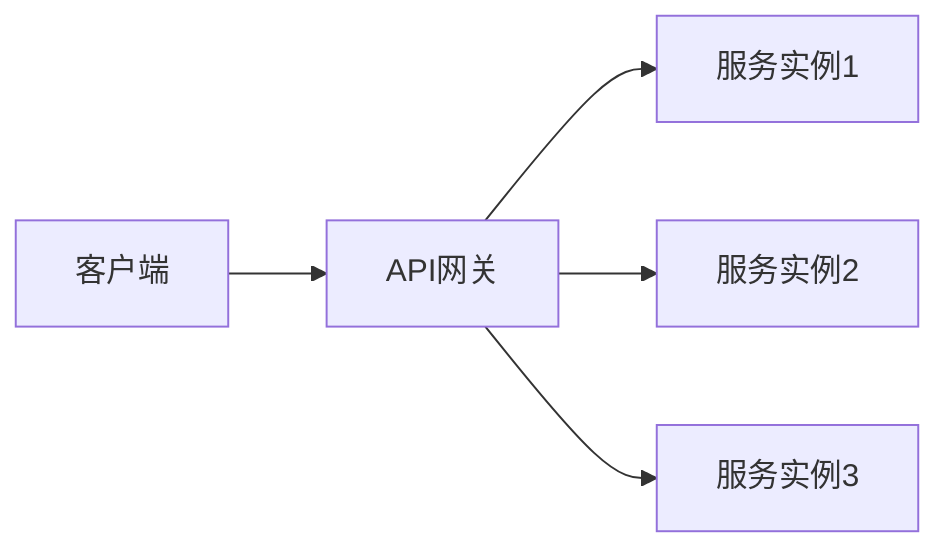
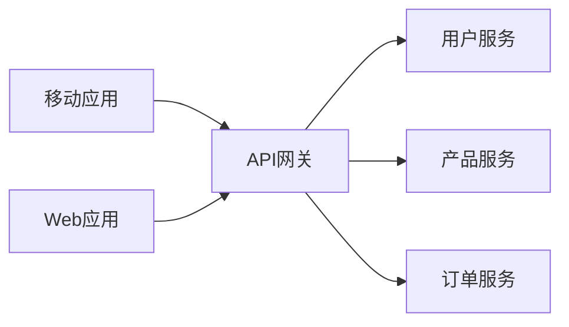
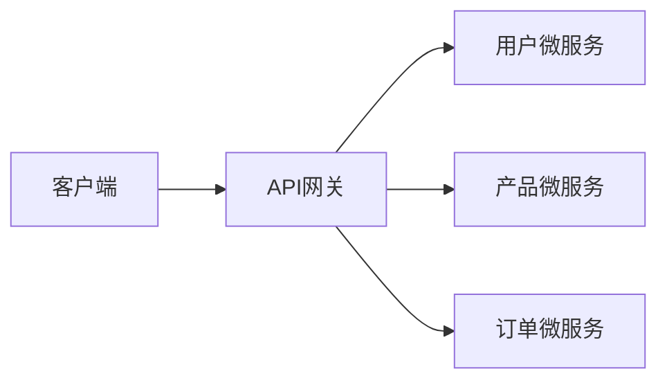

# API网关设计

在现代分布式系统中，API网关（API Gateway）是一个至关重要的组件。它充当客户端和后端服务之间的中间层，负责路由请求、负载均衡、身份验证、监控等功能。本文将详细介绍API网关的设计原则、核心功能以及实际应用场景。

## 什么是API网关？

API网关是一个服务器，它是系统的唯一入口点。它封装了内部系统的架构，并为客户端提供了一个统一的API接口。通过API网关，客户端无需知道后端服务的具体实现细节，只需与网关交互即可。

:::note
API网关的主要职责包括：
- 请求路由
- 负载均衡
- 身份验证和授权
- 请求和响应的转换
- 监控和日志记录
:::

## API网关的核心功能

### 1. 请求路由

API网关根据请求的路径、方法或其他属性，将请求路由到相应的后端服务。例如，一个请求 `/users` 可能会被路由到用户服务，而 `/products` 则被路由到产品服务。



### 2. 负载均衡

API网关可以将请求分发到多个后端服务实例，以实现负载均衡。这有助于提高系统的可用性和性能。



### 3. 身份验证和授权

API网关可以处理身份验证和授权，确保只有经过验证的请求才能访问后端服务。常见的身份验证方式包括OAuth、JWT等。

```javascript
// 示例：使用JWT进行身份验证
const jwt = require('jsonwebtoken');

function authenticate(req, res, next) {
    const token = req.headers['authorization'];
    if (!token) return res.status(401).send('Access Denied');

    try {
        const verified = jwt.verify(token, process.env.TOKEN_SECRET);
        req.user = verified;
        next();
    } catch (err) {
        res.status(400).send('Invalid Token');
    }
}
```

### 4. 请求和响应的转换

API网关可以对请求和响应进行转换，例如将XML转换为JSON，或者对响应进行压缩。

```javascript
// 示例：将XML请求转换为JSON
const xml2js = require('xml2js');

function convertXmlToJson(req, res, next) {
    if (req.headers['content-type'] === 'application/xml') {
        xml2js.parseString(req.body, (err, result) => {
            if (err) return res.status(400).send('Invalid XML');
            req.body = result;
            next();
        });
    } else {
        next();
    }
}
```

### 5. 监控和日志记录

API网关可以记录所有请求和响应的日志，并监控系统的健康状况。这有助于及时发现和解决问题。

```javascript
// 示例：记录请求日志
function logRequest(req, res, next) {
    console.log(`${req.method} ${req.url}`);
    next();
}
```

## 实际案例

### 案例1：电商平台的API网关

在一个电商平台中，API网关可以处理来自移动应用和Web应用的请求。它可以将 `/users` 请求路由到用户服务，将 `/products` 请求路由到产品服务，并处理身份验证和负载均衡。



### 案例2：微服务架构中的API网关

在微服务架构中，API网关可以充当所有微服务的入口点。它可以将请求路由到不同的微服务，并处理跨服务的身份验证和监控。



## 总结

API网关是现代分布式系统中不可或缺的组件。它通过提供统一的入口点，简化了客户端与后端服务的交互，并提供了请求路由、负载均衡、身份验证、监控等核心功能。通过本文的介绍，你应该对API网关的设计原则和实际应用有了初步的了解。

:::tip
如果你想进一步学习API网关的设计和实现，可以参考以下资源：
- [API Gateway Pattern](https://microservices.io/patterns/apigateway.html)
- [Nginx as an API Gateway](https://www.nginx.com/blog/deploying-nginx-plus-as-an-api-gateway/)
- [Kong API Gateway](https://konghq.com/kong/)
:::

:::caution
在实际应用中，API网关的性能和安全性至关重要。确保对API网关进行充分的测试和监控，以避免潜在的性能瓶颈和安全漏洞。
:::

## 练习

1. 设计一个简单的API网关，使用Node.js实现请求路由和身份验证功能。
2. 在一个微服务架构中，如何通过API网关实现跨服务的身份验证？
3. 研究一个开源的API网关（如Kong或Nginx），并尝试配置一个简单的路由规则。

通过完成这些练习，你将更深入地理解API网关的设计和实现。