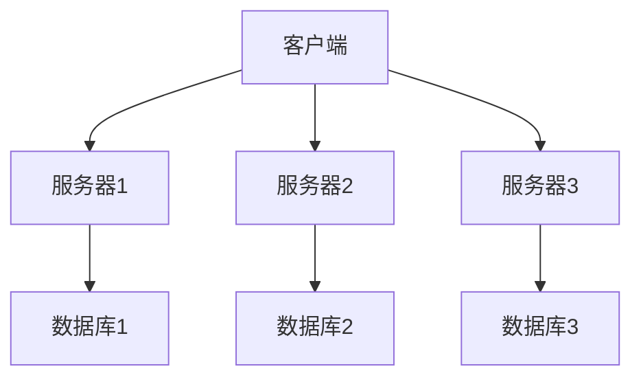

# 高可用设计

## 介绍

高可用性（High Availability, HA）是系统设计中的一个关键概念，指的是系统能够在预定的时间内持续提供服务，即使在某些组件发生故障的情况下也能保持正常运行。高可用性通常通过冗余、故障检测和自动恢复等机制来实现。

对于初学者来说，理解高可用设计的基本原理和实现方法是非常重要的，因为它是构建可靠、稳定系统的基石。

## 高可用性的核心原则

高可用性设计的核心原则包括以下几点：

1. **冗余**：通过增加额外的组件或资源来避免单点故障。
2. **故障检测**：系统能够快速检测到故障并采取相应的措施。
3. **自动恢复**：在检测到故障后，系统能够自动切换到备用资源或修复故障。
4. **负载均衡**：将请求分发到多个服务器，以避免单个服务器过载。

## 实现高可用性的方法

### 1. 冗余设计

冗余是高可用性设计的基础。通过在不同的地理位置部署多个服务器或数据中心，可以确保即使一个服务器或数据中心发生故障，其他服务器仍然可以继续提供服务。



在上面的图中，客户端可以访问多个服务器，每个服务器都有自己的数据库。如果其中一个服务器或数据库发生故障，客户端仍然可以通过其他服务器访问数据。

### 2. 故障检测与自动恢复

故障检测是高可用性设计中的关键步骤。系统需要能够快速检测到故障，并自动切换到备用资源。

例如，假设我们有一个简单的负载均衡器，它可以将请求分发到多个服务器：

```python
class LoadBalancer:
    def __init__(self, servers):
        self.servers = servers
        self.current = 0

    def get_next_server(self):
        server = self.servers[self.current]
        self.current = (self.current + 1) % len(self.servers)
        return server

    def detect_failure(self, server):
        if server not in self.servers:
            return False
        # 模拟故障检测
        if server == "server2":
            return True
        return False

    def recover(self):
        # 模拟自动恢复
        self.servers.remove("server2")
        self.servers.append("server4")

# 示例使用
lb = LoadBalancer(["server1", "server2", "server3"])
print(lb.get_next_server())  # 输出: server1
print(lb.get_next_server())  # 输出: server2
if lb.detect_failure("server2"):
    lb.recover()
print(lb.get_next_server())  # 输出: server3
print(lb.get_next_server())  # 输出: server4
```

在这个例子中，负载均衡器会检测到 `server2` 发生故障，并自动将其替换为 `server4`。

### 3. 负载均衡

负载均衡是将请求分发到多个服务器的过程，以避免单个服务器过载。常见的负载均衡算法包括轮询、加权轮询和最小连接数等。

```python
class RoundRobinLoadBalancer:
    def __init__(self, servers):
        self.servers = servers
        self.current = 0

    def get_next_server(self):
        server = self.servers[self.current]
        self.current = (self.current + 1) % len(self.servers)
        return server

# 示例使用
lb = RoundRobinLoadBalancer(["server1", "server2", "server3"])
print(lb.get_next_server())  # 输出: server1
print(lb.get_next_server())  # 输出: server2
print(lb.get_next_server())  # 输出: server3
print(lb.get_next_server())  # 输出: server1
```

在这个例子中，负载均衡器会依次将请求分发到 `server1`、`server2` 和 `server3`。

## 实际案例

### 案例1：电商网站的高可用性设计

假设我们正在为一个电商网站设计高可用性系统。我们可以通过以下步骤来实现：

1. **冗余**：在不同的地理位置部署多个服务器和数据中心。
2. **故障检测**：使用健康检查机制定期检测服务器的状态。
3. **自动恢复**：如果某个服务器发生故障，自动将其从负载均衡器中移除，并将流量切换到其他服务器。
4. **负载均衡**：使用负载均衡器将用户请求分发到多个服务器。

### 案例2：社交媒体平台的高可用性设计

对于一个社交媒体平台，高可用性设计可能包括：

1. **冗余**：在不同的数据中心存储用户数据，并使用分布式数据库。
2. **故障检测**：实时监控数据库和服务器的状态。
3. **自动恢复**：如果某个数据库节点发生故障，自动切换到备用节点。
4. **负载均衡**：使用负载均衡器将用户请求分发到多个应用服务器。

## 总结

高可用性设计是构建可靠、稳定系统的关键。通过冗余、故障检测、自动恢复和负载均衡等方法，可以确保系统在发生故障时仍然能够持续提供服务。

:::tip
在实际应用中，高可用性设计需要根据具体的业务需求和系统架构进行调整和优化。
:::

## 附加资源

- [高可用性设计模式](https://en.wikipedia.org/wiki/High_availability)
- [负载均衡算法](https://en.wikipedia.org/wiki/Load_balancing_(computing))
- [分布式系统设计](https://en.wikipedia.org/wiki/Distributed_computing)

## 练习

1. 设计一个简单的负载均衡器，并实现故障检测和自动恢复功能。
2. 思考如何为一个在线视频流媒体平台设计高可用性系统。
3. 研究并比较不同的负载均衡算法，如轮询、加权轮询和最小连接数。

:::caution
在实际生产环境中，高可用性设计需要结合具体的业务场景和技术栈进行详细规划和测试。
:::