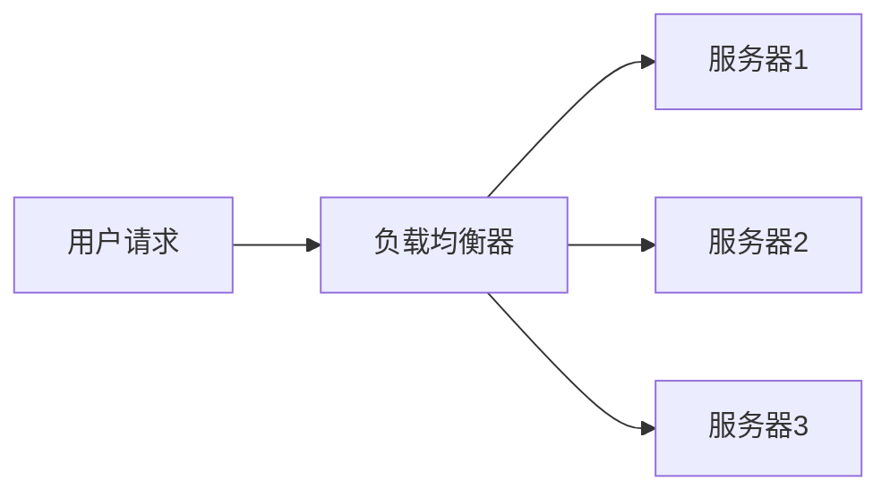

# 高并发设计

在现代互联网应用中，高并发设计是一个至关重要的主题。随着用户数量的增加，系统需要同时处理大量的请求，而高并发设计的目标就是确保系统能够在高负载下稳定运行，同时提供快速的响应时间。

## 什么是高并发？

高并发指的是系统在同一时间内处理大量请求的能力。这些请求可能来自不同的用户、设备或服务。高并发设计的核心在于如何有效地分配资源、优化性能以及避免系统崩溃。

## 高并发设计的核心概念

### 1. 负载均衡

负载均衡是一种将请求分发到多个服务器的技术，以确保每个服务器的负载都在可接受的范围内。常见的负载均衡算法包括轮询、加权轮询和最少连接数。



### 2. 缓存

缓存是提高系统性能的关键技术之一。通过将频繁访问的数据存储在内存中，系统可以快速响应请求，而不必每次都访问数据库。

```javascript
// 示例：使用 Redis 作为缓存
const redis = require('redis');
const client = redis.createClient();

client.get('user:123', (err, data) => {
    if (data) {
        console.log('从缓存中获取数据:', data);
    } else {
        console.log('从数据库中获取数据');
        client.set('user:123', JSON.stringify({ name: 'Alice', age: 30 }));
    }
});
```

### 3. 数据库优化

数据库通常是系统的瓶颈之一。为了支持高并发，可以采用以下优化策略：

- **分库分表**：将数据分散到多个数据库或表中，以减少单个数据库的负载。
- **读写分离**：将读操作和写操作分离到不同的数据库实例中，以提高性能。

### 4. 异步处理

异步处理允许系统在不阻塞主线程的情况下处理任务。常见的异步处理技术包括消息队列和事件驱动架构。

```javascript
// 示例：使用消息队列处理任务
const amqp = require('amqplib');

async function processTask(task) {
    // 模拟任务处理
    console.log('处理任务:', task);
}

async function main() {
    const connection = await amqp.connect('amqp://localhost');
    const channel = await connection.createChannel();
    const queue = 'tasks';

    await channel.assertQueue(queue, { durable: false });
    channel.consume(queue, (msg) => {
        if (msg !== null) {
            processTask(msg.content.toString());
            channel.ack(msg);
        }
    });
}

main();
```

## 实际案例

### 案例：电商网站的高并发设计

假设我们正在设计一个电商网站，该网站在促销活动期间会面临大量的用户请求。为了应对高并发，我们可以采用以下策略：

1. **负载均衡**：使用负载均衡器将用户请求分发到多个服务器。
2. **缓存**：将热门商品信息存储在缓存中，以减少数据库的访问压力。
3. **数据库优化**：对商品库存和订单数据进行分库分表，并使用读写分离技术。
4. **异步处理**：使用消息队列处理订单创建和支付等耗时操作，以确保系统的响应速度。

## 总结

高并发设计是现代系统设计中不可或缺的一部分。通过负载均衡、缓存、数据库优化和异步处理等技术，我们可以构建出能够应对高并发请求的系统。希望本文能够帮助你理解高并发设计的基本概念，并为你的系统设计提供一些实用的思路。

## 附加资源

- [《高并发系统设计》](https://example.com) - 一本深入探讨高并发设计的书籍。
- [Redis 官方文档](https://redis.io/documentation) - 学习如何使用 Redis 进行缓存。
- [RabbitMQ 官方文档](https://www.rabbitmq.com/documentation.html) - 了解如何使用消息队列进行异步处理。

## 练习

1. 设计一个简单的负载均衡器，使用轮询算法将请求分发到三个服务器。
2. 使用 Redis 缓存用户数据，并比较缓存命中和不命中时的响应时间。
3. 实现一个简单的消息队列系统，处理异步任务。

:::tip
在练习过程中，尝试模拟高并发场景，观察系统的性能变化。
:::