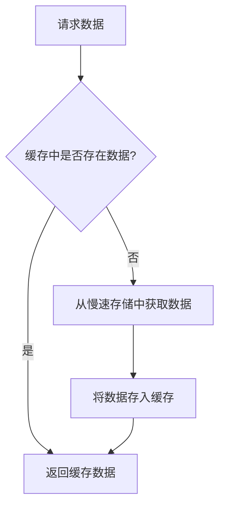

# 缓存设计与应用

缓存是系统设计中一个非常重要的概念，它通过存储频繁访问的数据，减少对慢速存储（如数据库或远程服务）的访问，从而提升系统的性能和响应速度。本文将逐步介绍缓存的基本概念、设计原则以及实际应用场景，帮助你全面理解缓存的作用和实现方式。

## 什么是缓存？

缓存是一种临时存储机制，用于保存频繁访问的数据，以便在后续请求中快速获取。缓存通常位于快速存储介质（如内存）中，能够显著减少对慢速存储（如磁盘或远程服务）的访问次数，从而提升系统的整体性能。

:::tip
缓存的核心思想是“空间换时间”，即通过占用更多的存储空间来换取更快的访问速度。
:::

## 缓存的基本工作原理

缓存的工作流程通常包括以下几个步骤：

1. **检查缓存**：当系统接收到请求时，首先检查缓存中是否存在所需数据。
2. **缓存命中**：如果缓存中存在所需数据（称为“缓存命中”），则直接返回数据。
3. **缓存未命中**：如果缓存中不存在所需数据（称为“缓存未命中”），则从慢速存储中获取数据，并将其存入缓存，以便后续请求使用。
4. **缓存更新**：当数据发生变化时，需要更新缓存中的数据，以确保缓存的一致性。

以下是一个简单的缓存工作流程图：



## 缓存的类型

根据缓存的位置和用途，缓存可以分为以下几种类型：

1. **客户端缓存**：存储在客户端（如浏览器）中，用于减少对服务器的请求次数。
2. **服务器端缓存**：存储在服务器内存中，用于减少对数据库或远程服务的访问。
3. **分布式缓存**：存储在多个服务器之间共享的缓存系统中，适用于大规模分布式系统。

## 缓存的设计原则

在设计缓存时，需要遵循以下几个原则：

1. **缓存命中率**：缓存命中率是指缓存命中的请求占总请求的比例。高缓存命中率意味着缓存的效果更好。
2. **缓存失效策略**：缓存中的数据可能会过期或失效，因此需要设计合理的失效策略，如基于时间的过期（TTL）或基于事件的失效。
3. **缓存一致性**：当数据发生变化时，需要确保缓存中的数据与源数据保持一致。
4. **缓存容量管理**：缓存通常有容量限制，因此需要设计合理的淘汰策略（如LRU、LFU等）来管理缓存中的数据。

## 缓存的实现示例

以下是一个简单的Python缓存实现示例，使用字典作为缓存存储：

```python
class SimpleCache:
    def __init__(self, max_size):
        self.cache = {}
        self.max_size = max_size

    def get(self, key):
        if key in self.cache:
            print("缓存命中")
            return self.cache[key]
        else:
            print("缓存未命中")
            return None

    def set(self, key, value):
        if len(self.cache) >= self.max_size:
            print("缓存已满，淘汰最早的数据")
            self.cache.pop(next(iter(self.cache)))
        self.cache[key] = value

# 使用示例
cache = SimpleCache(max_size=3)
cache.set("key1", "value1")
cache.set("key2", "value2")
cache.set("key3", "value3")

print(cache.get("key1"))  # 缓存命中，返回 "value1"
print(cache.get("key4"))  # 缓存未命中，返回 None
```

:::note
在实际应用中，通常会使用更复杂的缓存系统（如Redis、Memcached等），而不是简单的内存缓存。
:::

## 缓存的实际应用场景

缓存广泛应用于各种系统中，以下是一些常见的应用场景：

1. **Web应用中的页面缓存**：将动态生成的页面内容缓存起来，减少服务器的计算压力。
2. **数据库查询缓存**：将频繁查询的数据库结果缓存起来，减少数据库的访问次数。
3. **CDN（内容分发网络）**：通过在全球分布的缓存服务器上存储静态资源，加速用户访问速度。
4. **API响应缓存**：将API的响应结果缓存起来，减少对后端服务的请求次数。

## 总结

缓存是提升系统性能的重要手段，通过合理设计和使用缓存，可以显著减少对慢速存储的访问，提升系统的响应速度和吞吐量。在实际应用中，需要根据具体场景选择合适的缓存策略和工具，并注意缓存的一致性和容量管理。

## 附加资源与练习

- **资源**：
  - [Redis官方文档](https://redis.io/documentation)
  - [Memcached官方文档](https://memcached.org/)
  - [缓存设计模式](https://en.wikipedia.org/wiki/Cache_replacement_policies)

- **练习**：
  1. 使用Redis实现一个简单的缓存系统，并测试其性能。
  2. 设计一个缓存失效策略，确保缓存数据与数据库保持一致。
  3. 研究LRU和LFU缓存淘汰算法的实现，并比较它们的优缺点。

通过学习和实践，你将能够更好地掌握缓存的设计与应用，为构建高性能系统打下坚实的基础。