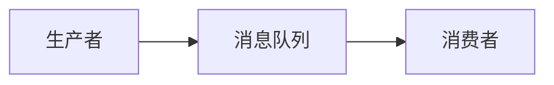

# 消息队列设计

## 介绍

消息队列（Message Queue）是一种在分布式系统中用于解耦生产者和消费者的通信机制。它允许应用程序通过异步的方式发送和接收消息，从而提高系统的可扩展性、可靠性和性能。消息队列的核心思想是将消息存储在队列中，直到消费者准备好处理它们。

在分布式系统中，消息队列常用于以下场景：
- 异步处理任务
- 解耦系统组件
- 流量削峰
- 实现事件驱动架构

## 消息队列的基本概念

### 1. 生产者（Producer）
生产者是生成消息并将其发送到消息队列的应用程序或服务。生产者不需要知道消息的消费者是谁，只需将消息发送到队列中。

### 2. 消费者（Consumer）
消费者是从消息队列中读取并处理消息的应用程序或服务。消费者从队列中获取消息并执行相应的操作。

### 3. 消息（Message）
消息是生产者发送到队列中的数据单元。它可以是任何格式的数据，如 JSON、XML 或二进制数据。

### 4. 队列（Queue）
队列是存储消息的容器。消息按照先进先出（FIFO）的顺序被存储和消费。

### 5. 代理（Broker）
代理是消息队列系统的核心组件，负责接收、存储和分发消息。常见的消息队列代理包括 RabbitMQ、Kafka 和 Redis。

## 消息队列的工作原理

消息队列的工作原理可以概括为以下几个步骤：
1. 生产者将消息发送到消息队列。
2. 消息队列将消息存储在队列中。
3. 消费者从队列中获取消息并处理。
4. 消费者处理完成后，可以选择从队列中删除消息或标记为已处理。



## 消息队列的设计考虑

在设计消息队列时，需要考虑以下几个关键因素：

### 1. 消息持久化
为了确保消息在系统崩溃或重启后不会丢失，消息队列通常需要支持消息持久化。持久化意味着消息会被写入磁盘，而不仅仅是存储在内存中。

### 2. 消息确认机制
消费者在处理消息后，可以向消息队列发送确认信号（ACK），表示消息已成功处理。如果消费者未能处理消息，消息队列可以将消息重新放回队列或发送给其他消费者。

### 3. 消息顺序
在某些场景下，消息的顺序非常重要。消息队列需要确保消息按照发送的顺序被消费。

### 4. 消息重试机制
如果消费者处理消息失败，消息队列需要支持消息的重试机制。重试机制可以设置重试次数和重试间隔。

### 5. 消息分区
在高并发场景下，消息队列可以通过分区（Partition）来提高吞吐量。每个分区可以独立处理消息，从而实现并行消费。

## 实际应用场景

### 1. 异步任务处理
假设你有一个电商网站，用户下单后需要发送订单确认邮件。为了避免邮件发送过程阻塞主业务流程，可以将邮件发送任务放入消息队列中，由后台服务异步处理。

```python
# 生产者代码示例
import pika

connection = pika.BlockingConnection(pika.ConnectionParameters('localhost'))
channel = connection.channel()

channel.queue_declare(queue='order_queue')

message = 'Order ID: 12345'
channel.basic_publish(exchange='', routing_key='order_queue', body=message)

print(" [x] Sent 'Order ID: 12345'")
connection.close()
```

```python
# 消费者代码示例
import pika

def callback(ch, method, properties, body):
    print(" [x] Received %r" % body)
    # 模拟发送邮件
    print(" [x] Sending email for order %r" % body)

connection = pika.BlockingConnection(pika.ConnectionParameters('localhost'))
channel = connection.channel()

channel.queue_declare(queue='order_queue')

channel.basic_consume(queue='order_queue', on_message_callback=callback, auto_ack=True)

print(' [*] Waiting for messages. To exit press CTRL+C')
channel.start_consuming()
```

### 2. 流量削峰
在高并发场景下，消息队列可以用于流量削峰。例如，在秒杀活动中，大量的用户请求可以先放入消息队列中，然后由后台服务逐步处理，避免系统过载。

## 总结

消息队列是分布式系统中非常重要的组件，它通过异步通信机制解耦了生产者和消费者，提高了系统的可扩展性和可靠性。在设计消息队列时，需要考虑消息持久化、确认机制、顺序、重试机制和分区等关键因素。

通过本文的学习，你应该对消息队列的基本概念、设计原理和实际应用场景有了初步的了解。接下来，你可以尝试使用 RabbitMQ、Kafka 或 Redis 等消息队列工具，进一步实践和探索。

## 附加资源

- [RabbitMQ 官方文档](https://www.rabbitmq.com/documentation.html)
- [Apache Kafka 官方文档](https://kafka.apache.org/documentation/)
- [Redis 消息队列教程](https://redis.io/topics/pubsub)

:::tip 练习
1. 使用 RabbitMQ 或 Kafka 实现一个简单的消息队列系统，生产者发送消息，消费者接收并处理消息。
2. 尝试在消息队列中实现消息持久化和确认机制，确保消息不会丢失。
3. 设计一个流量削峰的场景，使用消息队列来处理高并发请求。
:::