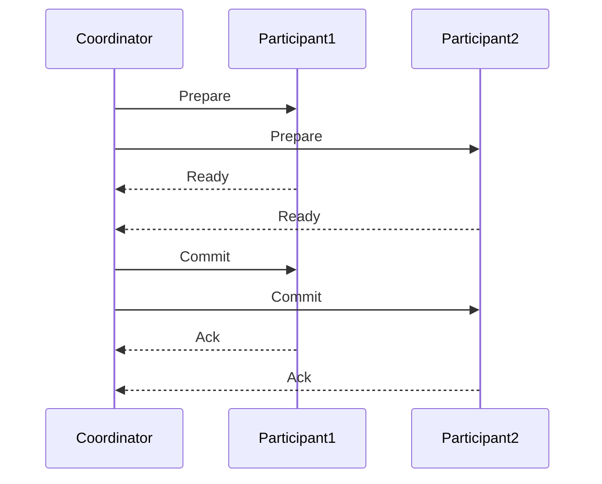
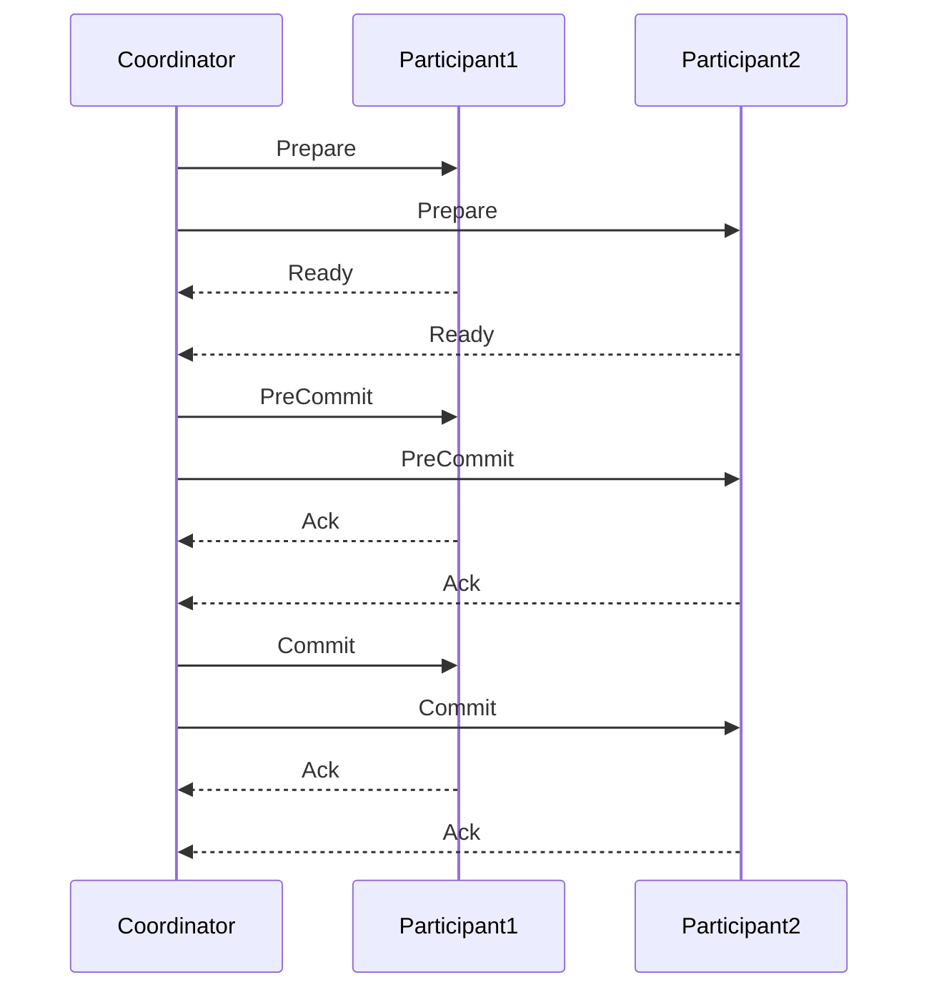
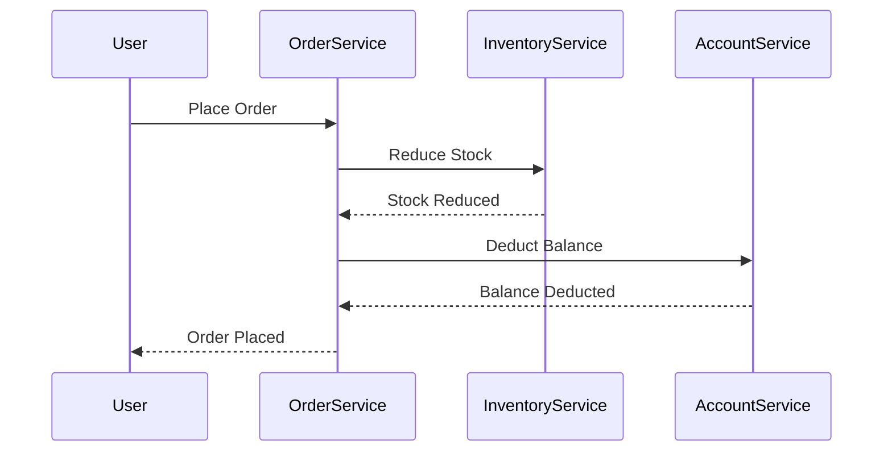

# 分布式事务

## 介绍

在分布式系统中，事务是一个非常重要的概念。事务是指一系列操作，这些操作要么全部成功，要么全部失败，以确保数据的一致性和完整性。在单机系统中，事务的实现相对简单，但在分布式系统中，由于数据分布在不同的节点上，事务的实现变得更加复杂。这就是分布式事务的由来。

分布式事务是指在分布式系统中，跨越多个节点的事务操作。这些节点可能位于不同的物理机器上，甚至可能位于不同的地理位置。分布式事务的目标是确保这些跨节点的操作能够像单机事务一样，要么全部成功，要么全部失败。

## 分布式事务的挑战

在分布式系统中，实现事务面临着以下几个主要挑战：

1. **网络延迟和分区**：由于网络延迟和分区问题，分布式系统中的节点可能无法及时通信，导致事务的协调变得复杂。
2. **数据一致性**：在分布式系统中，数据可能分布在多个节点上，如何确保这些数据在事务执行过程中保持一致是一个难题。
3. **故障恢复**：在分布式系统中，节点可能会发生故障，如何在故障发生后恢复事务的状态也是一个挑战。

## 分布式事务的实现方式

### 两阶段提交（2PC）

两阶段提交（2PC）是最常见的分布式事务协议之一。它将事务的提交过程分为两个阶段：准备阶段和提交阶段。

1. **准备阶段**：事务协调者向所有参与者发送准备请求，询问它们是否准备好提交事务。参与者执行事务操作，并将结果（准备好或未准备好）返回给协调者。
2. **提交阶段**：如果所有参与者都准备好提交事务，协调者向所有参与者发送提交请求，参与者提交事务并释放资源。如果有任何一个参与者未准备好，协调者将发送回滚请求，参与者回滚事务。

:::note
两阶段提交的优点是简单易实现，但它也存在一些问题，比如单点故障和阻塞问题。
:::

### 三阶段提交（3PC）

三阶段提交（3PC）是对两阶段提交的改进，它增加了一个预提交阶段，以减少阻塞问题。

1. **准备阶段**：与2PC相同，协调者向所有参与者发送准备请求。
2. **预提交阶段**：如果所有参与者都准备好，协调者向所有参与者发送预提交请求，参与者进入预提交状态。
3. **提交阶段**：协调者向所有参与者发送提交请求，参与者提交事务。

:::tip
三阶段提交通过增加预提交阶段，减少了阻塞问题，但仍然存在单点故障的问题。
:::

### 分布式事务的其他实现方式

除了2PC和3PC，还有一些其他的分布式事务实现方式，比如：

- **Saga模式**：将长事务分解为多个短事务，每个短事务都有对应的补偿操作。如果某个短事务失败，可以通过补偿操作回滚之前的事务。
- **TCC（Try-Confirm-Cancel）**：将事务分为Try、Confirm和Cancel三个阶段，Try阶段预留资源，Confirm阶段确认操作，Cancel阶段取消操作。

## 实际案例

### 电商系统中的分布式事务

在一个电商系统中，用户下单后，系统需要执行以下操作：

1. 扣减库存。
2. 创建订单。
3. 扣减用户账户余额。

这些操作可能分布在不同的服务中，比如库存服务、订单服务和账户服务。为了确保这些操作要么全部成功，要么全部失败，可以使用分布式事务。

:::caution
在实际应用中，分布式事务的实现可能会更加复杂，需要考虑网络延迟、故障恢复等问题。
:::

## 总结

分布式事务是分布式系统中确保数据一致性的重要机制。通过两阶段提交、三阶段提交、Saga模式、TCC等方式，可以在分布式系统中实现事务的一致性。然而，分布式事务的实现也面临着网络延迟、数据一致性、故障恢复等挑战。

在实际应用中，选择合适的分布式事务实现方式需要根据具体的业务场景和系统需求进行权衡。

## 附加资源

- [Distributed Systems: Principles and Paradigms](https://www.distributed-systems.net/)
- [Designing Data-Intensive Applications](https://dataintensive.net/)
- [Saga Pattern](https://microservices.io/patterns/data/saga.html)

## 练习

1. 尝试在一个简单的分布式系统中实现两阶段提交协议。
2. 思考在电商系统中，如何使用Saga模式来处理分布式事务。
3. 研究TCC模式，并尝试在一个实际项目中应用它。