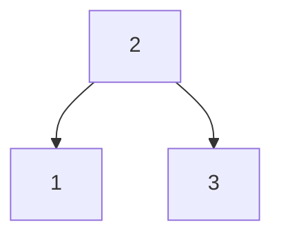

# Lean 类型声明

Lean是一种强大的交互式定理证明器，同时也是一种编程语言。它的类型系统是其核心特性之一，能够帮助开发者编写安全且正确的代码。本文将详细介绍Lean中的类型声明，帮助你理解如何在Lean中定义和使用类型。

## 什么是类型声明？

在Lean中，类型声明是指为变量、函数或其他表达式指定其类型的过程。类型是Lean中非常重要的概念，它决定了数据的结构和操作方式。通过类型声明，Lean可以在编译时检查代码的正确性，从而避免许多常见的错误。

### 基本语法

在Lean中，类型声明的基本语法如下：

```lean
variable (x : Type)
```

这里，`x` 是一个变量，`Type` 是它的类型。`Type` 是Lean中最基本的类型之一，表示任意类型的集合。

### 示例：声明一个自然数

让我们从一个简单的例子开始，声明一个自然数类型的变量：

```lean
variable (n : Nat)
```

在这个例子中，`n` 是一个自然数类型的变量。`Nat` 是Lean中表示自然数的类型。

## 类型推断

Lean具有强大的类型推断能力，这意味着在许多情况下，你不需要显式地声明类型，Lean可以根据上下文自动推断出类型。例如：

```lean
def add (x y : Nat) : Nat := x + y
```

在这个函数定义中，`x` 和 `y` 的类型被推断为 `Nat`，因为它们在加法操作中被使用。

## 类型构造器

Lean中的类型可以通过类型构造器来定义。类型构造器是一种函数，它接受一个或多个类型作为参数，并返回一个新的类型。例如，`List` 是一个类型构造器，它接受一个类型 `α` 并返回一个列表类型 `List α`。

```lean
def myList : List Nat := [1, 2, 3]
```

在这个例子中，`myList` 是一个包含自然数的列表，其类型为 `List Nat`。

## 实际案例：定义一个简单的数据结构

让我们通过一个实际案例来理解类型声明的应用。假设我们要定义一个简单的二叉树数据结构：

```lean
inductive Tree (α : Type) where
  | leaf : Tree α
  | node : Tree α → α → Tree α → Tree α
```

在这个定义中，`Tree` 是一个类型构造器，它接受一个类型 `α` 并返回一个二叉树类型。`leaf` 表示一个空树，`node` 表示一个包含左子树、节点值和右子树的树。

### 使用二叉树

我们可以使用这个二叉树类型来创建一个具体的树：

```lean
def myTree : Tree Nat :=
  Tree.node (Tree.node Tree.leaf 1 Tree.leaf) 2 (Tree.node Tree.leaf 3 Tree.leaf)
```

在这个例子中，`myTree` 是一个包含自然数的二叉树，其结构如下：



## 总结

通过本文，我们了解了Lean中的类型声明，包括基本语法、类型推断、类型构造器以及实际应用案例。类型声明是Lean类型系统的核心，掌握它对于编写安全且正确的代码至关重要。

### 附加资源

- [Lean官方文档](https://leanprover.github.io/documentation/)
- 《Theorem Proving in Lean》——一本深入讲解Lean的书籍

### 练习

1. 尝试定义一个包含整数的列表类型。
2. 使用类型构造器定义一个三元组类型 `Triple α β γ`。
3. 编写一个函数，接受一个 `Tree Nat` 并返回树中所有节点的和。

通过这些练习，你将进一步巩固对Lean类型声明的理解。祝你学习愉快！