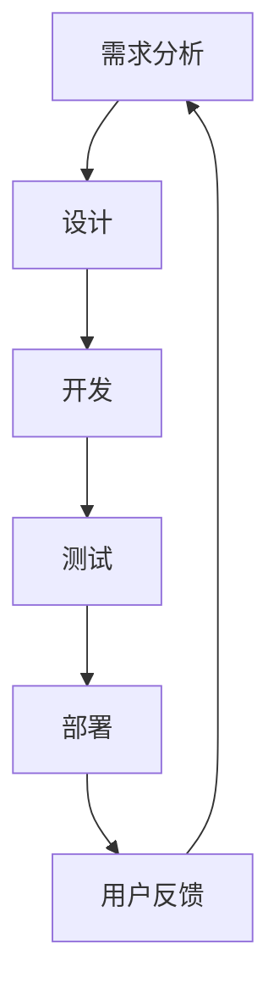

# Lean 设计模式

Lean设计模式是一种基于Lean原则的软件开发方法，旨在通过消除浪费、优化流程和提高效率来构建高质量的软件。Lean原则最初源自制造业，但其核心理念同样适用于软件开发。本文将详细介绍Lean设计模式的核心概念、实际应用场景以及如何将其融入开发流程。

## 什么是Lean设计模式？

Lean设计模式的核心思想是通过持续改进和消除浪费来优化软件开发流程。它强调以下几点：

1. **消除浪费**：识别并消除开发过程中不必要的步骤或资源浪费。
2. **持续改进**：通过反馈循环不断优化流程和产品。
3. **快速交付**：尽早交付可用的软件版本，以便快速获取用户反馈。
4. **尊重团队**：鼓励团队成员的创造力和协作精神。

Lean设计模式的目标是让开发过程更加高效、灵活，同时减少错误和返工。

---

## Lean 设计模式的核心原则

### 1. 消除浪费
在软件开发中，浪费可能表现为不必要的代码、重复的工作、过度的文档或低效的沟通。Lean设计模式鼓励团队识别这些浪费并采取措施消除它们。

:::tip
**示例**：在代码中，重复的逻辑可以通过提取公共函数或模块来消除。
:::

```javascript
// 重复的代码
function calculateAreaOfCircle(radius) {
  return Math.PI * radius * radius;
}

function calculateAreaOfSquare(side) {
  return side * side;
}

// 优化后的代码
function calculateArea(shape, dimension) {
  if (shape === 'circle') {
    return Math.PI * dimension * dimension;
  } else if (shape === 'square') {
    return dimension * dimension;
  }
}
```

### 2. 持续改进
Lean设计模式强调通过小步快跑的方式不断改进产品。每次迭代都应以用户反馈为基础，逐步优化功能。

:::note
**案例**：一个电商网站可以通过A/B测试不断优化用户界面，以提高转化率。
:::

### 3. 快速交付
尽早交付可用的软件版本，以便快速获取用户反馈。这有助于减少开发风险并确保产品符合用户需求。

:::caution
**注意**：快速交付并不意味着牺牲质量。确保每次交付的版本都是稳定且可用的。
:::

### 4. 尊重团队
Lean设计模式鼓励团队成员之间的协作和沟通。通过尊重每个人的贡献，团队可以更高效地解决问题。

---

## 实际应用场景

### 案例：敏捷开发中的Lean设计模式
在敏捷开发中，Lean设计模式可以帮助团队更好地管理任务和资源。例如，使用看板（Kanban）工具可以直观地展示任务状态，帮助团队识别瓶颈并优化流程。



### 案例：持续集成与持续交付（CI/CD）
Lean设计模式在CI/CD流程中也有广泛应用。通过自动化测试和部署，团队可以快速交付高质量的软件。

:::warning
**提醒**：在实施CI/CD时，确保测试覆盖率足够高，以避免引入新的问题。
:::

---

## 总结

Lean设计模式通过消除浪费、持续改进、快速交付和尊重团队，帮助开发团队构建高效且高质量的软件。无论是敏捷开发还是CI/CD流程，Lean原则都能为团队提供清晰的指导方向。

---

## 附加资源与练习

### 资源
- 《Lean软件开发：从概念到实践》——深入了解Lean原则在软件开发中的应用。
- [Lean Software Development Wikipedia](https://en.wikipedia.org/wiki/Lean_software_development) —— 了解更多关于Lean软件开发的历史和背景。

### 练习
1. 分析你当前的项目，尝试识别并消除至少一种浪费。
2. 设计一个简单的看板工具，用于管理你的开发任务。
3. 尝试在项目中实施CI/CD流程，并记录改进效果。

通过学习和实践Lean设计模式，你将能够显著提升开发效率和软件质量。