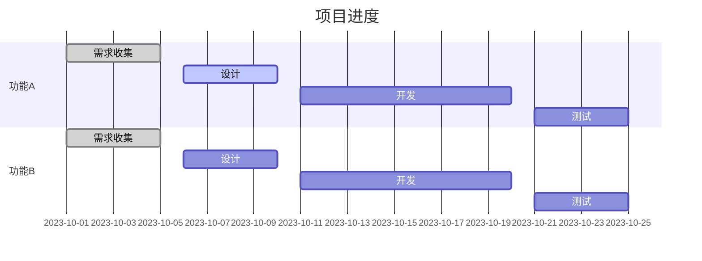

# Lean 大型项目管理

## 介绍

Lean（精益）是一种起源于制造业的管理哲学，旨在通过消除浪费、优化流程和持续改进来提高效率。在软件开发中，Lean原则同样适用，尤其是在大型项目管理中。通过应用Lean原则，团队可以更好地应对复杂性、减少瓶颈，并确保项目按时交付。

本文将逐步介绍如何在大型软件开发项目中应用Lean原则，并通过实际案例展示其有效性。

## Lean 原则的核心概念

Lean的核心原则包括：

1. **消除浪费**：识别并消除不增加价值的活动。
2. **持续改进**：通过不断优化流程来提高效率。
3. **尊重人**：鼓励团队成员的创造力和参与感。
4. **建立质量**：在开发过程中确保质量，而不是在后期修复问题。
5. **快速交付**：通过小批量工作和快速迭代来缩短交付周期。

## 在大型项目中应用Lean

### 1. 价值流映射

价值流映射（Value Stream Mapping）是Lean中的一种工具，用于可视化整个开发流程，并识别浪费的环节。在大型项目中，价值流映射可以帮助团队理解从需求到交付的整个流程，并找出瓶颈。


在上图中，每个环节都可能存在浪费。例如，需求收集阶段可能因为沟通不畅而导致信息丢失，开发阶段可能因为代码质量差而导致返工。

### 2. 小批量工作

在大型项目中，小批量工作（Small Batch Work）可以帮助团队更快地交付功能，并减少风险。通过将大任务分解为小任务，团队可以更快地获得反馈，并在发现问题时及时调整。

:::tip
小批量工作的一个常见实践是使用**用户故事**（User Stories）来定义任务。每个用户故事都应该足够小，以便在一个迭代周期内完成。
:::

### 3. 持续集成与持续交付

持续集成（Continuous Integration, CI）和持续交付（Continuous Delivery, CD）是Lean软件开发中的关键实践。通过自动化构建、测试和部署流程，团队可以确保代码始终处于可部署状态，并减少手动操作带来的错误。

```bash
# 示例：持续集成脚本
git pull origin main
npm install
npm test
npm run build
```

在上面的脚本中，每次代码提交后，系统会自动拉取最新代码、安装依赖、运行测试并构建项目。

### 4. 可视化管理

在大型项目中，可视化管理（Visual Management）可以帮助团队更好地跟踪进度和识别问题。常见的可视化管理工具包括看板（Kanban）和燃尽图（Burndown Chart）。



通过甘特图，团队可以清晰地看到每个任务的进度，并及时调整资源。

## 实际案例

### 案例：大型电商平台开发

某大型电商平台在开发新功能时，遇到了进度延迟和质量问题。通过应用Lean原则，团队采取了以下措施：

1. **价值流映射**：团队绘制了从需求到交付的整个流程，并发现测试环节存在瓶颈。通过增加自动化测试，团队减少了手动测试的时间。
2. **小批量工作**：团队将大功能分解为多个小功能，并采用迭代开发。每个迭代周期为两周，确保功能能够快速交付。
3. **持续集成与交付**：团队引入了CI/CD工具，自动化了构建、测试和部署流程。每次代码提交后，系统会自动运行测试并部署到测试环境。
4. **可视化管理**：团队使用看板跟踪任务进度，并通过每日站会（Daily Standup）及时解决问题。

经过这些改进，团队成功缩短了交付周期，并提高了产品质量。

## 总结

在大型软件开发项目中，应用Lean原则可以帮助团队提高效率、减少浪费并交付高质量产品。通过价值流映射、小批量工作、持续集成与交付以及可视化管理，团队可以更好地应对复杂性，并确保项目按时交付。

## 附加资源与练习

- **资源**：
  - 《精益软件开发：从概念到现金》（Mary Poppendieck, Tom Poppendieck）
  - 《持续交付：可靠软件发布的构建、测试与部署》（Jez Humble, David Farley）

- **练习**：
  - 尝试在您当前的项目中应用价值流映射，识别并消除浪费。
  - 将一个大任务分解为多个小任务，并尝试在一个迭代周期内完成。

通过不断实践和优化，您将能够在大型项目中更好地应用Lean原则，并取得显著的效果。