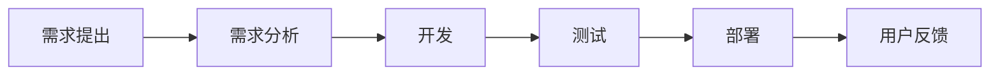

## 什么是Lean DevOps？

Lean DevOps是一种结合了精益（Lean）原则和DevOps实践的软件开发方法论。它的核心目标是通过消除浪费、优化流程和增强团队协作，实现快速、高质量的软件交付。Lean DevOps不仅关注技术工具，还强调文化和流程的改进。

:::note
**精益原则**起源于制造业，强调通过减少浪费、提高效率来创造价值。DevOps则是一种文化和实践，旨在打破开发和运维之间的壁垒，实现持续交付和持续改进。
:::

## Lean DevOps的核心原则

1. **消除浪费**：识别并消除开发流程中的非增值活动，例如重复的手动操作、不必要的等待时间等。
2. **持续改进**：通过小步快跑的方式不断优化流程，而不是一次性大规模变革。
3. **自动化**：尽可能自动化重复性任务，例如测试、部署和监控。
4. **快速反馈**：建立快速反馈机制，尽早发现并解决问题。
5. **团队协作**：打破部门壁垒，促进开发、运维和业务团队之间的紧密合作。

## Lean DevOps实践的关键步骤

### 1. 价值流映射（Value Stream Mapping）

价值流映射是一种可视化工具，用于分析从需求提出到软件交付的整个流程。通过识别每个步骤的耗时和瓶颈，团队可以找到改进的机会。



:::tip
通过价值流映射，团队可以清晰地看到哪些步骤是增值的，哪些是浪费的。
:::

### 2. 持续集成与持续交付（CI/CD）

持续集成（CI）和持续交付（CD）是Lean DevOps的核心实践。CI/CD通过自动化构建、测试和部署流程，确保代码的快速交付和高质量。

以下是一个简单的CI/CD流水线示例：

```yaml
# .github/workflows/ci-cd.yml
name: CI/CD Pipeline

on:
  push:
    branches:
      - main

jobs:
  build:
    runs-on: ubuntu-latest
    steps:
      - name: Checkout code
        uses: actions/checkout@v2

      - name: Set up Node.js
        uses: actions/setup-node@v2
        with:
          node-version: '14'

      - name: Install dependencies
        run: npm install

      - name: Run tests
        run: npm test

  deploy:
    needs: build
    runs-on: ubuntu-latest
    steps:
      - name: Deploy to production
        run: npm run deploy
```

:::caution
确保在CI/CD流水线中加入足够的测试覆盖率，以避免将错误代码部署到生产环境。
:::

### 3. 基础设施即代码（Infrastructure as Code, IaC）

基础设施即代码是一种通过代码定义和管理基础设施的方法。它使得基础设施的配置可以像应用程序代码一样进行版本控制和自动化管理。

以下是一个使用Terraform定义AWS EC2实例的示例：

```hcl
# main.tf
provider "aws" {
  region = "us-west-2"
}

resource "aws_instance" "example" {
  ami           = "ami-0c55b159cbfafe1f0"
  instance_type = "t2.micro"

  tags = {
    Name = "example-instance"
  }
}
```

:::tip
通过IaC，团队可以快速复制和重建基础设施，减少人为错误。
:::

### 4. 监控与反馈

监控是Lean DevOps中不可或缺的一部分。通过实时监控系统的性能和健康状况，团队可以快速响应问题并持续改进。

以下是一个使用Prometheus和Grafana进行监控的示例：

```yaml
# prometheus.yml
global:
  scrape_interval: 15s

scrape_configs:
  - job_name: 'node_exporter'
    static_configs:
      - targets: ['localhost:9100']
```

:::warning
确保监控系统能够覆盖关键指标，例如CPU使用率、内存使用率和响应时间。
:::

## 实际案例：某电商平台的Lean DevOps实践

某电商平台通过实施Lean DevOps，显著提高了交付效率和质量。以下是他们的改进步骤：

1. **价值流映射**：识别出测试环节是主要瓶颈，耗时占整个流程的40%。
2. **自动化测试**：引入自动化测试工具，将测试时间从2天缩短到2小时。
3. **CI/CD流水线**：建立完整的CI/CD流水线，实现代码的自动构建、测试和部署。
4. **基础设施即代码**：使用Terraform管理AWS基础设施，确保环境的一致性。
5. **实时监控**：部署Prometheus和Grafana，实时监控系统性能。

通过这些改进，该平台的交付周期从2周缩短到2天，故障率降低了50%。

## 总结

Lean DevOps通过结合精益原则和DevOps实践，帮助团队实现快速、高质量的软件交付。关键步骤包括价值流映射、CI/CD、基础设施即代码和实时监控。通过持续改进和团队协作，Lean DevOps能够显著提升开发效率和产品质量。

## 附加资源与练习

- **资源**：
  - 《精益软件开发》——Mary Poppendieck
  - 《DevOps实践指南》——Gene Kim
  - [Terraform官方文档](https://www.terraform.io/docs/index.html)
  - [Prometheus官方文档](https://prometheus.io/docs/introduction/overview/)

- **练习**：
  1. 为你的项目创建一个简单的CI/CD流水线。
  2. 使用Terraform定义一个简单的AWS基础设施。
  3. 部署Prometheus和Grafana，监控你的应用程序性能。

通过实践这些步骤，你将更好地理解Lean DevOps的核心概念和应用场景。