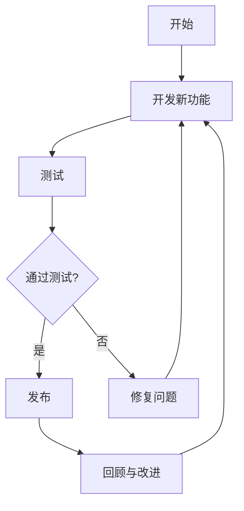
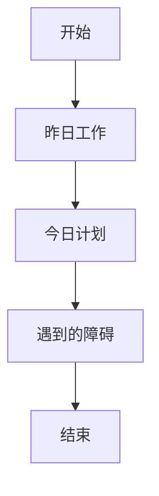

# Lean 系统编程

Lean系统编程是一种将精益生产（Lean Manufacturing）原则应用于软件开发的方法。它强调通过减少浪费、优化流程和持续改进来提高效率和质量。本文将逐步介绍Lean系统编程的核心概念，并通过实际案例展示其应用。

## 什么是Lean系统编程？

Lean系统编程的核心思想是通过消除浪费、优化流程和持续改进来提高软件开发的效率和质量。它借鉴了精益生产中的许多原则，如“准时生产”（Just-in-Time）和“持续改进”（Kaizen），并将其应用于软件开发中。

### 核心原则

1. **消除浪费**：识别并消除软件开发过程中不必要的步骤和资源浪费。
2. **持续改进**：通过不断反思和改进流程，提高开发效率和质量。
3. **准时生产**：只在需要时进行开发，避免过度生产和库存积压。
4. **尊重人**：重视团队成员的贡献，鼓励协作和创新。

## Lean 系统编程的实际应用

### 1. 消除浪费

在软件开发中，浪费可能表现为不必要的代码、重复的工作或低效的流程。通过识别这些浪费，我们可以优化开发流程。

#### 示例：消除重复代码

```python
# 重复代码示例
def calculate_area_of_square(side):
    return side * side

def calculate_area_of_rectangle(length, width):
    return length * width

# 优化后的代码
def calculate_area(shape, *args):
    if shape == "square":
        return args[0] * args[0]
    elif shape == "rectangle":
        return args[0] * args[1]

# 使用优化后的代码
print(calculate_area("square", 5))  # 输出: 25
print(calculate_area("rectangle", 4, 6))  # 输出: 24
```

### 2. 持续改进

持续改进是Lean系统编程的核心。通过定期回顾和反思开发过程，团队可以不断优化流程。

#### 示例：持续改进流程



### 3. 准时生产

准时生产意味着只在需要时进行开发，避免过度生产和库存积压。在软件开发中，这可能表现为按需开发功能，而不是一次性开发所有功能。

#### 示例：按需开发功能

```python
# 按需开发功能示例
def develop_feature(feature_name):
    if feature_name == "login":
        return "开发登录功能"
    elif feature_name == "payment":
        return "开发支付功能"

# 按需开发
print(develop_feature("login"))  # 输出: 开发登录功能
```

### 4. 尊重人

尊重人意味着重视团队成员的贡献，鼓励协作和创新。在Lean系统编程中，团队成员的参与和反馈是持续改进的关键。

#### 示例：团队协作

```python
# 团队协作示例
def team_collaboration(task):
    return f"团队成员共同完成: {task}"

# 团队协作
print(team_collaboration("优化登录流程"))  # 输出: 团队成员共同完成: 优化登录流程
```

## 实际案例

### 案例：敏捷开发中的Lean系统编程

在敏捷开发中，Lean系统编程的原则被广泛应用。例如，通过每日站会（Daily Standup）和迭代回顾（Sprint Retrospective），团队可以不断识别和消除浪费，优化开发流程。

#### 示例：每日站会



## 总结

Lean系统编程通过消除浪费、持续改进、准时生产和尊重人等原则，帮助团队提高软件开发的效率和质量。通过实际案例和代码示例，我们可以看到Lean系统编程在软件开发中的广泛应用。

## 附加资源与练习

- **资源**：
  - [《精益软件开发》](https://example.com) - 深入了解Lean系统编程的书籍。
  - [Lean Software Development: An Agile Toolkit](https://example.com) - 关于Lean系统编程的经典书籍。

- **练习**：
  - 尝试在现有项目中应用Lean系统编程的原则，识别并消除浪费。
  - 组织一次团队回顾会议，讨论如何改进开发流程。

通过学习和实践Lean系统编程，你将能够更高效地开发软件，并提高团队的整体表现。