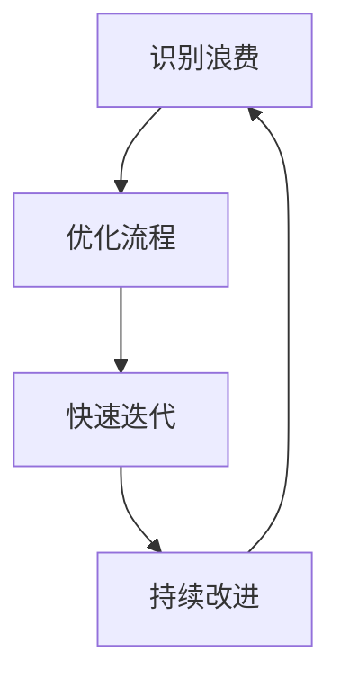

# Lean Web开发

## 介绍

Lean（精益）是一种起源于制造业的管理哲学，旨在通过消除浪费、优化流程和持续改进来提高效率。近年来，Lean原则被广泛应用于软件开发领域，尤其是在Web开发中。Lean Web开发的核心思想是通过简化流程、快速迭代和持续交付，为用户提供高质量的产品。

本文将逐步介绍Lean Web开发的核心概念，并通过实际案例展示如何将这些原则应用于实际项目中。

---

## Lean Web开发的核心原则

### 1. 消除浪费

在Web开发中，浪费可能表现为不必要的代码、重复的任务、低效的流程或未使用的功能。Lean强调识别并消除这些浪费，以提高开发效率。

:::tip
**示例：** 避免编写重复的代码。使用模块化设计或工具（如Webpack）来复用代码。
:::

```javascript
// 重复的代码
function calculateArea(width, height) {
  return width * height;
}

function calculatePerimeter(width, height) {
  return 2 * (width + height);
}

// 优化后的代码
function calculateRectangle(width, height, type) {
  if (type === 'area') {
    return width * height;
  } else if (type === 'perimeter') {
    return 2 * (width + height);
  }
}
```

### 2. 快速迭代

Lean Web开发鼓励快速迭代和持续交付。通过小步快跑的方式，团队可以更快地获取用户反馈，并根据反馈调整开发方向。

:::note
**案例：** 使用敏捷开发方法（如Scrum）将项目分解为多个小任务，每两周交付一个可用的版本。
:::

### 3. 持续改进

持续改进是Lean的核心原则之一。通过定期回顾和优化流程，团队可以不断提高开发效率和质量。

:::caution
**注意：** 持续改进需要团队的积极参与和开放的文化氛围。
:::

---

## 实际应用案例

### 案例：构建一个Lean风格的博客平台

假设我们要开发一个简单的博客平台。以下是Lean Web开发的实际应用步骤：

1. **最小可行产品（MVP）：** 首先构建一个仅包含核心功能（如发布文章、查看文章）的MVP。
2. **用户反馈：** 发布MVP后，收集用户反馈，了解他们的需求和痛点。
3. **迭代改进：** 根据反馈逐步添加新功能（如评论、搜索）并优化现有功能。

```javascript
// MVP示例：简单的博客发布功能
function publishPost(title, content) {
  const post = { title, content, date: new Date() };
  // 保存到数据库
  saveToDatabase(post);
}
```

---

## 总结

Lean Web开发通过消除浪费、快速迭代和持续改进，帮助团队更高效地交付高质量的Web应用。无论是小型项目还是大型企业级应用，Lean原则都能为开发流程带来显著的优化。

---

## 附加资源与练习

### 资源
- [《精益软件开发》](https://example.com) - 深入了解Lean在软件开发中的应用。
- [Lean Web开发工具](https://example.com) - 推荐的工具和框架。

### 练习
1. 尝试将Lean原则应用于你的下一个Web项目，记录每个阶段的变化。
2. 分析一个现有的Web应用，识别其中的浪费并提出改进建议。

---



通过以上内容，希望你能更好地理解Lean Web开发的核心概念，并将其应用于实际项目中。Happy coding!