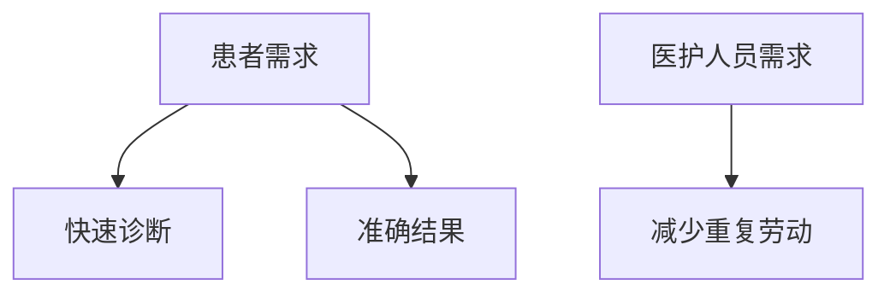
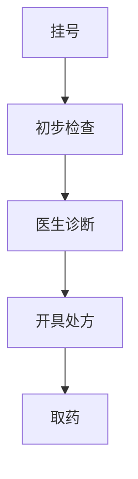
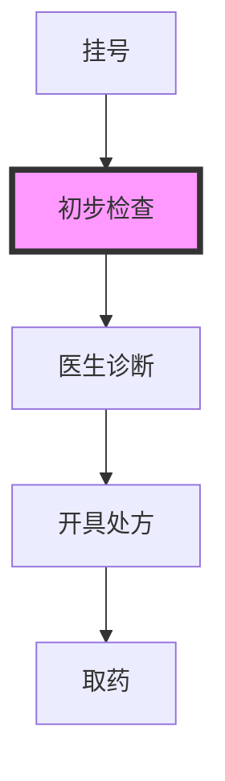
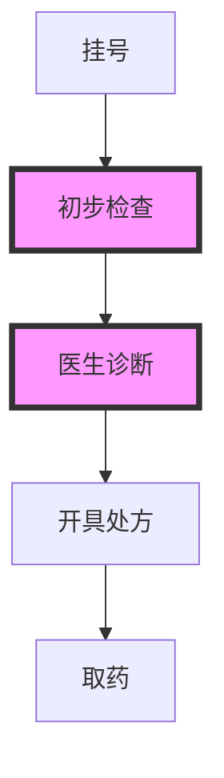

## 介绍

Lean（精益）是一种以最小化浪费、最大化价值为核心的管理哲学。在医疗系统中，Lean原则可以帮助我们验证系统的有效性，确保其能够高效运行并满足患者和医护人员的需求。本文将逐步讲解如何使用Lean原则验证医疗系统，并通过实际案例展示其应用。

## Lean 原则概述

Lean的核心原则包括：
1. **价值**：明确客户（患者）的需求。
2. **价值流**：识别并优化从需求到交付的流程。
3. **流动**：确保流程顺畅，减少等待和停滞。
4. **拉动**：根据需求拉动资源，避免过度生产。
5. **持续改进**：不断优化流程，追求卓越。

## Lean 医疗系统验证步骤

### 1. 明确价值

首先，我们需要明确医疗系统的价值所在。例如，患者可能希望快速获得准确的诊断结果，而医护人员则希望减少重复劳动。



### 2. 识别价值流

接下来，我们需要识别从患者需求到最终交付的整个流程。例如，患者从挂号到诊断的流程可能包括以下步骤：



### 3. 优化流程

通过分析价值流，我们可以发现潜在的浪费和瓶颈。例如，如果初步检查和医生诊断之间存在长时间的等待，我们可以优化这一环节。



### 4. 实施拉动系统

在医疗系统中，我们可以根据患者的需求来拉动资源。例如，当患者挂号后，系统可以自动分配医生资源，避免资源浪费。

```python
def allocate_doctor(patient):
    if patient.status == "挂号":
        doctor = find_available_doctor()
        assign_doctor(patient, doctor)
        return "医生已分配"
    else:
        return "等待挂号"
```

**输入：**
```python
patient = {"status": "挂号"}
```

**输出：**
```
医生已分配
```

### 5. 持续改进

最后，我们需要不断收集反馈并进行改进。例如，通过患者满意度调查，我们可以发现系统中的不足并进行优化。

```python
def collect_feedback(patient):
    feedback = patient.feedback
    if feedback == "不满意":
        return "需要改进"
    else:
        return "继续优化"
```

**输入：**
```python
patient = {"feedback": "不满意"}
```

**输出：**
```
需要改进
```

## 实际案例

### 案例：急诊室流程优化

某医院急诊室通过Lean原则优化了患者从挂号到诊断的流程。通过减少等待时间和优化资源分配，患者的平均等待时间从30分钟减少到15分钟，满意度显著提高。



## 总结

通过Lean原则验证医疗系统，我们可以确保系统高效、可靠且符合患者需求。本文介绍了Lean的核心原则，并通过实际案例展示了其在医疗系统中的应用。希望本文能帮助你更好地理解和应用Lean原则。

## 附加资源

- [Lean Healthcare: A Guide to Implementing Lean Principles in Healthcare](https://www.lean.org)
- [The Toyota Way: 14 Management Principles from the World's Greatest Manufacturer](https://www.amazon.com/Toyota-Way-Management-Principles-Manufacturer/dp/0071392319)

## 练习

1. 选择一个你熟悉的医疗流程，尝试用Lean原则进行分析和优化。
2. 编写一个简单的Python程序，模拟医疗资源分配的过程。
