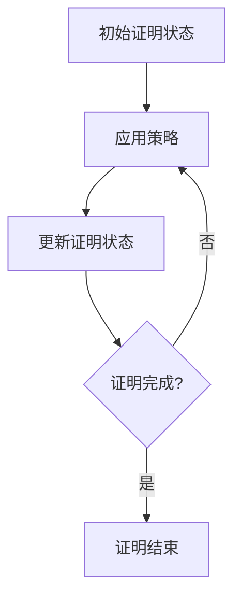

# Lean 证明状态

在Lean中，**证明状态**（Proof State）是证明过程中的一个核心概念。它表示当前证明的中间状态，包括已知的假设、目标以及尚未完成的证明步骤。理解证明状态对于掌握Lean的证明机制至关重要。本文将详细介绍Lean中的证明状态，并通过示例帮助你更好地理解这一概念。

## 什么是证明状态？

在Lean中，当你开始一个证明时，系统会为你创建一个初始的证明状态。这个状态包含了当前的目标（即需要证明的命题）以及已知的假设（即已经证明或假设为真的命题）。随着你逐步应用证明策略，证明状态会不断更新，直到最终完成证明。

证明状态通常以以下形式呈现：

```
目标：需要证明的命题
假设：
  - 假设1
  - 假设2
  ...
```

## 查看证明状态

在Lean中，你可以使用 `show_term` 或 `show` 命令来查看当前的证明状态。以下是一个简单的例子：

```lean
example : ∀ (n : ℕ), n = n :=
begin
  intro n,
  show_term,  -- 查看当前证明状态
  refl
end
```

在这个例子中，`show_term` 命令会输出当前的证明状态。假设当前的目标是 `n = n`，并且已知的假设是 `n : ℕ`。

## 逐步讲解证明状态

让我们通过一个具体的例子来逐步讲解证明状态的变化。

### 示例：证明 `∀ (n : ℕ), n = n`

1. **初始状态**：
   - 目标：`∀ (n : ℕ), n = n`
   - 假设：无

2. **应用 `intro` 策略**：
   - 目标：`n = n`
   - 假设：`n : ℕ`

3. **应用 `refl` 策略**：
   - 目标：无（证明完成）

通过这个简单的例子，你可以看到证明状态是如何随着每一步策略的应用而变化的。

## 实际案例

让我们看一个稍微复杂一点的例子，展示证明状态在实际中的应用。

### 示例：证明 `∀ (n : ℕ), n + 0 = n`

```lean
example : ∀ (n : ℕ), n + 0 = n :=
begin
  intro n,
  show_term,  -- 查看当前证明状态
  induction n,
  { show_term,  -- 查看基础情况的证明状态
    refl },
  { show_term,  -- 查看归纳情况的证明状态
    simp [nat.succ_add],
    assumption }
end
```

在这个例子中，我们使用了归纳法来证明命题。每一步的 `show_term` 命令都会输出当前的证明状态，帮助你理解证明的进展。

## 总结

理解Lean中的证明状态是掌握形式化证明的关键。通过查看和操作证明状态，你可以更好地理解证明的进展，并有效地应用各种证明策略。

:::tip 提示
在Lean中，`show_term` 是一个非常有用的命令，它可以帮助你查看当前的证明状态。建议在复杂的证明中频繁使用它来跟踪证明的进展。
:::

## 附加资源与练习

为了进一步巩固你对证明状态的理解，建议你尝试以下练习：

1. 尝试在Lean中证明 `∀ (n : ℕ), 0 + n = n`，并使用 `show_term` 查看每一步的证明状态。
2. 阅读Lean官方文档中关于证明状态的部分，了解更多高级用法。

通过这些练习，你将能够更熟练地操作和理解Lean中的证明状态。

:::note 注意
在Lean中，证明状态是动态变化的。每次应用一个策略后，证明状态都会更新。因此，理解每一步策略对证明状态的影响是非常重要的。
:::



通过以上内容，你应该对Lean中的证明状态有了一个全面的理解。继续练习和探索，你将能够更自如地使用Lean进行形式化证明。