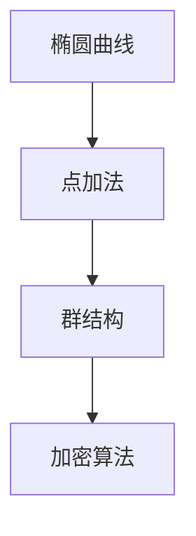

## 介绍

在数学中，**群（Group）** 是一种基本的代数结构，它由一个集合和一个二元运算组成，满足四个基本性质：封闭性、结合律、单位元的存在性以及逆元的存在性。群的概念在数学的许多分支中都有广泛应用，例如代数、几何和物理学。

在 Lean 中，群是通过类型类和结构来定义的。通过学习 Lean 中的群，你可以更好地理解抽象代数的基础，并将其应用于编程中。

## 群的定义

一个群是一个集合 $ G $ 和一个二元运算 $ \cdot $（通常称为“乘法”），满足以下性质：

1. **封闭性**：对于任意 $ a, b \in G $，有 $ a \cdot b \in G $。
2. **结合律**：对于任意 $ a, b, c \in G $，有 $ (a \cdot b) \cdot c = a \cdot (b \cdot c) $。
3. **单位元**：存在一个元素 $ e \in G $，使得对于任意 $ a \in G $，有 $ e \cdot a = a \cdot e = a $。
4. **逆元**：对于任意 $ a \in G $，存在一个元素 $ a^{-1} \in G $，使得 $ a \cdot a^{-1} = a^{-1} \cdot a = e $。

在 Lean 中，群的定义如下：

```lean
class Group (G : Type) extends Monoid G :=
(inv : G → G)
(mul_left_inv : ∀ a : G, inv a * a = 1)
```

这里，`Group` 类型类继承了 `Monoid`，并添加了逆元 `inv` 和左逆元的性质 `mul_left_inv`。

## 代码示例

让我们通过一个简单的例子来理解如何在 Lean 中定义一个群。假设我们有一个整数集合 $ \mathbb{Z} $，并定义加法作为二元运算。那么 $ \mathbb{Z} $ 在加法下形成一个群。

```lean
import algebra.group.basic

instance : add_group ℤ :=
{ add := (+),
  add_assoc := int.add_assoc,
  zero := 0,
  zero_add := int.zero_add,
  add_zero := int.add_zero,
  neg := int.neg,
  add_left_neg := int.add_left_neg }
```

在这个例子中，我们定义了整数集合 $ \mathbb{Z} $ 的加法群。`add_group` 是 Lean 中用于定义加法群的类型类。

## 群的性质

群有许多重要的性质，以下是一些常见的性质：

1. **单位元的唯一性**：群中的单位元是唯一的。
2. **逆元的唯一性**：每个元素的逆元是唯一的。
3. **消去律**：如果 $ a \cdot b = a \cdot c $，则 $ b = c $。

这些性质在群的理论中非常重要，并且在 Lean 中可以通过定理来证明。

## 实际案例

群的概念在密码学中有广泛应用。例如，**椭圆曲线加密（ECC）** 就是基于椭圆曲线上的点构成的群。椭圆曲线上的点加法满足群的四个性质，因此可以用于构建安全的加密算法。



在这个图中，我们可以看到椭圆曲线上的点加法形成了一个群结构，进而用于构建加密算法。

## 总结

群是数学中一个非常基础且重要的概念，它在许多领域都有广泛的应用。通过 Lean，我们可以形式化地定义和操作群，从而更好地理解其性质和应用。

## 附加资源

- [Lean 官方文档](https://leanprover.github.io/documentation/)
- 《抽象代数》 by David S. Dummit and Richard M. Foote
- [群论入门](https://en.wikipedia.org/wiki/Group_theory)

## 练习

1. 在 Lean 中定义一个有限群，并验证其群性质。
2. 证明群中单位元的唯一性。
3. 研究椭圆曲线加密算法，并尝试在 Lean 中实现一个简单的椭圆曲线群。

通过完成这些练习，你将更深入地理解群的概念及其在 Lean 中的应用。