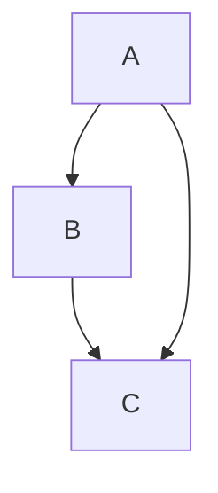
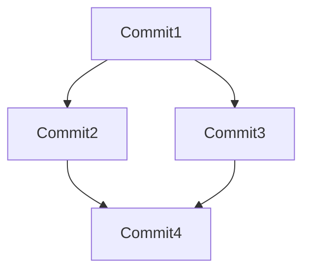

# Lean 偏序集

## 介绍

在数学中，**偏序集**（Partial Order）是一种二元关系，满足**自反性**、**反对称性**和**传递性**。偏序集是研究集合中元素之间关系的重要工具，广泛应用于计算机科学、逻辑学、代数等领域。

在Lean中，偏序集通过类型类和定理的形式被定义和实现。通过学习Lean中的偏序集，你可以更好地理解数学结构在编程中的表达方式，并掌握如何利用Lean进行形式化验证。

---

## 偏序集的定义

偏序集由一个集合和一个二元关系组成，记作 `(S, ≤)`，其中 `≤` 是定义在集合 `S` 上的偏序关系。偏序关系需要满足以下三个性质：

1. **自反性**：对于任意 `x ∈ S`，有 `x ≤ x`。
2. **反对称性**：对于任意 `x, y ∈ S`，如果 `x ≤ y` 且 `y ≤ x`，则 `x = y`。
3. **传递性**：对于任意 `x, y, z ∈ S`，如果 `x ≤ y` 且 `y ≤ z`，则 `x ≤ z`。

在Lean中，偏序集的定义如下：

```lean
class PartialOrder (α : Type u) extends LE α where
  le_refl : ∀ a : α, a ≤ a
  le_antisymm : ∀ a b : α, a ≤ b → b ≤ a → a = b
  le_trans : ∀ a b c : α, a ≤ b → b ≤ c → a ≤ c
```

这里，`α` 是一个类型，`LE` 是“小于等于”关系的类型类。`PartialOrder` 扩展了 `LE`，并添加了自反性、反对称性和传递性的约束。

---

## 偏序集的例子

### 例子1：自然数上的偏序

自然数集合 `ℕ` 与通常的“小于等于”关系 `≤` 构成一个偏序集。我们可以用Lean来验证这一点：

```lean
instance : PartialOrder ℕ where
  le_refl := nat.le_refl
  le_antisymm := nat.le_antisymm
  le_trans := nat.le_trans
```

在这个例子中，`nat.le_refl`、`nat.le_antisymm` 和 `nat.le_trans` 是Lean标准库中已经证明的定理，分别对应自反性、反对称性和传递性。

---

### 例子2：集合的包含关系

给定一个集合 `S`，其幂集 `𝒫(S)`（即 `S` 的所有子集的集合）与集合的包含关系 `⊆` 构成一个偏序集。我们可以用Lean定义这一关系：

```lean
instance {α : Type u} : PartialOrder (Set α) where
  le_refl := set.subset.refl
  le_antisymm := set.subset.antisymm
  le_trans := set.subset.trans
```

这里，`Set α` 表示类型 `α` 的幂集，`set.subset.refl`、`set.subset.antisymm` 和 `set.subset.trans` 是Lean标准库中关于集合包含关系的定理。

---

## 偏序集的实际应用

### 应用1：任务调度

在任务调度问题中，任务之间存在依赖关系。例如，任务A必须在任务B之前完成。这种依赖关系可以用偏序集来表示：



在这个图中，箭头表示“必须在之前完成”的关系。偏序集的性质确保了任务调度的合理性和无环性。

---

### 应用2：版本控制系统

在版本控制系统中，提交历史形成一个偏序集。每个提交节点代表一个版本，箭头表示“基于”关系。例如：



这种结构确保了版本历史的线性和一致性。

---

## 总结

偏序集是数学和计算机科学中的重要概念，用于描述元素之间的层次结构和依赖关系。在Lean中，偏序集通过类型类和定理的形式被定义和实现，使得我们可以进行形式化验证和推理。

通过本文的学习，你应该已经掌握了偏序集的基本定义、性质以及在Lean中的实现方式。希望你能通过实际案例进一步理解偏序集的应用。

---

## 附加资源与练习

### 资源
- [Lean官方文档](https://leanprover.github.io/)
- 《定理证明与编程》：一本关于Lean和形式化验证的书籍。

### 练习
1. 在Lean中定义一个自定义类型的偏序集。
2. 证明一个给定的关系是否满足偏序集的性质。
3. 尝试用偏序集解决一个实际问题，例如任务调度或版本控制。

:::tip
如果你在学习过程中遇到问题，可以尝试在Lean社区中提问，或者查阅相关文档和教程。
:::