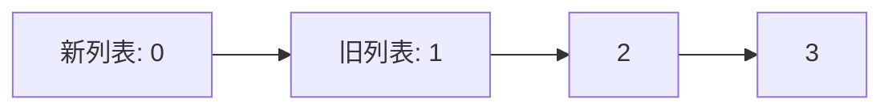

# Lean 持久化数据结构

## 介绍

持久化数据结构（Persistent Data Structures）是一种在修改时保留其历史版本的数据结构。与传统的可变数据结构不同，持久化数据结构在每次修改时都会生成一个新的版本，而不会破坏旧版本。这种特性使得持久化数据结构在函数式编程、并发编程以及需要回溯操作的场景中非常有用。

在Lean编程语言中，持久化数据结构是实现高效、不可变数据操作的核心工具之一。本文将逐步介绍Lean中的持久化数据结构，并通过代码示例和实际案例帮助你理解其工作原理和应用场景。

## 什么是持久化数据结构？

持久化数据结构的主要特点是**不可变性**。每次对数据结构进行修改时，都会生成一个新的版本，而旧版本仍然可以访问。这种特性使得持久化数据结构在需要保留历史状态或并发操作的场景中非常有用。

:::note
**注意**：持久化数据结构并不是指将数据存储到磁盘或数据库中，而是指在内存中保留多个版本的数据结构。
:::

## Lean 中的持久化数据结构

Lean是一种函数式编程语言，天然支持不可变数据结构。在Lean中，持久化数据结构的实现通常依赖于**共享结构**和**路径复制**技术。这些技术使得在修改数据结构时，可以高效地生成新版本，而不会完全复制整个数据结构。

### 示例：持久化列表

让我们通过一个简单的例子来理解Lean中的持久化列表。假设我们有一个列表 `[1, 2, 3]`，我们希望在列表的头部添加一个新元素 `0`，同时保留原始列表。

```lean
def originalList := [1, 2, 3]
def newList := 0 :: originalList

#eval originalList  -- 输出: [1, 2, 3]
#eval newList       -- 输出: [0, 1, 2, 3]
```

在这个例子中，`originalList` 和 `newList` 是两个不同的列表。`newList` 是通过在 `originalList` 的头部添加 `0` 生成的，而 `originalList` 仍然保持不变。

:::tip
**提示**：在Lean中，`::` 是列表的构造操作符，用于在列表的头部添加元素。
:::

### 持久化数据结构的内部实现

持久化数据结构的核心思想是通过**共享结构**来减少内存开销。当我们在一个持久化列表的头部添加一个新元素时，新列表会共享旧列表的所有尾部元素，而不是完全复制整个列表。



在这个图中，新列表 `[0, 1, 2, 3]` 共享了旧列表 `[1, 2, 3]` 的结构。这种共享机制使得持久化数据结构在内存使用上非常高效。

## 实际应用场景

持久化数据结构在许多实际场景中都有广泛应用，特别是在需要保留历史状态或并发操作的系统中。

### 1. 版本控制系统

版本控制系统（如Git）是持久化数据结构的典型应用。每次提交都会生成一个新的版本，而旧版本仍然可以访问。这种特性使得开发者可以轻松地回溯到历史状态。

### 2. 函数式编程

在函数式编程中，数据是不可变的。持久化数据结构使得在函数式编程中处理数据变得更加高效和自然。

### 3. 并发编程

在并发编程中，多个线程可能同时访问和修改数据。持久化数据结构可以避免数据竞争，因为每个线程都可以访问自己的数据版本。

## 总结

持久化数据结构是一种在修改时保留历史版本的数据结构，具有不可变性和高效的内存使用特性。在Lean中，持久化数据结构通过共享结构和路径复制技术实现，适用于版本控制、函数式编程和并发编程等场景。

:::caution
**注意**：虽然持久化数据结构在内存使用上非常高效，但在某些情况下，频繁的修改操作可能会导致内存碎片化。因此，在实际应用中需要权衡利弊。
:::

## 附加资源与练习

- **练习1**：尝试在Lean中实现一个持久化二叉树，并测试其在不同操作下的性能。
- **练习2**：研究Lean标准库中的持久化数据结构实现，理解其内部工作原理。
- **资源**：阅读《Purely Functional Data Structures》一书，深入了解持久化数据结构的理论和实践。

希望本文能帮助你理解Lean中的持久化数据结构，并为你的编程学习之旅提供帮助！