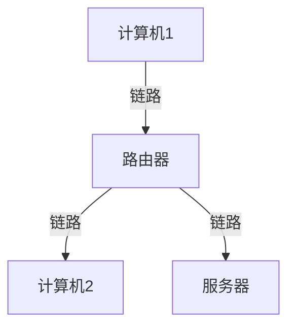

## 什么是计算机网络？

计算机网络是指通过通信链路和交换设备将多台计算机连接在一起，以实现资源共享和信息交换的系统。简单来说，计算机网络使得计算机之间能够相互通信，共享数据和资源。

:::note
**关键点**：计算机网络的核心目标是实现资源共享和信息交换。
:::

### 计算机网络的基本组成部分

一个典型的计算机网络由以下几个主要部分组成：

1. **节点（Node）**：网络中的设备，如计算机、服务器、路由器、交换机等。
2. **链路（Link）**：连接节点的物理或逻辑通道，如电缆、光纤或无线信号。
3. **协议（Protocol）**：规定网络中设备如何通信的规则和标准，如 TCP/IP 协议。
4. **网络拓扑（Topology）**：网络中设备的物理或逻辑布局，如星型、总线型、环型等。



:::tip
**提示**：网络拓扑决定了数据在网络中的传输路径和效率。
:::

### 计算机网络的类型

根据规模和用途，计算机网络可以分为以下几类：

1. **局域网（LAN, Local Area Network）**：覆盖范围较小，通常在一个建筑物或校园内，如家庭网络或办公室网络。
2. **广域网（WAN, Wide Area Network）**：覆盖范围较大，通常跨越城市、国家甚至全球，如互联网。
3. **城域网（MAN, Metropolitan Area Network）**：介于 LAN 和 WAN 之间，覆盖一个城市或地区。

:::caution
**注意**：不同类型的网络适用于不同的场景，选择合适的网络类型可以提高效率和降低成本。
:::

### 计算机网络的实际应用

计算机网络在我们的日常生活中无处不在。以下是一些常见的应用场景：

1. **互联网访问**：通过计算机网络，我们可以访问全球范围内的信息和资源。
2. **电子邮件**：计算机网络使得电子邮件能够快速、可靠地传递。
3. **在线购物**：电子商务平台依赖于计算机网络来处理交易和物流信息。
4. **远程办公**：通过 VPN（虚拟专用网络），员工可以在家中安全地访问公司内部网络。

:::warning
**警告**：网络安全是计算机网络中的一个重要问题，确保网络的安全性至关重要。
:::

### 代码示例：简单的网络通信

以下是一个使用 Python 的简单示例，展示如何在两台计算机之间进行基本的网络通信。

```python
# 服务器端代码
import socket

server_socket = socket.socket(socket.AF_INET, socket.SOCK_STREAM)
server_socket.bind(('localhost', 12345))
server_socket.listen(1)

print("等待客户端连接...")
client_socket, addr = server_socket.accept()
print(f"连接来自: {addr}")

data = client_socket.recv(1024)
print(f"收到数据: {data.decode()}")

client_socket.send("你好，客户端！".encode())
client_socket.close()
server_socket.close()
```

```python
# 客户端代码
import socket

client_socket = socket.socket(socket.AF_INET, socket.SOCK_STREAM)
client_socket.connect(('localhost', 12345))

client_socket.send("你好，服务器！".encode())
data = client_socket.recv(1024)
print(f"收到数据: {data.decode()}")

client_socket.close()
```

**输出**：
```
等待客户端连接...
连接来自: ('127.0.0.1', 12345)
收到数据: 你好，客户端！
```

:::note
**注意**：此示例仅用于演示基本的网络通信，实际应用中需要考虑更多的安全性和性能问题。
:::

## 总结

计算机网络是现代信息技术的基础，它使得全球范围内的信息交换和资源共享成为可能。通过理解计算机网络的基本概念和组成部分，初学者可以更好地掌握网络技术的核心知识。

### 附加资源

- [计算机网络教程 - 菜鸟教程](https://www.runoob.com/w3cnote/computer-network-tutorial.html)
- [TCP/IP 协议详解](https://www.tutorialspoint.com/tcpip/index.htm)
- [计算机网络：自顶向下方法（书籍推荐）](https://www.amazon.com/Computer-Networking-Top-Down-Approach-7th/dp/0133594149)

### 练习

1. 尝试修改上述代码示例，使其能够在不同的计算机上运行。
2. 研究并绘制你所在学校或公司的网络拓扑图。
3. 了解并解释 TCP/IP 协议栈的每一层功能。

通过不断学习和实践，你将逐步掌握计算机网络的精髓，并能够应用于实际项目中。