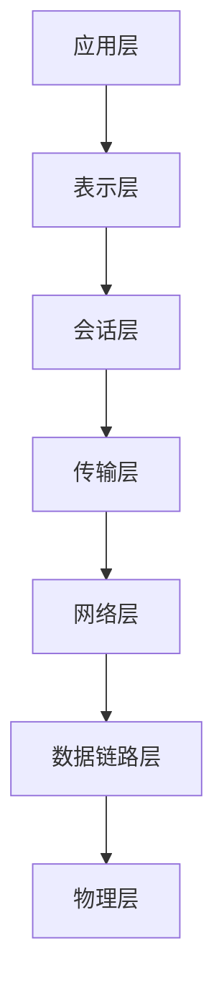
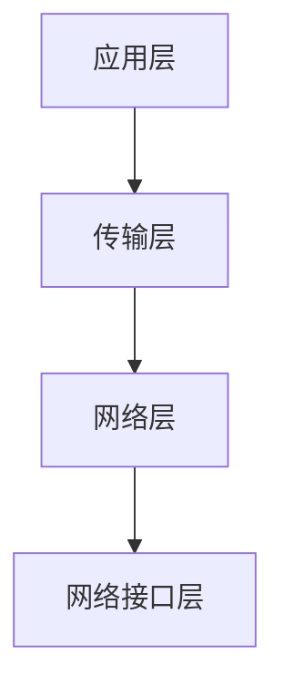

## 介绍

网络体系结构是计算机网络的基础框架，它定义了网络如何组织、通信以及管理数据流。通过将网络功能划分为不同的层次，网络体系结构简化了复杂系统的设计和实现。最著名的网络体系结构是 **OSI 模型** 和 **TCP/IP 模型**，它们为现代网络通信提供了标准化的参考。

在本节中，我们将逐步讲解网络体系结构的基本概念，并通过实际案例帮助你理解其重要性。

---

## 网络体系结构的分层模型

网络体系结构通常采用分层模型，每一层都有特定的功能和职责。分层模型的主要优点包括：

- **模块化设计**：每一层可以独立开发和测试。
- **易于维护**：修改某一层的功能不会影响其他层。
- **标准化**：分层模型促进了不同厂商设备之间的互操作性。

### OSI 模型

OSI（Open Systems Interconnection）模型是一个七层模型，由国际标准化组织（ISO）提出。以下是各层的名称和功能：

1. **物理层（Physical Layer）**：负责传输原始比特流，定义物理介质（如电缆、光纤）的特性。
2. **数据链路层（Data Link Layer）**：提供节点到节点的数据传输，处理错误检测和纠正。
3. **网络层（Network Layer）**：负责数据包的路由和转发，确保数据从源节点到达目标节点。
4. **传输层（Transport Layer）**：提供端到端的通信，确保数据的可靠传输。
5. **会话层（Session Layer）**：管理会话的建立、维护和终止。
6. **表示层（Presentation Layer）**：处理数据的格式化和加密。
7. **应用层（Application Layer）**：为用户提供网络服务，如电子邮件、文件传输等。



### TCP/IP 模型

TCP/IP 模型是互联网的实际标准，它由四层组成：

1. **网络接口层（Network Interface Layer）**：相当于 OSI 模型的物理层和数据链路层。
2. **网络层（Internet Layer）**：相当于 OSI 模型的网络层，主要协议是 IP（Internet Protocol）。
3. **传输层（Transport Layer）**：相当于 OSI 模型的传输层，主要协议是 TCP（Transmission Control Protocol）和 UDP（User Datagram Protocol）。
4. **应用层（Application Layer）**：相当于 OSI 模型的应用层、表示层和会话层。



---

## 实际案例：网页浏览

让我们以浏览网页为例，看看网络体系结构如何在实际中发挥作用。

1. **应用层**：你在浏览器中输入一个 URL（如 `https://example.com`），浏览器生成一个 HTTP 请求。
2. **传输层**：HTTP 请求被封装为 TCP 数据段，确保数据可靠传输。
3. **网络层**：TCP 数据段被封装为 IP 数据包，添加源和目标 IP 地址。
4. **数据链路层**：IP 数据包被封装为以太网帧，添加 MAC 地址。
5. **物理层**：以太网帧通过电缆或无线信号传输到目标服务器。

服务器接收到请求后，按照相反的顺序解封装数据，最终将网页内容返回给你的浏览器。

---

## 代码示例：简单的 TCP 客户端

以下是一个使用 Python 实现的简单 TCP 客户端示例，展示了传输层的工作原理：

```python
import socket

# 创建一个 TCP/IP 套接字
client_socket = socket.socket(socket.AF_INET, socket.SOCK_STREAM)

# 连接到服务器
server_address = ('localhost', 12345)
client_socket.connect(server_address)

try:
    # 发送数据
    message = 'Hello, Server!'
    client_socket.sendall(message.encode())

    # 接收响应
    data = client_socket.recv(1024)
    print(f'Received: {data.decode()}')

finally:
    # 关闭连接
    client_socket.close()
```

**输入**：客户端发送消息 `Hello, Server!`。<br />
**输出**：服务器返回响应，客户端打印接收到的数据。

---

## 总结

网络体系结构是计算机网络的核心概念，它通过分层模型简化了网络的设计和实现。OSI 模型和 TCP/IP 模型是两种主要的网络体系结构，它们为现代网络通信提供了标准化的参考。

通过理解网络体系结构，你可以更好地掌握网络通信的原理，并为学习更高级的网络技术打下坚实的基础。

---

## 附加资源与练习

- **练习**：尝试编写一个简单的 TCP 服务器，与上述客户端代码配合使用。
- **资源**：
  - [OSI 模型详解](https://example.com/osi-model)
  - [TCP/IP 协议栈指南](https://example.com/tcp-ip-guide)

:::tip
如果你对网络体系结构有任何疑问，欢迎在评论区留言，我们会尽快为你解答！
:::