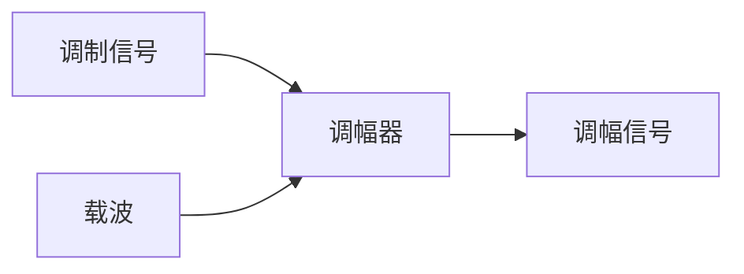

# 信息编码与调制

在计算机网络中，信息编码与调制是数据传输的基础技术。它们确保了数据能够高效、可靠地在不同设备之间传输。本文将详细介绍信息编码与调制的概念、原理及其实际应用。

## 什么是信息编码与调制？

**信息编码**是将原始数据转换为适合传输的信号的过程。编码的目的是确保数据在传输过程中能够被正确识别和解析。常见的编码方式包括二进制编码、ASCII 编码等。

**调制**是将数字信号转换为模拟信号的过程，以便通过模拟通信介质（如无线电波、光纤等）传输。调制技术包括调幅（AM）、调频（FM）和调相（PM）等。

## 信息编码

### 二进制编码

二进制编码是最基本的信息编码方式。它将数据转换为由 0 和 1 组成的二进制序列。例如，字符 'A' 在 ASCII 编码中表示为 `01000001`。

```plaintext
字符 'A' -> 二进制编码 -> 01000001
```

### ASCII 编码

ASCII（American Standard Code for Information Interchange）是一种常见的字符编码标准。它使用 7 位二进制数表示 128 个字符，包括字母、数字、标点符号和控制字符。

```plaintext
字符 'A' -> ASCII 编码 -> 65 (十进制) -> 01000001 (二进制)
```

### Unicode 编码

Unicode 是一种更广泛的字符编码标准，支持全球多种语言的字符。它使用 16 位或更多位来表示字符，能够表示超过 100,000 个字符。

```plaintext
字符 'A' -> Unicode 编码 -> U+0041
```

## 调制技术

### 调幅（AM）

调幅是通过改变信号的幅度来传输信息的技术。在调幅中，载波的幅度随调制信号的变化而变化。



### 调频（FM）

调频是通过改变信号的频率来传输信息的技术。在调频中，载波的频率随调制信号的变化而变化。


### 调相（PM）

调相是通过改变信号的相位来传输信息的技术。在调相中，载波的相位随调制信号的变化而变化。


## 实际应用

### 无线通信

在无线通信中，调制技术用于将数字信号转换为无线电波，以便通过空气传输。例如，Wi-Fi 和蓝牙技术都使用了调制技术。

### 光纤通信

在光纤通信中，调制技术用于将数字信号转换为光信号，以便通过光纤传输。光信号的调制通常使用调幅或调相技术。

### 数字电视

数字电视信号通过调制技术传输，以确保高质量的图像和声音。常见的调制技术包括正交幅度调制（QAM）和正交频分复用（OFDM）。

## 总结

信息编码与调制是计算机网络中数据传输的关键技术。通过编码，数据能够被正确识别和解析；通过调制，数据能够通过不同的通信介质传输。理解这些技术对于学习计算机网络至关重要。

## 附加资源

- [ASCII 编码表](https://www.asciitable.com/)
- [Unicode 官方网站](https://home.unicode.org/)
- [调制技术详解](https://en.wikipedia.org/wiki/Modulation)

## 练习

1. 将字符 'B' 转换为 ASCII 编码和 Unicode 编码。
2. 解释调幅和调频的区别。
3. 描述一个实际应用场景，说明信息编码与调制的重要性。
