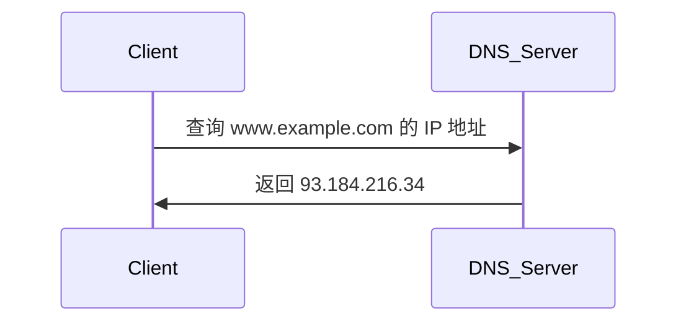

# 网络协议概念

## 介绍

网络协议是计算机网络中用于通信的规则和标准。它们定义了数据如何在网络中传输、如何被格式化、如何被处理以及如何被接收。简单来说，网络协议是设备之间通信的“语言”，确保不同设备能够理解彼此发送的信息。

网络协议的作用类似于人类语言中的语法和词汇。如果没有统一的协议，设备之间的通信将变得混乱，甚至无法进行。因此，网络协议是计算机网络的基础。

## 网络协议的基本组成

网络协议通常由以下几个部分组成：

1. **语法**：定义数据的格式和结构。
2. **语义**：定义数据的含义以及如何处理数据。
3. **时序**：定义数据何时发送以及如何同步。

### 示例：HTTP 协议

HTTP（超文本传输协议）是互联网上最常用的协议之一。它定义了客户端（如浏览器）和服务器之间的通信规则。以下是一个简单的 HTTP 请求示例：

```http
GET /index.html HTTP/1.1
Host: www.example.com
```

在这个请求中，`GET` 是请求方法，`/index.html` 是请求的资源路径，`HTTP/1.1` 是协议版本，`Host` 是请求的目标主机。

## 常见的网络协议

以下是一些常见的网络协议及其用途：

1. **TCP/IP**：传输控制协议/互联网协议，是互联网的基础协议，负责数据的可靠传输。
2. **HTTP/HTTPS**：用于网页浏览和数据传输。
3. **FTP**：文件传输协议，用于文件的上传和下载。
4. **SMTP/POP3/IMAP**：用于电子邮件的发送和接收。
5. **DNS**：域名系统，将域名转换为 IP 地址。

### 示例：DNS 查询

DNS 协议用于将域名（如 `www.example.com`）转换为 IP 地址（如 `93.184.216.34`）。以下是一个简单的 DNS 查询过程：



## 实际应用场景

### 场景 1：网页浏览

当你访问一个网站时，浏览器会使用 HTTP 或 HTTPS 协议向服务器发送请求，服务器则会返回网页内容。以下是一个简单的 HTTP 请求和响应的示例：

```http
GET /index.html HTTP/1.1
Host: www.example.com
```

服务器响应：

```http
HTTP/1.1 200 OK
Content-Type: text/html
Content-Length: 1234

<!DOCTYPE html>
<html>
<head>
    <title>Example</title>
</head>
<body>
    <h1>Hello, World!</h1>
</body>
</html>
```

### 场景 2：电子邮件发送

当你发送一封电子邮件时，SMTP 协议用于将邮件从你的电子邮件客户端发送到邮件服务器。以下是一个简单的 SMTP 会话示例：

```smtp
HELO example.com
MAIL FROM:<sender@example.com>
RCPT TO:<recipient@example.com>
DATA
Subject: Test Email

This is a test email.
.
QUIT
```

## 总结

网络协议是计算机网络中不可或缺的一部分，它们定义了设备之间通信的规则和标准。通过理解网络协议的基本概念和常见类型，你可以更好地理解互联网的工作原理，并为深入学习计算机网络打下坚实的基础。

## 附加资源

- [RFC 文档](https://www.rfc-editor.org/)：网络协议的官方标准文档。
- [Wireshark](https://www.wireshark.org/)：网络协议分析工具，帮助你深入了解网络通信。

## 练习

1. 使用 Wireshark 捕获并分析一个 HTTP 请求和响应。
2. 编写一个简单的 Python 脚本，使用 `socket` 模块实现一个基本的 TCP 客户端和服务器。
3. 研究并解释 HTTPS 协议与 HTTP 协议的主要区别。

:::tip
如果你对某个协议感兴趣，可以查阅相关的 RFC 文档，深入了解其细节和实现。
:::