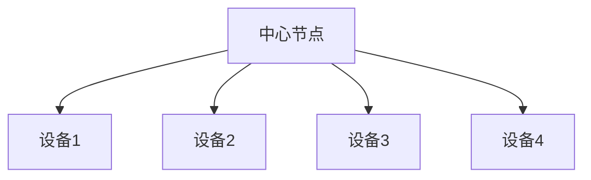
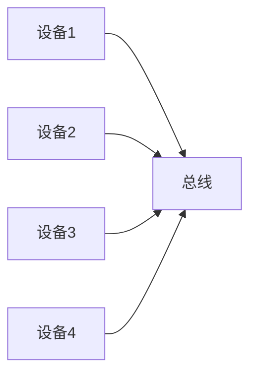
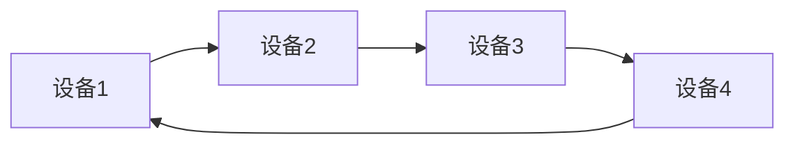
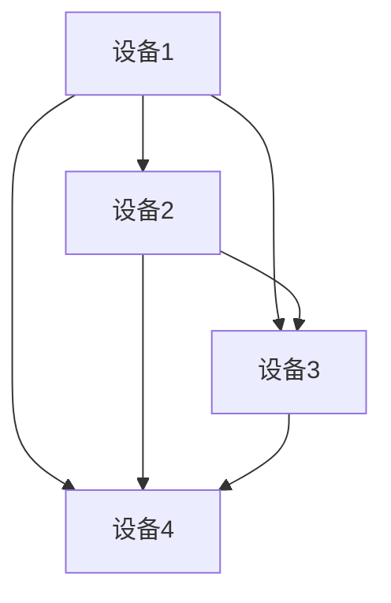
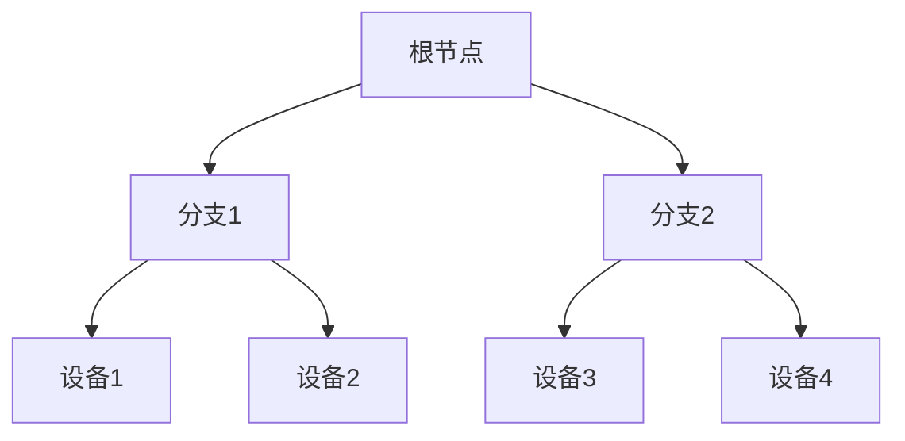

## 介绍

网络拓扑结构是指计算机网络中设备（如计算机、路由器、交换机等）之间的连接方式和布局。它是网络设计的基础，决定了数据如何在网络中传输。理解网络拓扑结构对于构建高效、可靠的网络至关重要。

## 常见的网络拓扑结构

以下是几种常见的网络拓扑结构：

### 1. 星型拓扑（Star Topology）

在星型拓扑中，所有设备都连接到一个中心节点（通常是交换机或集线器）。中心节点负责转发数据。

**优点：**
- 易于安装和管理。
- 单个设备故障不会影响整个网络。

**缺点：**
- 中心节点是单点故障，如果中心节点故障，整个网络将瘫痪。

**实际应用：**
- 家庭网络通常采用星型拓扑，路由器作为中心节点连接多个设备。

### 2. 总线型拓扑（Bus Topology）

在总线型拓扑中，所有设备都连接到一条共享的通信线路（总线）。

**优点：**
- 结构简单，成本低。

**缺点：**
- 总线是单点故障，如果总线故障，整个网络将瘫痪。
- 随着设备数量的增加，网络性能会下降。

**实际应用：**
- 早期的以太网网络常采用总线型拓扑。

### 3. 环型拓扑（Ring Topology）

在环型拓扑中，每个设备都连接到两个相邻的设备，形成一个闭合环。

**优点：**
- 数据传输方向固定，延迟可预测。

**缺点：**
- 单个设备故障可能导致整个网络瘫痪。

**实际应用：**
- 令牌环网络（Token Ring）采用环型拓扑。

### 4. 网状拓扑（Mesh Topology）

在网状拓扑中，每个设备都与其他设备直接连接。

**优点：**
- 高可靠性，即使部分连接故障，网络仍可运行。
- 数据传输路径多，延迟低。

**缺点：**
- 成本高，布线复杂。

**实际应用：**
- 军事网络和关键基础设施网络常采用网状拓扑。

### 5. 树型拓扑（Tree Topology）

树型拓扑是星型拓扑和总线型拓扑的结合，形成一个层次结构。

**优点：**
- 易于扩展和管理。
- 故障隔离性好。

**缺点：**
- 根节点是单点故障。

**实际应用：**
- 企业网络常采用树型拓扑。

## 实际案例

### 案例1：家庭网络

家庭网络通常采用星型拓扑，路由器作为中心节点连接多个设备（如电脑、手机、智能电视等）。这种结构简单易用，适合初学者。

### 案例2：企业网络

企业网络通常采用树型拓扑，核心交换机作为根节点，连接多个分支交换机，每个分支交换机再连接多个设备。这种结构易于扩展和管理，适合大规模网络。

## 总结

网络拓扑结构是计算机网络设计的基础，不同的拓扑结构适用于不同的应用场景。选择合适的拓扑结构可以提高网络的性能和可靠性。

## 附加资源

- [计算机网络基础教程](https://example.com)
- [网络拓扑结构详解](https://example.com)

## 练习

1. 描述星型拓扑和总线型拓扑的优缺点。
2. 设计一个小型办公室网络，选择合适的拓扑结构并解释原因。
3. 研究一个实际网络案例，分析其拓扑结构。

:::tip
**提示：** 在实际应用中，网络拓扑结构可能会结合多种类型，以满足不同的需求。
:::