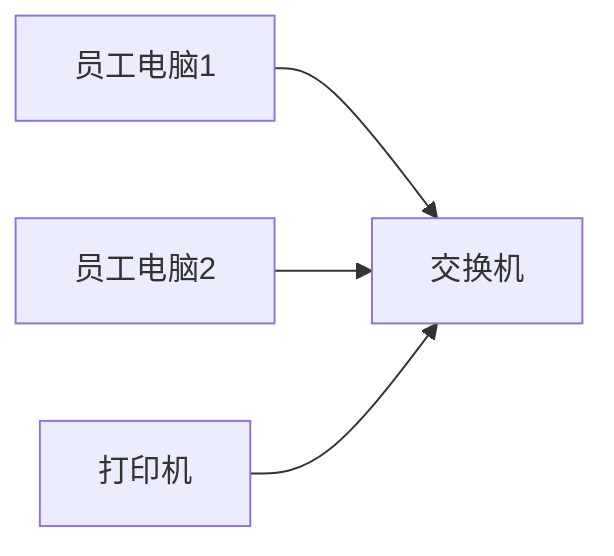
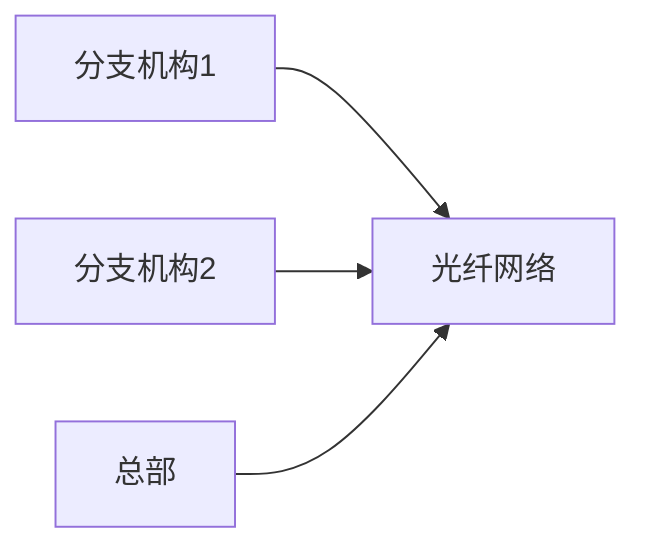
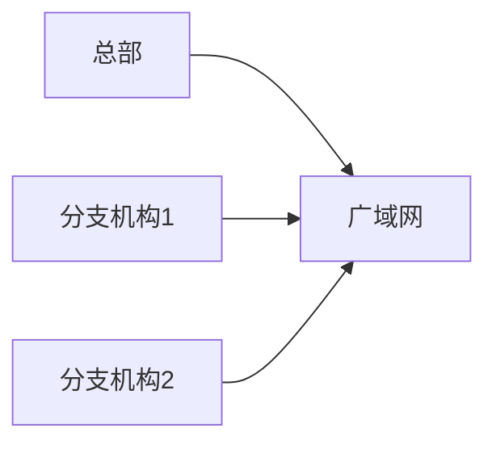

## 介绍

计算机网络是现代信息技术的基础，它将分布在不同地理位置的计算机设备连接起来，实现资源共享和信息传递。根据覆盖范围、拓扑结构和使用场景的不同，计算机网络可以分为多种类型。本文将详细介绍常见的网络分类及其特点，帮助初学者建立对计算机网络的基本理解。

---

## 网络分类

计算机网络通常根据其覆盖范围分为以下几类：

1. **局域网（LAN, Local Area Network）**
2. **城域网（MAN, Metropolitan Area Network）**
3. **广域网（WAN, Wide Area Network）**
4. **个人区域网（PAN, Personal Area Network）**

下面我们将逐一介绍这些网络类型及其特点。

---

### 1. 局域网（LAN）

局域网是一种覆盖范围较小的网络，通常用于连接同一建筑物或校园内的计算机设备。它的特点是传输速度快、延迟低，适合小范围内的资源共享。

#### 特点：
- **覆盖范围**：通常不超过几公里。
- **传输速率**：高，通常在 100 Mbps 到 10 Gbps 之间。
- **拓扑结构**：常见的拓扑结构包括星型、环型和总线型。
- **应用场景**：办公室、学校、家庭等小范围网络。

#### 实际案例：
在一个办公室中，所有员工的计算机通过交换机连接在一起，形成一个局域网。员工可以共享打印机、文件和数据库等资源。

---

### 2. 城域网（MAN）

城域网覆盖的范围比局域网大，通常是一个城市或一个大型园区。它通过光纤或其他高速传输介质连接多个局域网。

#### 特点：
- **覆盖范围**：几公里到几十公里。
- **传输速率**：较高，通常在 1 Gbps 到 10 Gbps 之间。
- **拓扑结构**：通常采用环形或网状结构。
- **应用场景**：城市范围内的企业、政府机构或大学校园。

#### 实际案例：
一个城市的多个分支机构通过光纤连接在一起，形成一个城域网。分支机构之间可以快速共享数据和资源。

---

### 3. 广域网（WAN）

广域网覆盖的范围最大，可以跨越国家甚至全球。它通过公共或专用通信线路连接多个局域网或城域网。

#### 特点：
- **覆盖范围**：几百公里到全球范围。
- **传输速率**：相对较低，通常在 1 Mbps 到 100 Mbps 之间。
- **拓扑结构**：复杂的网状结构。
- **应用场景**：跨国公司、互联网服务提供商（ISP）等。

#### 实际案例：
一家跨国公司的总部和分布在全球的分支机构通过广域网连接在一起，实现全球范围内的数据共享和通信。

---

### 4. 个人区域网（PAN）

个人区域网是一种覆盖范围极小的网络，通常用于连接个人设备，如智能手机、平板电脑和笔记本电脑。

#### 特点：
- **覆盖范围**：几米到几十米。
- **传输速率**：较低，通常在 1 Mbps 到 100 Mbps 之间。
- **拓扑结构**：点对点或星型结构。
- **应用场景**：个人设备之间的数据传输，如蓝牙耳机与手机的连接。

#### 实际案例：
用户通过蓝牙将手机与耳机连接，形成一个个人区域网，实现音频传输。

---

## 总结

计算机网络根据覆盖范围可以分为局域网、城域网、广域网和个人区域网。每种网络类型都有其独特的特点和应用场景。理解这些分类及其特点，有助于我们更好地设计和维护网络系统。

---

## 附加资源与练习

### 资源：
- [计算机网络基础教程](https://example.com)
- [网络拓扑结构详解](https://example.com)

### 练习：
1. 描述你所在学校或公司的网络类型，并分析其特点。
2. 设计一个小型局域网，画出其拓扑结构图。
3. 比较局域网和广域网的优缺点。

:::tip
如果你对网络分类有任何疑问，欢迎在评论区留言，我们会尽快为你解答！
:::