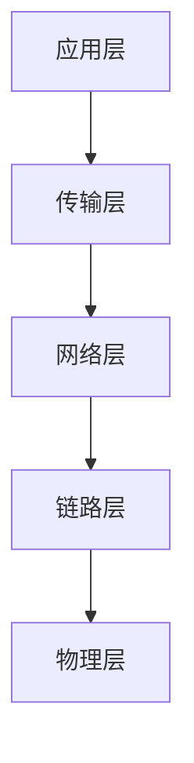
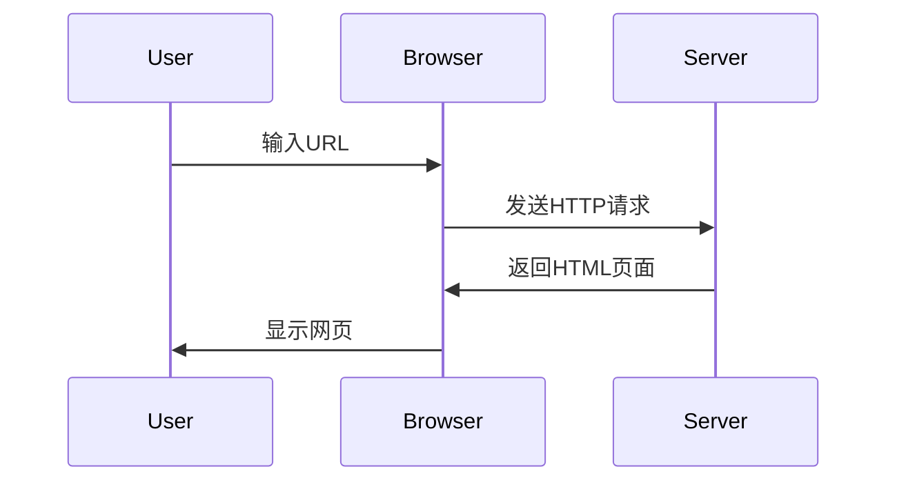

## 引言

计算机网络是现代信息社会的基石，它使得全球范围内的信息交换成为可能。从最初的简单通信技术到如今的复杂互联网架构，计算机网络的发展经历了多个重要阶段。本文将带你回顾计算机网络的发展历史，帮助你理解这一领域的演变过程。

## 早期通信技术

在计算机网络出现之前，人类已经发展出了多种通信技术。这些技术为后来的计算机网络奠定了基础。

### 电报与电话

19世纪中叶，电报的发明标志着远距离通信的开始。电报通过电信号传输信息，极大地提高了通信速度。随后，电话的发明进一步推动了通信技术的发展，使得语音通信成为可能。

:::note
电报和电话的发明为后来的计算机网络提供了重要的技术基础。
:::

## 计算机网络的诞生

20世纪中叶，随着计算机技术的发展，人们开始探索如何将多台计算机连接起来，以实现资源共享和信息交换。

### ARPANET

1969年，美国国防部高级研究计划局（ARPA）启动了ARPANET项目，这是世界上第一个计算机网络。ARPANET最初连接了四所大学的计算机，采用了分组交换技术，为后来的互联网奠定了基础。

:::tip
ARPANET的成功证明了分组交换技术的可行性，这一技术至今仍是互联网的核心。
:::

### TCP/IP协议

1970年代，ARPANET的研究人员开发了TCP/IP协议，这是现代互联网的基础协议。TCP/IP协议定义了数据如何在网络中传输，并确保了不同网络之间的互操作性。

:::caution
TCP/IP协议的分层结构使得网络设计更加模块化，但也增加了复杂性。
:::

## 互联网的普及

1980年代，随着TCP/IP协议的广泛应用，ARPANET逐渐演变为互联网。1990年代，万维网（WWW）的发明使得互联网变得更加易用，推动了互联网的普及。

### 万维网（WWW）

1991年，蒂姆·伯纳斯-李（Tim Berners-Lee）发明了万维网，这是一种基于超文本的信息系统。万维网通过浏览器和服务器之间的通信，使得用户可以方便地访问和共享信息。

:::warning
万维网的发明极大地推动了互联网的普及，但也带来了安全和隐私问题。
:::

## 现代互联网

21世纪以来，互联网技术不断发展，出现了许多新的应用和技术，如云计算、物联网和5G网络。

### 云计算

云计算通过互联网提供计算资源和服务，使得用户可以按需使用计算能力。云计算的出现极大地改变了IT行业的格局。

:::tip
云计算使得企业和个人可以更灵活地使用计算资源，但也带来了数据安全和隐私保护的挑战。
:::

### 物联网（IoT）

物联网是指通过互联网连接各种物理设备，实现设备之间的通信和数据交换。物联网的应用范围非常广泛，包括智能家居、工业自动化等。

:::caution
物联网的发展带来了许多便利，但也增加了网络安全的复杂性。
:::

## 总结

计算机网络的发展历史是一部技术创新和应用扩展的历史。从早期的电报和电话，到ARPANET和TCP/IP协议，再到现代互联网和云计算，计算机网络不断演变，推动了信息社会的进步。

## 附加资源与练习

- **推荐阅读**: 《计算机网络：自顶向下方法》 by James F. Kurose and Keith W. Ross
- **在线课程**: Coursera上的《计算机网络基础》课程
- **练习**: 尝试使用Wireshark工具分析网络流量，理解TCP/IP协议的工作原理

:::note
通过阅读和实践，你可以更深入地理解计算机网络的发展历史及其重要性。
:::