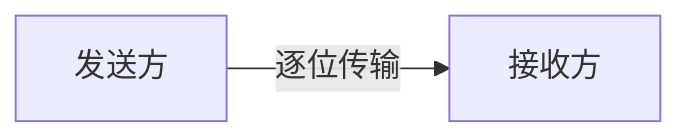
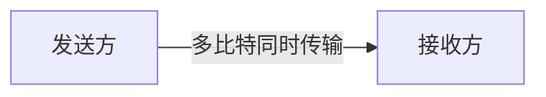

# 数据通信基础

数据通信是计算机网络的核心组成部分，它涉及数据的传输、接收和处理。无论是浏览网页、发送电子邮件，还是进行视频通话，数据通信都在背后发挥着关键作用。本文将带你了解数据通信的基本概念、传输方式以及实际应用场景。

## 什么是数据通信？

数据通信是指通过某种传输介质（如电缆、光纤或无线信号）在两个或多个设备之间传输数据的过程。它通常涉及以下三个主要组成部分：

1. **发送方**：生成并发送数据的设备。
2. **接收方**：接收并处理数据的设备。
3. **传输介质**：数据从发送方传输到接收方的物理路径。

数据通信的目标是确保数据能够准确、高效地从发送方传输到接收方。

## 数据传输方式

数据通信可以通过两种主要方式进行传输：**串行传输**和**并行传输**。

### 1. 串行传输

在串行传输中，数据以**逐位**的方式通过单一通信线路传输。这种方式适用于长距离通信，因为它减少了线路的数量，从而降低了成本。



**优点**：
- 适合长距离通信。
- 线路成本低。

**缺点**：
- 传输速度相对较慢。

### 2. 并行传输

在并行传输中，数据以**多比特**的方式通过多条通信线路同时传输。这种方式通常用于短距离通信，如计算机内部的数据传输。



**优点**：
- 传输速度快。

**缺点**：
- 线路成本高。
- 不适合长距离通信。

## 数据通信协议

数据通信协议是设备之间进行通信时遵循的规则和标准。常见的协议包括：

- **TCP/IP**：用于互联网通信的核心协议。
- **HTTP/HTTPS**：用于网页浏览的协议。
- **FTP**：用于文件传输的协议。

以下是一个简单的 Python 示例，展示如何使用 `socket` 模块进行基本的 TCP 通信：

```python
# 服务器端代码
import socket

server_socket = socket.socket(socket.AF_INET, socket.SOCK_STREAM)
server_socket.bind(('localhost', 12345))
server_socket.listen(1)

print("等待客户端连接...")
client_socket, addr = server_socket.accept()
print(f"已连接到 {addr}")

data = client_socket.recv(1024)
print(f"接收到数据: {data.decode()}")

client_socket.send("Hello from server!".encode())
client_socket.close()
```

```python
# 客户端代码
import socket

client_socket = socket.socket(socket.AF_INET, socket.SOCK_STREAM)
client_socket.connect(('localhost', 12345))

client_socket.send("Hello from client!".encode())
data = client_socket.recv(1024)
print(f"接收到数据: {data.decode()}")

client_socket.close()
```

**输出**：
- 服务器端输出：`接收到数据: Hello from client!`
- 客户端输出：`接收到数据: Hello from server!`

:::tip
在实际应用中，数据通信协议通常比这个示例复杂得多，但它们的基本原理是相似的。
:::

## 实际应用场景

### 1. 互联网浏览

当你访问一个网站时，你的浏览器会通过 HTTP/HTTPS 协议与服务器进行通信，请求网页内容并将其显示在你的屏幕上。

### 2. 电子邮件

发送电子邮件时，SMTP 协议用于将邮件从发送方传输到接收方的邮件服务器，而 POP3 或 IMAP 协议用于从邮件服务器下载邮件到接收方的设备。

### 3. 视频通话

视频通话应用（如 Zoom 或 Skype）使用实时传输协议（RTP）来传输音频和视频数据，确保通话的流畅性。

## 总结

数据通信是计算机网络的基础，它涉及数据的传输、接收和处理。本文介绍了数据通信的基本概念、传输方式以及实际应用场景。通过学习这些基础知识，你将能够更好地理解计算机网络的工作原理。

## 附加资源与练习

- **练习**：尝试使用 Python 的 `socket` 模块编写一个简单的聊天程序，支持多个客户端连接。
- **资源**：
  - [TCP/IP 协议详解](https://www.example.com/tcp-ip)
  - [HTTP/HTTPS 协议指南](https://www.example.com/http-https)
  - [计算机网络基础课程](https://www.example.com/network-basics)

:::note
如果你对数据通信的某个方面有疑问，欢迎在评论区提问，我们会尽快为你解答！
:::