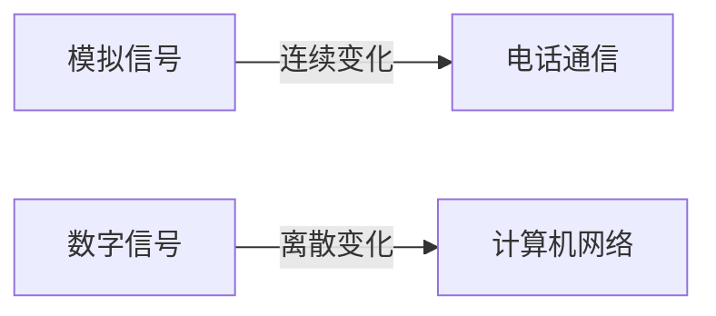

# 数据通信原理

数据通信是计算机网络和现代通信系统的基础。它涉及将数据从发送方传输到接收方的过程。无论是通过有线还是无线方式，数据通信都依赖于一系列物理层技术来实现高效、可靠的传输。本文将逐步介绍数据通信的基本原理，帮助初学者理解这一核心概念。

---

## 什么是数据通信？

数据通信是指通过某种介质（如电缆、光纤或无线电波）将数据从发送方传输到接收方的过程。它涉及以下几个关键步骤：

1. **数据编码**：将原始数据转换为适合传输的信号。
2. **信号传输**：通过物理介质传输信号。
3. **信号解码**：将接收到的信号还原为原始数据。

数据通信的核心目标是确保数据能够准确、高效地从发送方传递到接收方。

---

## 数据通信的基本组成

数据通信系统通常由以下几个部分组成：

1. **发送方**：生成并发送数据的设备。
2. **接收方**：接收并处理数据的设备。
3. **传输介质**：数据通过其传输的物理路径（如电缆、光纤或空气）。
4. **协议**：定义数据如何传输和接收的规则。

---

## 信号传输

信号是数据通信的核心。信号可以分为两种类型：

1. **模拟信号**：连续变化的信号，通常用于传统的电话通信。
2. **数字信号**：离散的信号，通常用于计算机网络。

### 模拟信号与数字信号的对比



---

## 数据编码

数据编码是将原始数据转换为适合传输的信号的过程。常见的编码方式包括：

- **不归零编码（NRZ）**：用高电平表示1，低电平表示0。
- **曼彻斯特编码**：每个比特周期中间有一个跳变，用于同步。

### 示例：曼彻斯特编码

假设我们要传输二进制数据 `1010`，曼彻斯特编码的结果如下：

```plaintext
原始数据：1 0 1 0
曼彻斯特编码：高-低 低-高 高-低 低-高
```

---

## 调制与解调

调制是将数字信号转换为模拟信号的过程，而解调则是将模拟信号还原为数字信号的过程。调制技术常用于无线通信中。

### 常见的调制技术

1. **幅度调制（AM）**：通过改变信号的幅度来传输数据。
2. **频率调制（FM）**：通过改变信号的频率来传输数据。
3. **相位调制（PM）**：通过改变信号的相位来传输数据。

---

## 实际应用案例

### 案例1：Wi-Fi通信

Wi-Fi是一种典型的无线数据通信技术。它使用无线电波作为传输介质，并通过调制技术将数字信号转换为模拟信号进行传输。

### 案例2：光纤通信

光纤通信使用光信号作为传输介质。数据通过激光或LED转换为光信号，并通过光纤传输到接收端。

---

## 总结

数据通信是计算机网络和现代通信系统的基石。通过理解信号传输、数据编码、调制与解调等核心概念，我们可以更好地掌握数据通信的工作原理。无论是Wi-Fi还是光纤通信，这些技术都依赖于数据通信的基本原理。

---

## 附加资源与练习

### 推荐资源
- 《计算机网络：自顶向下方法》——深入了解数据通信和网络协议。
- 《通信原理》——学习调制、解调和信号处理技术。

### 练习
1. 尝试用曼彻斯特编码对二进制数据 `1101` 进行编码。
2. 研究Wi-Fi通信中使用的调制技术，并写一篇简短的报告。

:::tip
如果你对数据通信的某个概念感到困惑，可以尝试通过模拟工具（如Wireshark）观察实际的数据传输过程。
:::