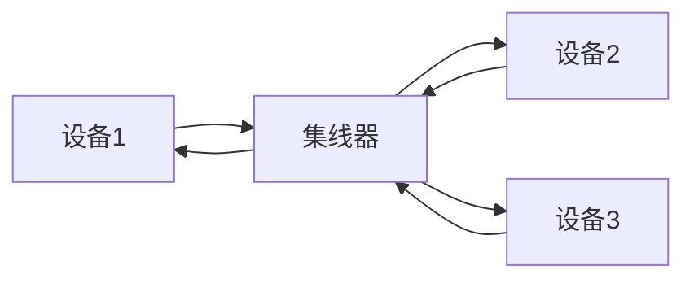
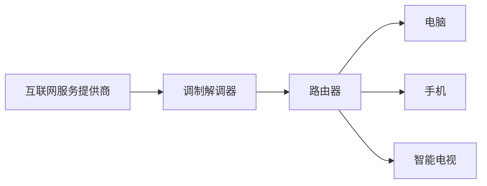
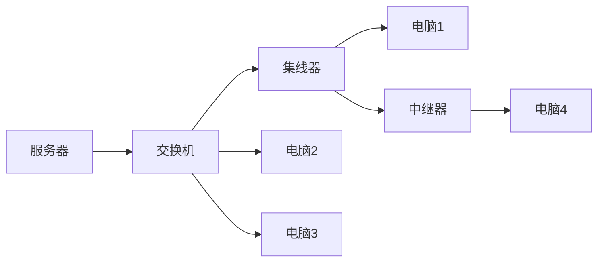

# 物理层设备

## 介绍

在计算机网络中，**物理层**是OSI模型中的第一层，负责在设备之间传输原始的比特流。物理层设备是实现这一功能的关键组件，它们负责将数据从一台设备传输到另一台设备。本文将介绍常见的物理层设备及其功能，帮助初学者理解这些设备在网络通信中的作用。

## 常见的物理层设备

### 1. 网卡（Network Interface Card, NIC）

**网卡**是计算机与网络之间的接口设备。它负责将计算机中的数据转换为网络可以传输的信号，并将接收到的信号转换回计算机可以理解的数据。

:::note
网卡通常集成在计算机的主板上，也可以通过PCI或USB接口外接。
:::

### 2. 集线器（Hub）

**集线器**是一种简单的网络设备，用于连接多个设备。它将从一个端口接收到的数据广播到所有其他端口。集线器工作在物理层，不进行任何数据过滤或处理。

:::caution
集线器会将数据广播到所有端口，这可能导致网络拥塞和安全问题。因此，在现代网络中，集线器已被交换机取代。
:::

### 3. 中继器（Repeater）

**中继器**用于扩展网络的传输距离。它接收信号并将其放大，然后重新发送，以克服信号衰减的问题。

:::tip
中继器通常用于长距离传输，如光纤通信中。
:::

### 4. 调制解调器（Modem）

**调制解调器**用于将数字信号转换为模拟信号（调制），以便通过电话线传输，并将接收到的模拟信号转换回数字信号（解调）。

:::note
调制解调器在早期的互联网接入中非常常见，但随着宽带技术的发展，其使用逐渐减少。
:::

## 实际应用案例

### 案例1：家庭网络

在一个典型的家庭网络中，调制解调器将互联网信号从ISP（互联网服务提供商）传输到家庭路由器。路由器通过网卡连接到家庭中的各种设备，如电脑、手机和智能电视。

### 案例2：企业网络

在企业网络中，集线器和交换机用于连接多个设备。中继器用于扩展网络的覆盖范围，特别是在大型办公楼或园区中。

## 总结

物理层设备是计算机网络的基础，它们负责数据的传输和信号的转换。了解这些设备的功能和应用场景，有助于更好地理解网络通信的基本原理。

## 附加资源与练习

- **练习1**：尝试在家中或办公室中识别不同的物理层设备，并描述它们的功能。
- **练习2**：研究现代网络中的物理层设备，如光纤收发器，并比较它们与传统设备的区别。

:::tip
深入学习物理层设备的工作原理，可以帮助你更好地理解网络通信的底层机制。
:::