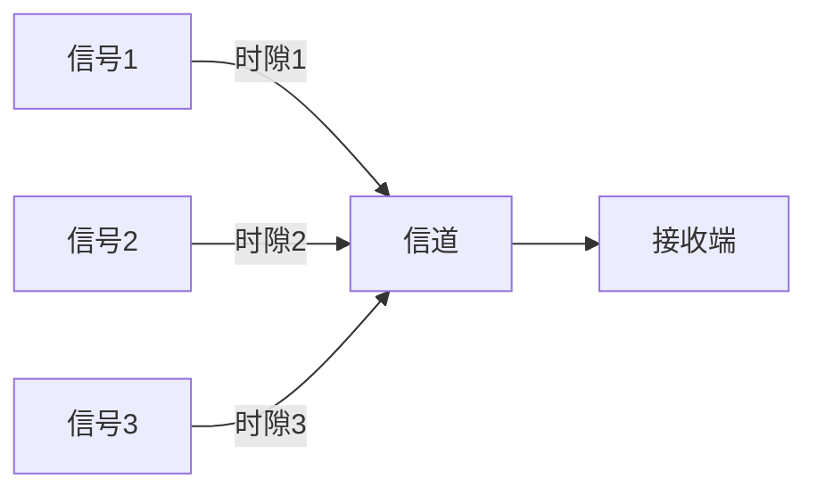
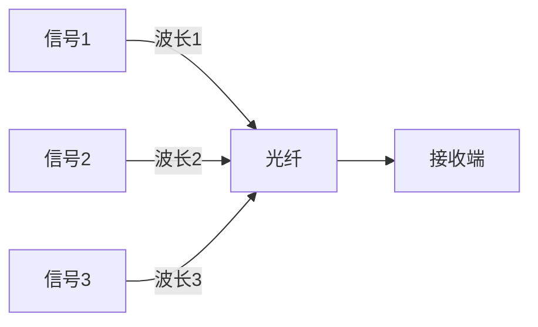
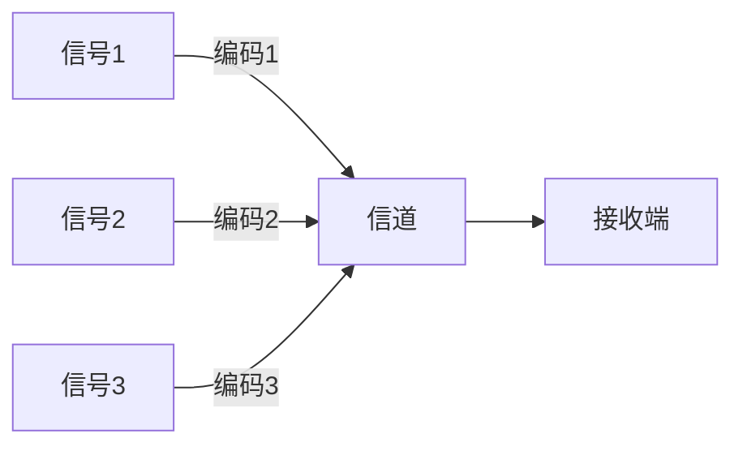

# 多路复用技术

## 介绍

多路复用技术（Multiplexing）是通信系统中一种重要的技术，它允许多个信号通过单一的通信信道进行传输。通过多路复用技术，我们可以有效地利用带宽资源，提高通信效率。本文将介绍多路复用的基本概念、常见类型以及实际应用场景。

## 多路复用的基本概念

多路复用技术的主要目的是将多个信号合并到一个信道中进行传输，然后在接收端将这些信号分离出来。这样可以节省带宽资源，降低通信成本。

### 多路复用的类型

多路复用技术主要分为以下几种类型：

1. **频分多路复用（FDM）**
2. **时分多路复用（TDM）**
3. **波分多路复用（WDM）**
4. **码分多路复用（CDM）**

接下来，我们将逐一介绍这些类型。

#### 1. 频分多路复用（FDM）

频分多路复用（Frequency Division Multiplexing, FDM）是将不同频率的信号分配到不同的频段上进行传输。每个信号占用一个特定的频段，互不干扰。

#### 2. 时分多路复用（TDM）

时分多路复用（Time Division Multiplexing, TDM）是将时间划分为多个时隙，每个信号在不同的时隙中传输。所有信号轮流使用信道，但每个信号只在特定的时隙中传输。

#### 3. 波分多路复用（WDM）

波分多路复用（Wavelength Division Multiplexing, WDM）主要用于光纤通信中，将不同波长的光信号合并到一根光纤中进行传输。每个信号占用一个特定的波长。

#### 4. 码分多路复用（CDM）

码分多路复用（Code Division Multiplexing, CDM）是通过为每个信号分配一个唯一的编码来实现多路复用。所有信号在同一频段和时间内传输，但通过编码来区分不同的信号。

## 实际应用场景

### 1. 电话系统

在传统的电话系统中，频分多路复用（FDM）被广泛使用。每个电话信号被分配到不同的频段，通过一根电话线传输多个电话信号。

### 2. 光纤通信

在光纤通信中，波分多路复用（WDM）技术被广泛应用。通过将不同波长的光信号合并到一根光纤中，可以大幅提高光纤的传输容量。

### 3. 无线通信

在无线通信中，码分多路复用（CDM）技术被用于3G和4G网络中。通过为每个用户分配一个唯一的编码，多个用户可以同时使用同一频段进行通信。

## 总结

多路复用技术是通信系统中不可或缺的一部分，它通过将多个信号合并到一个信道中进行传输，有效地利用了带宽资源。本文介绍了多路复用的基本概念、常见类型以及实际应用场景。希望通过本文的学习，您能够对多路复用技术有一个全面的了解。

## 附加资源

- [多路复用技术 - 维基百科](https://zh.wikipedia.org/wiki/%E5%A4%9A%E8%B7%AF%E5%A4%8D%E7%94%A8)
- [通信系统原理 - 清华大学公开课](https://www.coursera.org/learn/communication-systems)

## 练习

1. 解释频分多路复用和时分多路复用的区别。
2. 在光纤通信中，为什么波分多路复用技术比频分多路复用技术更有效？
3. 尝试编写一个简单的模拟程序，模拟时分多路复用的过程。

:::tip
在编写模拟程序时，可以使用Python等编程语言来实现简单的多路复用模拟。
:::