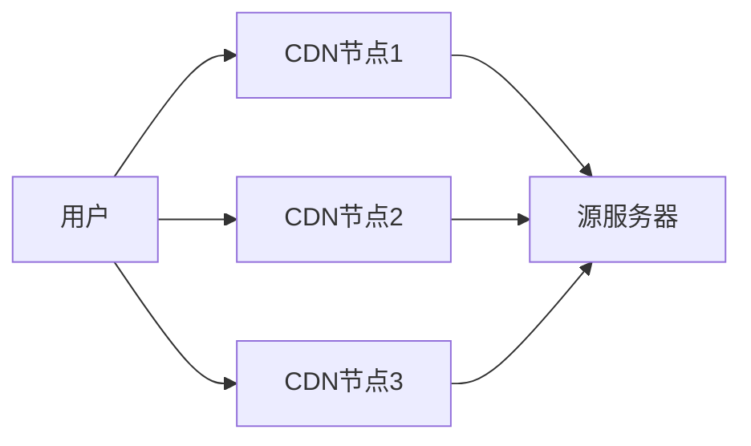

## 介绍

互联网架构是指支撑全球互联网运行的技术框架和设计模式。它由多个层次和组件组成，共同协作以实现数据的传输、存储和处理。理解互联网架构是学习网络技术的基础，因为它帮助我们了解互联网如何连接全球用户、设备和应用程序。

:::note
互联网架构的核心目标是确保数据的可靠传输、高效路由和安全性。
:::

## 互联网架构的组成部分

互联网架构可以分为以下几个主要部分：

1. **客户端-服务器模型**  
   这是互联网中最常见的架构模式。客户端（如浏览器）向服务器（如网站）发送请求，服务器处理请求并返回响应。

2. **网络协议**  
   网络协议是互联网通信的规则和标准。常见的协议包括：
   - **HTTP/HTTPS**：用于网页浏览。
   - **TCP/IP**：用于数据传输。
   - **DNS**：用于域名解析。

3. **网络基础设施**  
   包括路由器、交换机、光纤电缆等硬件设备，以及数据中心和云服务提供商。

4. **分布式系统**  
   互联网是一个分布式系统，数据和服务分布在多个地理位置，以提高可靠性和性能。

## 客户端-服务器模型

客户端-服务器模型是互联网架构的基础。以下是一个简单的示例，展示客户端如何与服务器交互：

```python
# 客户端代码示例（Python）
import requests

# 向服务器发送GET请求
response = requests.get("https://api.example.com/data")
print(response.json())  # 输出服务器返回的数据
```

**输入：**  
客户端发送一个HTTP GET请求到 `https://api.example.com/data`。

**输出：**  
服务器返回JSON格式的数据，例如：
```json
{
  "status": "success",
  "data": {
    "id": 1,
    "name": "Example Data"
  }
}
```

:::tip
客户端-服务器模型的优势在于它的简单性和可扩展性。服务器可以同时为多个客户端提供服务。
:::

## 网络协议的作用

网络协议是互联网通信的基石。以下是一些关键协议的功能：

- **HTTP/HTTPS**：用于在客户端和服务器之间传输超文本（如网页）。
- **TCP/IP**：确保数据包在网络上可靠传输。
- **DNS**：将人类可读的域名（如 `www.example.com`）转换为机器可读的IP地址（如 `192.0.2.1`）。

以下是一个DNS查询的示例：

```bash
# 使用命令行工具查询域名
nslookup www.example.com
```

**输出：**  
```
Server: 192.168.1.1
Address: 192.168.1.1#53

Non-authoritative answer:
Name: www.example.com
Address: 93.184.216.34
```

## 分布式系统的实际应用

分布式系统是互联网架构的重要组成部分。以下是一个实际案例：

:::caution
分布式系统的复杂性较高，但它的优势在于高可用性和容错能力。
:::

**案例：内容分发网络（CDN）**  
CDN是一种分布式系统，用于将内容（如图片、视频）缓存到全球多个服务器节点。当用户请求内容时，CDN会从离用户最近的节点提供服务，从而减少延迟。



## 总结

互联网架构是一个复杂但高度组织化的系统，由客户端-服务器模型、网络协议、网络基础设施和分布式系统等部分组成。理解这些组件及其相互作用是学习互联网技术的关键。

## 附加资源

- [MDN Web Docs - HTTP](https://developer.mozilla.org/en-US/docs/Web/HTTP)
- [Cloudflare Learning Center - What is a CDN?](https://www.cloudflare.com/learning/cdn/what-is-a-cdn/)
- [Khan Academy - Internet 101](https://www.khanacademy.org/computing/computers-and-internet)

## 练习

1. 使用Python编写一个简单的HTTP客户端，向 `https://jsonplaceholder.typicode.com/posts` 发送GET请求，并打印返回的JSON数据。
2. 使用 `nslookup` 或 `dig` 命令查询你最喜欢的网站的IP地址。
3. 研究一个实际的CDN提供商（如Cloudflare或Akamai），并了解其工作原理。