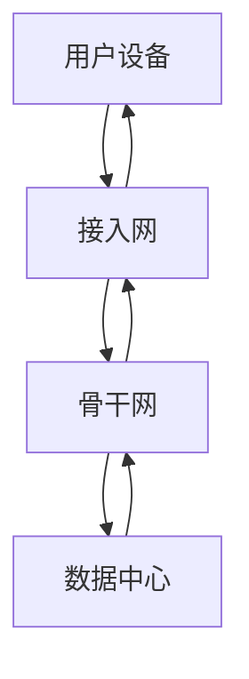

## 引言

在互联网的世界中，**骨干网**和**接入网**是两个至关重要的概念。它们共同构成了互联网的基础设施，确保数据能够高效、稳定地传输到全球各地。对于初学者来说，理解这两者的区别和功能是学习互联网技术的重要一步。

本文将逐步讲解骨干网与接入网的定义、作用、区别以及实际应用场景，帮助你全面掌握这些概念。

---

## 什么是骨干网？

**骨干网**（Backbone Network）是互联网的核心部分，负责在不同区域之间传输大量数据。它由高速光纤线路、路由器、交换机等设备组成，连接着全球各地的数据中心、互联网服务提供商（ISP）和大型网络节点。

骨干网的特点包括：
- **高带宽**：能够处理大量数据的传输。
- **低延迟**：确保数据能够快速到达目的地。
- **高可靠性**：采用冗余设计，避免单点故障。

:::tip
骨干网可以类比为高速公路系统，连接着各个城市（区域网络），确保车辆（数据）能够快速、高效地通行。
:::

---

## 什么是接入网？

**接入网**（Access Network）是连接用户设备（如电脑、手机）与骨干网的桥梁。它负责将用户的数据传输到骨干网，并从骨干网接收数据返回给用户。

接入网的主要形式包括：
- **DSL（数字用户线路）**：通过电话线提供互联网接入。
- **光纤到户（FTTH）**：使用光纤直接连接到用户家中。
- **无线接入**：如Wi-Fi、4G/5G等。

:::note
接入网可以类比为从高速公路（骨干网）到你家门口的小路，确保你能够方便地进出主干道。
:::

---

## 骨干网与接入网的区别

| 特性          | 骨干网                          | 接入网                          |
|---------------|---------------------------------|---------------------------------|
| **作用**      | 连接不同区域，传输大量数据       | 连接用户设备与骨干网            |
| **带宽**      | 高带宽（Tbps级别）              | 较低带宽（Mbps到Gbps级别）      |
| **覆盖范围**  | 全球或区域范围                  | 局部范围（家庭、办公室等）      |
| **设备**      | 高速路由器、光纤线路            | 调制解调器、无线接入点等        |

---

## 实际应用场景

### 1. 视频流媒体服务
当你观看在线视频时，数据从视频提供商的服务器通过骨干网传输到你的ISP，再通过接入网传输到你的设备。骨干网的高带宽和低延迟确保了视频的流畅播放。

### 2. 云计算服务
云计算服务依赖于骨干网将用户请求传输到远程数据中心，并将处理结果返回给用户。接入网则确保用户能够快速访问这些服务。

---

## 总结

骨干网和接入网是互联网基础设施的两个关键组成部分。骨干网负责大规模数据传输，而接入网则连接用户与骨干网。理解它们的区别和作用，有助于你更好地掌握互联网的工作原理。

---

## 附加资源与练习

### 推荐阅读
- [《计算机网络：自顶向下方法》](https://example.com) - 深入了解互联网架构。
- [互联网工程任务组（IETF）文档](https://ietf.org) - 了解互联网标准和技术细节。

### 练习
1. 画出一个简单的网络拓扑图，标注出骨干网和接入网的位置。
2. 研究你所在地区的ISP，了解它们使用的接入网技术（如DSL、光纤或无线）。

通过以上内容，你应该对骨干网与接入网有了全面的了解。继续深入学习，你将能够更好地理解互联网的运作机制！