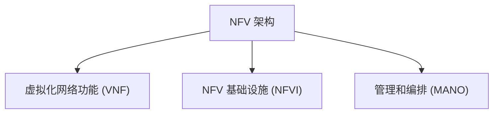

# 网络功能虚拟化(NFV)

## 介绍

网络功能虚拟化（Network Functions Virtualization，简称 NFV）是一种通过虚拟化技术将传统网络设备（如路由器、防火墙、负载均衡器等）的功能从专用硬件中解耦出来，并在通用服务器上运行的技术。NFV 的目标是提高网络灵活性、降低成本，并加速新服务的部署。

:::note
NFV 与 SDN（软件定义网络）不同，但两者可以结合使用。SDN 关注的是网络的控制平面和数据平面的分离，而 NFV 关注的是网络功能的虚拟化。
:::

## NFV 的基本架构

NFV 架构主要由以下几个组件组成：

1. **虚拟化网络功能（VNF）**：这是运行在虚拟机或容器中的软件实例，提供传统网络设备的功能。
2. **NFV 基础设施（NFVI）**：包括计算、存储和网络资源，用于支持 VNF 的运行。
3. **管理和编排（MANO）**：负责 VNF 的生命周期管理、资源分配和网络服务的编排。



## NFV 的工作原理

1. **虚拟化网络功能（VNF）**：VNF 是 NFV 的核心，它将传统网络设备的功能（如防火墙、负载均衡器等）以软件的形式实现，并运行在虚拟机或容器中。
2. **NFV 基础设施（NFVI）**：NFVI 提供了运行 VNF 所需的计算、存储和网络资源。这些资源可以是物理的，也可以是虚拟的。
3. **管理和编排（MANO）**：MANO 负责 VNF 的部署、配置、监控和扩展。它确保网络服务能够根据需求动态调整。

## 实际应用场景

### 1. 虚拟化防火墙

传统防火墙通常部署在专用硬件上，而 NFV 允许将防火墙功能虚拟化，并在通用服务器上运行。这使得防火墙的部署更加灵活，且可以根据流量需求动态扩展。

```bash
# 示例：部署虚拟化防火墙
vnf-deploy --name my-firewall --image firewall-vnf --flavor small
```

### 2. 虚拟化负载均衡器

负载均衡器用于将流量分配到多个服务器，以提高系统的可用性和性能。通过 NFV，负载均衡器可以以软件的形式运行，并根据流量需求动态调整。

```bash
# 示例：部署虚拟化负载均衡器
vnf-deploy --name my-loadbalancer --image loadbalancer-vnf --flavor medium
```

### 3. 5G 网络中的 NFV

在 5G 网络中，NFV 被广泛用于虚拟化核心网功能（如 MME、SGW、PGW 等）。这使得 5G 网络能够更加灵活地应对不同的业务需求，并降低运营成本。

## 总结

网络功能虚拟化（NFV）通过将传统网络设备的功能虚拟化，并在通用服务器上运行，极大地提高了网络的灵活性和可扩展性。NFV 不仅降低了硬件成本，还加速了新服务的部署。随着 5G 和云计算的快速发展，NFV 将在未来的网络架构中扮演越来越重要的角色。

## 附加资源

- [ETSI NFV 标准文档](https://www.etsi.org/technologies/nfv)
- [OpenStack Tacker - NFV 管理和编排工具](https://docs.openstack.org/tacker/latest/)
- [NFV 入门指南](https://www.sdxcentral.com/nfv/definitions/nfv-network-functions-virtualization/)

## 练习

1. 尝试在本地虚拟机中部署一个简单的 VNF（如虚拟化防火墙）。
2. 研究并比较 NFV 和 SDN 的异同点。
3. 探索如何在 5G 网络中使用 NFV 技术。

:::tip
如果你对 NFV 有更多疑问，欢迎在评论区留言，我们会尽快回复！
:::