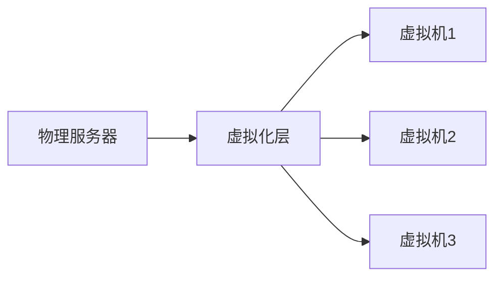
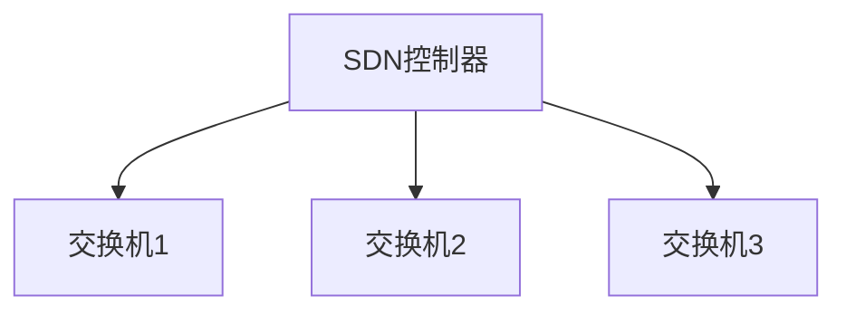

# 云网络

## 介绍

云网络（Cloud Networking）是指通过互联网连接和管理分布式计算资源的技术。它允许用户通过云服务提供商（如 AWS、Google Cloud、Azure 等）访问和管理计算资源、存储和网络服务。云网络的核心目标是提供灵活、可扩展和高可用的网络基础设施，以支持各种应用程序和服务。

## 云网络的基本概念

### 1. 虚拟化

云网络的基础是虚拟化技术。虚拟化允许将物理资源（如服务器、存储和网络）抽象为虚拟资源，从而更高效地管理和分配这些资源。



### 2. 软件定义网络（SDN）

软件定义网络（SDN）是一种网络架构，它将网络控制平面与数据平面分离。通过集中化的控制器，SDN 可以动态地管理和配置网络资源。



### 3. 网络功能虚拟化（NFV）

网络功能虚拟化（NFV）是一种将传统网络功能（如防火墙、负载均衡器等）虚拟化的技术。NFV 允许这些功能在虚拟机上运行，从而提高了灵活性和可扩展性。

## 云网络的工作原理

云网络通过虚拟化技术将物理网络资源抽象为虚拟资源，并通过 SDN 和 NFV 技术动态管理和配置这些资源。用户可以通过云服务提供商的管理界面或 API 来创建、配置和管理虚拟网络。

### 示例：创建一个虚拟网络

以下是一个使用 AWS CLI 创建虚拟网络的示例：

```bash
aws ec2 create-vpc --cidr-block 10.0.0.0/16
```

**输入：**

```bash
aws ec2 create-vpc --cidr-block 10.0.0.0/16
```

**输出：**

```json
{
    "Vpc": {
        "CidrBlock": "10.0.0.0/16",
        "DhcpOptionsId": "dopt-xxxxxxxx",
        "State": "pending",
        "VpcId": "vpc-xxxxxxxx",
        "InstanceTenancy": "default",
        "Ipv6CidrBlockAssociationSet": [],
        "CidrBlockAssociationSet": [
            {
                "AssociationId": "vpc-cidr-assoc-xxxxxxxx",
                "CidrBlock": "10.0.0.0/16",
                "CidrBlockState": {
                    "State": "associated"
                }
            }
        ],
        "IsDefault": false
    }
}
```

## 实际应用场景

### 1. 企业网络

企业可以使用云网络来构建和管理其内部网络，包括虚拟私有云（VPC）、子网、路由表和网络安全组。这使企业能够灵活地扩展其网络基础设施，同时保持高可用性和安全性。

### 2. 内容分发网络（CDN）

内容分发网络（CDN）利用云网络技术在全球范围内分发内容。通过将内容缓存到离用户更近的边缘节点，CDN 可以显著提高内容加载速度和用户体验。

### 3. 物联网（IoT）

物联网（IoT）设备通常需要连接到云网络以进行数据收集和分析。云网络提供了可扩展的网络基础设施，以支持大量 IoT 设备的连接和数据传输。

## 总结

云网络是现代互联网技术的重要组成部分，它通过虚拟化、SDN 和 NFV 技术提供了灵活、可扩展和高可用的网络基础设施。无论是企业网络、内容分发网络还是物联网，云网络都在其中发挥着关键作用。

## 附加资源

- [AWS VPC 文档](https://docs.aws.amazon.com/vpc/)
- [Google Cloud Networking 文档](https://cloud.google.com/network)
- [Azure Virtual Network 文档](https://docs.microsoft.com/en-us/azure/virtual-network/)

## 练习

1. 使用 AWS CLI 创建一个虚拟私有云（VPC），并配置子网和路由表。
2. 研究并比较不同云服务提供商的网络服务（如 AWS VPC、Google Cloud VPC 和 Azure Virtual Network）。
3. 尝试使用 SDN 控制器（如 OpenDaylight）配置一个简单的虚拟网络。

:::tip
在练习过程中，建议使用云服务提供商的免费层或试用账户，以避免产生不必要的费用。
:::