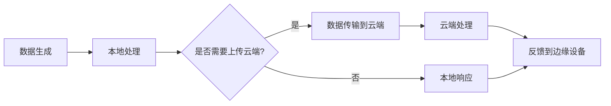

## 什么是边缘计算？

边缘计算（Edge Computing）是一种分布式计算架构，它将数据处理和存储从传统的集中式数据中心转移到靠近数据源的“边缘”设备上。这些边缘设备可以是智能手机、物联网设备、路由器或其他本地计算设备。通过这种方式，边缘计算能够减少延迟、提高数据处理效率，并降低对中心化云服务的依赖。

:::note
**边缘计算的核心思想**：将计算能力尽可能地靠近数据生成的地方，以减少数据传输的时间和带宽消耗。
:::

## 边缘计算的工作原理

边缘计算的工作原理可以简单概括为以下几个步骤：

1. **数据生成**：数据由边缘设备（如传感器、摄像头等）生成。
2. **本地处理**：数据在边缘设备或附近的边缘服务器上进行初步处理。
3. **数据传输**：只有必要的数据会被传输到云端进行进一步分析或存储。
4. **响应与反馈**：处理结果可以直接反馈给边缘设备，实现实时响应。



## 边缘计算的优势

1. **低延迟**：由于数据处理在本地进行，边缘计算能够显著减少数据传输的延迟，特别适合需要实时响应的应用场景。
2. **带宽节省**：只有必要的数据会被传输到云端，减少了网络带宽的消耗。
3. **数据隐私**：敏感数据可以在本地处理，减少了数据泄露的风险。
4. **可靠性**：即使网络连接中断，边缘设备仍然可以独立运行。

## 实际应用案例

### 1. 智能家居

在智能家居系统中，边缘计算可以用于本地处理传感器数据。例如，智能门锁可以通过边缘计算实时分析摄像头数据，判断是否有人试图非法入侵，而不需要将视频流传输到云端。

```python
# 示例：智能门锁的边缘计算逻辑
def detect_intrusion(video_frame):
    # 本地处理视频帧，检测异常
    if is_intrusion_detected(video_frame):
        return "Intrusion detected!"
    else:
        return "No intrusion detected."

# 假设 video_frame 是从摄像头获取的视频帧
video_frame = get_video_frame()
result = detect_intrusion(video_frame)
print(result)
```

**输出**：
```
Intrusion detected!
```

### 2. 自动驾驶

自动驾驶汽车需要实时处理大量的传感器数据（如摄像头、雷达、激光雷达等）。边缘计算可以在车辆内部处理这些数据，确保车辆能够快速做出驾驶决策，而不依赖于云端。

```python
# 示例：自动驾驶的边缘计算逻辑
def process_sensor_data(sensor_data):
    # 本地处理传感器数据，生成驾驶决策
    decision = make_driving_decision(sensor_data)
    return decision

# 假设 sensor_data 是从传感器获取的数据
sensor_data = get_sensor_data()
decision = process_sensor_data(sensor_data)
print(decision)
```

**输出**：
```
Turn left at the next intersection.
```

## 边缘计算的挑战

尽管边缘计算有许多优势，但它也面临一些挑战：

1. **设备资源有限**：边缘设备通常计算能力和存储空间有限，可能无法处理复杂的任务。
2. **安全性**：边缘设备可能更容易受到物理攻击或网络攻击。
3. **管理复杂性**：分布式系统的管理和维护比集中式系统更为复杂。

:::caution
**注意**：在设计边缘计算系统时，必须考虑到设备的资源限制和安全问题。
:::

## 总结

边缘计算是一种将计算能力推向数据源的技术，它能够显著减少延迟、节省带宽并提高数据隐私。尽管面临一些挑战，但边缘计算在智能家居、自动驾驶、工业物联网等领域有着广泛的应用前景。

## 附加资源与练习

- **推荐阅读**：
  - [边缘计算：从理论到实践](https://example.com/edge-computing-book)
  - [物联网与边缘计算的结合](https://example.com/iot-edge-computing)

- **练习**：
  1. 尝试编写一个简单的边缘计算程序，处理本地传感器数据并做出决策。
  2. 研究一个实际的边缘计算应用案例，并分析其优势和挑战。

:::tip
**提示**：如果你对边缘计算感兴趣，可以尝试使用 Raspberry Pi 或 Arduino 等设备进行实验，体验边缘计算的魅力。
:::