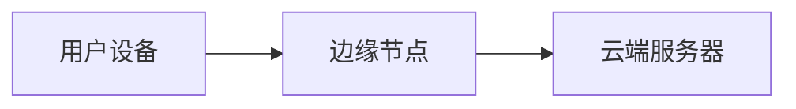

## 介绍

下一代互联网（Next-Generation Internet, NGI）是指通过新兴技术和架构改进当前互联网基础设施的演进方向。它旨在解决现有互联网的局限性，如安全性、速度、可扩展性和隐私问题。下一代互联网的核心目标是为用户提供更快速、更安全、更智能的网络体验。

:::note
下一代互联网并不是一个单一的技术，而是一系列技术和协议的集合，包括但不限于 5G、IPv6、区块链、边缘计算和人工智能。
:::

---

## 下一代互联网的核心技术

### 1. IPv6：下一代互联网协议

IPv6（Internet Protocol version 6）是当前 IPv4 的升级版本。IPv4 的地址空间有限（约 43 亿个地址），而 IPv6 提供了几乎无限的地址空间（约 3.4 × 10³⁸ 个地址），解决了 IP 地址耗尽的问题。

#### 示例：IPv6 地址格式
IPv6 地址由 8 组 16 位十六进制数组成，例如：
```
2001:0db8:85a3:0000:0000:8a2e:0370:7334
```

:::tip
IPv6 还支持自动配置和无状态地址分配，简化了网络管理。
:::

---

### 2. 5G 网络：更快的连接速度

5G 是第五代移动通信技术，提供了更高的数据传输速度、更低的延迟和更大的连接密度。它不仅是移动设备的革命，也是物联网（IoT）和边缘计算的关键推动力。

#### 示例：5G 延迟对比
- 4G 延迟：约 30-50 毫秒
- 5G 延迟：约 1 毫秒

---

### 3. 边缘计算：数据处理更接近用户

边缘计算将数据处理从中心化的云端转移到离用户更近的边缘节点。这减少了延迟，提高了实时性，特别适合自动驾驶、智能城市和工业物联网等场景。



:::caution
边缘计算需要更强的本地计算能力和更复杂的网络架构。
:::

---

### 4. 区块链：去中心化的信任机制

区块链技术通过去中心化的方式确保数据的安全性和透明性。它在下一代互联网中扮演着重要角色，特别是在金融、供应链管理和数字身份验证领域。

#### 示例：区块链交易
```javascript
const blockchain = [
    { from: "Alice", to: "Bob", amount: 10 },
    { from: "Bob", to: "Charlie", amount: 5 }
];
console.log(blockchain);
```

输出：
```
[
    { from: "Alice", to: "Bob", amount: 10 },
    { from: "Bob", to: "Charlie", amount: 5 }
]
```

---

## 实际应用案例

### 1. 智能城市

下一代互联网技术（如 5G 和边缘计算）被广泛应用于智能城市中。例如，交通信号灯可以根据实时交通数据动态调整，减少拥堵。

### 2. 远程医疗

5G 的低延迟和高带宽使远程手术成为可能。医生可以通过网络实时操控手术机器人，为偏远地区的患者提供医疗服务。

### 3. 去中心化金融（DeFi）

区块链技术推动了去中心化金融的发展，用户可以在没有中介的情况下进行借贷、交易和投资。

---

## 总结

下一代互联网通过 IPv6、5G、边缘计算和区块链等技术，正在重塑我们的网络世界。它不仅解决了现有互联网的局限性，还为未来的创新应用奠定了基础。

:::warning
尽管下一代互联网带来了许多机遇，但也伴随着新的挑战，如安全性、隐私保护和标准化问题。
:::

---

## 附加资源与练习

### 推荐阅读
- [IPv6 官方文档](https://www.ietf.org/rfc/rfc8200.txt)
- [5G 技术白皮书](https://www.3gpp.org/)
- [区块链入门指南](https://blockchain.info/)

### 练习
1. 编写一个简单的 JavaScript 程序，模拟区块链交易。
2. 研究你所在城市的智能城市项目，并分析其使用的下一代互联网技术。
3. 尝试配置一个 IPv6 地址，并测试其连接性。

---

通过本文，你应该对下一代互联网有了初步的了解。继续探索这些技术，你将更好地理解它们如何改变我们的未来！