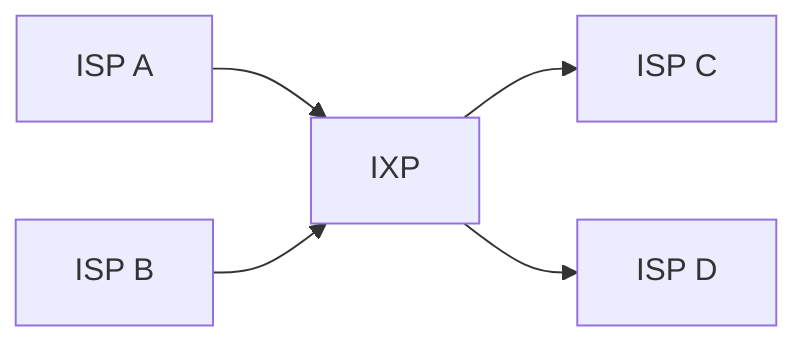

# ISP与IXP

## 介绍

在互联网的世界中，**互联网服务提供商（ISP）**和**互联网交换点（IXP）**是两个至关重要的组成部分。它们共同协作，确保我们能够顺畅地访问互联网上的各种资源。本文将详细介绍这两个概念，帮助你理解它们的工作原理以及它们如何影响我们的日常网络体验。

### 什么是ISP？

**互联网服务提供商（ISP）**是为个人、企业和其他组织提供互联网接入服务的公司。ISP通过多种技术（如DSL、光纤、卫星等）将用户连接到互联网。常见的ISP包括Comcast、AT&T和中国电信等。

### 什么是IXP？

**互联网交换点（IXP）**是多个ISP之间交换流量的物理基础设施。IXP的主要目的是减少数据包在互联网上的传输距离，从而提高网络性能并降低延迟。IXP通常位于数据中心内，由多个ISP共同维护。

## ISP的工作原理

ISP通过一系列网络设备和技术将用户连接到互联网。以下是ISP工作的基本步骤：

1. **用户接入**：用户通过调制解调器、路由器等设备连接到ISP的网络。
2. **数据传输**：ISP将用户的数据包传输到互联网骨干网。
3. **路由选择**：ISP使用路由协议（如BGP）选择最佳路径将数据包传输到目的地。
4. **返回数据**：目的地服务器返回的数据包通过相同的路径返回到用户。

:::note
ISP通常会提供多种服务，如宽带接入、电子邮件托管和虚拟主机等。
:::

## IXP的工作原理

IXP的主要功能是允许不同的ISP之间直接交换流量，而不需要通过第三方网络。以下是IXP工作的基本步骤：

1. **ISP连接**：多个ISP将它们的网络设备连接到IXP的交换机。
2. **流量交换**：ISP之间通过IXP直接交换流量，而不需要通过互联网骨干网。
3. **性能优化**：通过减少数据包的传输距离，IXP显著提高了网络性能并降低了延迟。

:::tip
IXP通常位于数据中心内，由多个ISP共同维护。它们使用高速交换机来处理大量的流量。
:::

## 实际案例

### 案例1：ISP的日常使用

假设你正在使用家中的Wi-Fi浏览网页。你的请求首先通过路由器发送到你的ISP（如Comcast）。Comcast将你的请求传输到互联网骨干网，最终到达目标服务器。服务器返回的数据包通过相同的路径返回到你的设备。

### 案例2：IXP的作用

假设你在美国访问一个位于欧洲的网站。如果没有IXP，你的请求可能需要经过多个ISP和互联网骨干网，导致较高的延迟。通过IXP，美国的ISP可以直接与欧洲的ISP交换流量，从而显著减少延迟。

## 总结

ISP和IXP在互联网中扮演着至关重要的角色。ISP为用户提供互联网接入服务，而IXP则通过优化流量交换提高了网络性能。理解这两个概念有助于你更好地理解互联网的工作原理。

## 附加资源

- [互联网服务提供商（ISP）](https://en.wikipedia.org/wiki/Internet_service_provider)
- [互联网交换点（IXP）](https://en.wikipedia.org/wiki/Internet_exchange_point)
- [BGP路由协议](https://en.wikipedia.org/wiki/Border_Gateway_Protocol)

## 练习

1. 解释ISP和IXP的主要区别。
2. 描述IXP如何优化网络性能。
3. 查找你所在地区的ISP和IXP，并描述它们如何协作提供互联网服务。

:::caution
确保在练习中使用正确的术语，并尽量结合实际案例进行解释。
:::