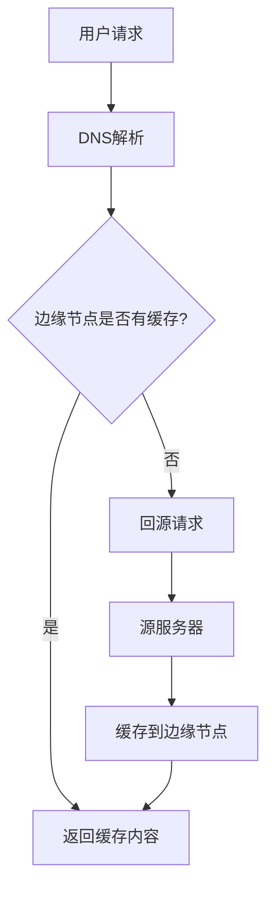

# CDN技术

## 什么是CDN？

CDN（Content Delivery Network，内容分发网络）是一种分布式服务器系统，旨在通过将内容缓存到离用户更近的服务器上，从而加快内容的加载速度。CDN的主要目标是减少延迟、提高网站性能，并减轻源服务器的负载。

## CDN的工作原理

CDN通过在全球多个地理位置部署服务器节点（也称为边缘节点）来工作。当用户请求某个资源（如图片、视频或网页）时，CDN会将请求路由到离用户最近的边缘节点，而不是直接访问源服务器。这样可以显著减少数据传输的距离和时间。

### CDN的工作流程

1. **用户请求**：用户尝试访问某个网站或资源。
2. **DNS解析**：用户的请求首先被发送到CDN的DNS服务器，该服务器会确定离用户最近的边缘节点。
3. **边缘节点响应**：如果边缘节点缓存了请求的资源，它会直接将资源返回给用户。
4. **回源请求**：如果边缘节点没有缓存该资源，它会向源服务器请求资源，缓存后再返回给用户。



## CDN的实际应用场景

### 1. 加速静态资源加载

静态资源（如图片、CSS文件、JavaScript文件）是网站加载速度的关键因素。通过将这些资源缓存到CDN的边缘节点，可以显著减少加载时间。

```html
<!-- 传统方式 -->


<!-- 使用CDN -->

```

### 2. 视频流媒体分发

视频流媒体服务（如Netflix、YouTube）使用CDN来分发视频内容。通过将视频缓存到离用户最近的边缘节点，可以确保流畅的播放体验。

```html
<video controls>
    <source src="https://cdn.example.com/videos/sample.mp4" type="video/mp4" />
    Your browser does not support the video tag.
</video>
```

### 3. 动态内容加速

虽然CDN主要用于缓存静态内容，但现代CDN也支持动态内容的加速。通过优化路由和使用边缘计算，CDN可以减少动态内容的延迟。

```javascript
// 传统方式
fetch('https://example.com/api/data')
    .then(response => response.json())
    .then(data => console.log(data));

// 使用CDN
fetch('https://cdn.example.com/api/data')
    .then(response => response.json())
    .then(data => console.log(data));
```

## CDN的优势

- **减少延迟**：通过将内容缓存到离用户更近的服务器，CDN可以显著减少加载时间。
- **提高可用性**：即使源服务器出现故障，CDN仍然可以提供缓存的内容。
- **减轻源服务器负载**：CDN可以处理大量用户请求，从而减轻源服务器的负载。
- **全球覆盖**：CDN的全球分布确保了无论用户位于何处，都能获得快速的访问体验。

## 总结

CDN技术是现代互联网基础设施的重要组成部分，它通过分布式缓存和优化路由，显著提高了内容的加载速度和可用性。无论是静态资源、视频流媒体还是动态内容，CDN都能提供显著的性能提升。

## 附加资源

- [CDN基础知识](https://www.cloudflare.com/learning/cdn/what-is-a-cdn/)
- [CDN性能优化](https://www.akamai.com/blog/performance/cdn-performance-optimization)
- [CDN与边缘计算](https://www.fastly.com/blog/edge-computing-vs-cdn)

## 练习

1. 尝试将你的静态资源（如图片、CSS文件）托管到CDN，并比较加载时间。
2. 研究不同的CDN提供商（如Cloudflare、Akamai、Fastly），并比较它们的性能和价格。
3. 使用CDN加速一个简单的API，并测试其响应时间。

:::tip
如果你对CDN技术有任何疑问，欢迎在评论区留言，我们会尽快回复你！
:::