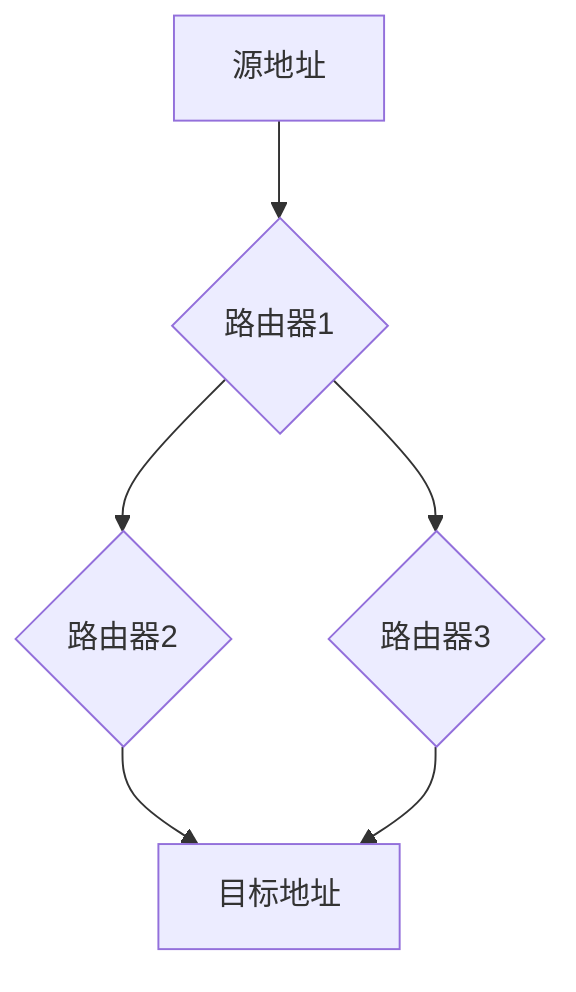

# 互联网路由策略

互联网路由策略是网络通信中的核心概念之一。它决定了数据包如何从源地址传输到目标地址。理解路由策略对于构建高效、可靠的网络至关重要。本文将逐步介绍路由策略的基本概念、工作原理以及实际应用场景。

## 什么是互联网路由策略？

互联网路由策略是指网络中路由器根据一定的规则和算法，选择最佳路径将数据包从源地址传输到目标地址的过程。这些规则和算法可以是静态的（手动配置）或动态的（自动调整）。

:::note
**路由策略的核心目标**：确保数据包能够高效、可靠地传输到目标地址，同时避免网络拥塞和故障。
:::

## 路由策略的基本类型

### 1. 静态路由

静态路由是由网络管理员手动配置的路由策略。它适用于小型网络或需要固定路由的场景。

**示例：**
```bash
# 在路由器上配置静态路由
ip route 192.168.1.0 255.255.255.0 10.0.0.1
```
**解释：**
- `192.168.1.0` 是目标网络。
- `255.255.255.0` 是子网掩码。
- `10.0.0.1` 是下一跳地址。

### 2. 动态路由

动态路由是路由器根据网络拓扑和状态自动调整的路由策略。常见的动态路由协议包括 RIP、OSPF 和 BGP。

**示例：**
```bash
# 配置 OSPF 动态路由协议
router ospf 1
 network 192.168.1.0 0.0.0.255 area 0
```
**解释：**
- `192.168.1.0` 是目标网络。
- `0.0.0.255` 是通配符掩码。
- `area 0` 是 OSPF 区域。

## 路由策略的工作原理

### 1. 路由表

路由器通过路由表来决定数据包的传输路径。路由表包含目标网络、下一跳地址和出接口等信息。

**示例路由表：**
```plaintext
Destination     Gateway         Genmask         Flags   Metric  Iface
192.168.1.0     10.0.0.1        255.255.255.0   U       0       eth0
```

### 2. 路由选择算法

路由器根据路由表中的信息，使用路由选择算法（如最短路径优先算法）选择最佳路径。



**解释：**
- 数据包从源地址出发，经过多个路由器，最终到达目标地址。
- 路由器根据路由表选择最佳路径。

## 实际应用场景

### 1. 企业网络

在企业网络中，路由策略用于连接不同的部门和分支机构。通过配置静态路由和动态路由，确保数据包能够高效传输。

**案例：**
- 总部和分支机构之间通过 VPN 连接，使用 OSPF 动态路由协议自动调整路由。

### 2. 互联网服务提供商（ISP）

ISP 使用 BGP（边界网关协议）来管理不同自治系统（AS）之间的路由。BGP 能够处理大规模的路由信息，确保全球互联网的连通性。

**案例：**
- ISP A 和 ISP B 之间通过 BGP 协议交换路由信息，确保用户能够访问全球互联网资源。

## 总结

互联网路由策略是网络通信的基础。通过静态路由和动态路由，路由器能够选择最佳路径传输数据包。理解路由策略的工作原理和应用场景，对于构建高效、可靠的网络至关重要。

## 附加资源

- **书籍推荐**：*《TCP/IP 详解》* 系列书籍，深入讲解网络协议和路由策略。
- **在线课程**：Coursera 上的 *《计算机网络》* 课程，适合初学者学习网络基础知识。
- **练习**：尝试在模拟器（如 GNS3）中配置静态路由和动态路由，加深理解。

:::tip
**小提示**：在学习路由策略时，建议从静态路由开始，逐步过渡到动态路由协议，如 OSPF 和 BGP。
:::