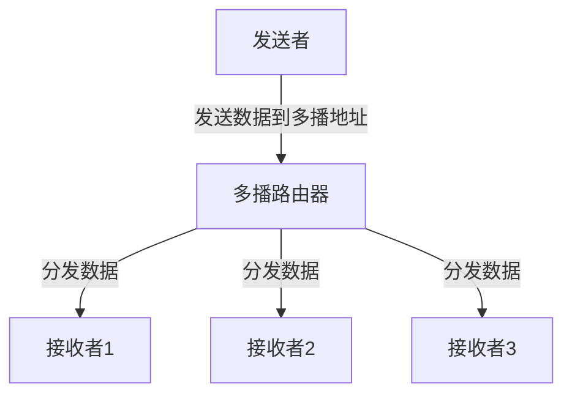

## 什么是多播技术？

多播（Multicast）是一种网络通信技术，允许一个发送者将数据同时传输给多个接收者，而不是像单播（Unicast）那样一对一传输，或像广播（Broadcast）那样传输给所有设备。多播技术的主要目的是高效地利用网络带宽，特别是在需要将相同数据分发给多个接收者的场景中。

:::note
多播技术常用于视频流、在线会议、实时数据分发等场景。
:::

## 多播的工作原理

多播依赖于特定的网络协议和地址来实现。以下是多播技术的关键组成部分：

1. **多播地址**：多播使用特殊的 IP 地址范围（例如 IPv4 的 `224.0.0.0` 到 `239.255.255.255`）来标识多播组。加入多播组的设备会监听这些地址。
2. **多播组**：接收者通过加入多播组来接收数据。发送者只需将数据发送到多播地址，网络会自动将数据分发给所有加入该组的设备。
3. **多播路由协议**：路由器使用多播路由协议（如 PIM，Protocol Independent Multicast）来确保数据只传输到需要它的网络部分。



## 多播技术的优势

- **高效利用带宽**：数据只需在网络上传输一次，路由器会将其复制并分发给多个接收者。
- **减少发送者负载**：发送者无需为每个接收者单独发送数据。
- **适用于大规模分发**：特别适合需要将相同数据分发给大量接收者的场景。

## 多播的实际应用

### 1. 视频流媒体
在线视频平台（如直播服务）使用多播技术将视频流同时传输给大量观众，从而减少服务器的负载和网络带宽的消耗。

### 2. 在线会议
多播技术可以用于实时传输音频和视频数据，确保所有参会者都能同步接收会议内容。

### 3. 金融数据分发
证券交易所使用多播技术将实时股票价格和交易数据分发给多个客户端。

## 代码示例：使用 Python 实现多播

以下是一个简单的 Python 示例，展示如何使用多播发送和接收数据。

### 发送者代码
```python
import socket

MULTICAST_GROUP = '224.1.1.1'
MULTICAST_PORT = 5007

# 创建 UDP 套接字
sock = socket.socket(socket.AF_INET, socket.SOCK_DGRAM)

# 设置多播 TTL（生存时间）
ttl = struct.pack('b', 1)
sock.setsockopt(socket.IPPROTO_IP, socket.IP_MULTICAST_TTL, ttl)

# 发送数据到多播组
message = b'Hello, Multicast!'
sock.sendto(message, (MULTICAST_GROUP, MULTICAST_PORT))
print(f"Sent: {message}")
```

### 接收者代码
```python
import socket

MULTICAST_GROUP = '224.1.1.1'
MULTICAST_PORT = 5007

# 创建 UDP 套接字
sock = socket.socket(socket.AF_INET, socket.SOCK_DGRAM)

# 绑定到多播端口
sock.bind(('', MULTICAST_PORT))

# 加入多播组
group = socket.inet_aton(MULTICAST_GROUP)
mreq = struct.pack('4sL', group, socket.INADDR_ANY)
sock.setsockopt(socket.IPPROTO_IP, socket.IP_ADD_MEMBERSHIP, mreq)

# 接收数据
while True:
    data, address = sock.recvfrom(1024)
    print(f"Received: {data} from {address}")
```

:::tip
在实际应用中，请确保网络设备（如路由器）支持多播，并正确配置多播路由协议。
:::

## 总结

多播技术是一种高效的数据传输方式，特别适用于需要将相同数据分发给多个接收者的场景。通过使用多播地址和多播组，网络可以优化带宽使用并减少发送者的负载。多播技术在视频流、在线会议和金融数据分发等领域有广泛的应用。

## 附加资源与练习

- **练习**：尝试修改上述代码，使其能够发送和接收文本消息。
- **深入学习**：研究多播路由协议（如 PIM）的工作原理。
- **扩展阅读**：了解 IPv6 中的多播技术及其与 IPv4 的区别。

:::caution
在实际部署多播技术时，请确保网络设备支持多播，并正确配置防火墙和路由规则。
:::