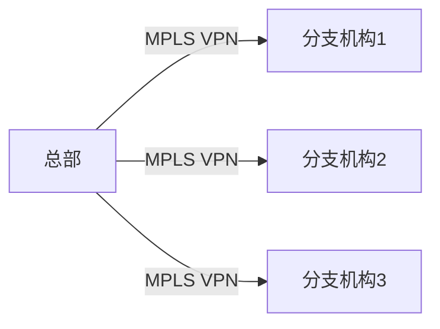
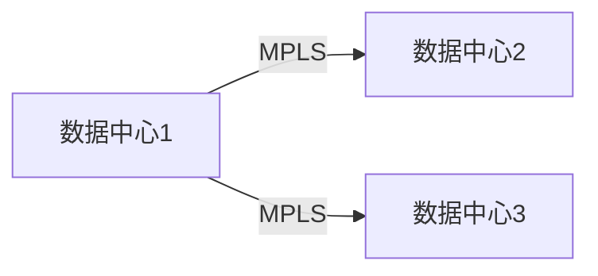

# MPLS技术

## 介绍

MPLS（多协议标签交换，Multiprotocol Label Switching）是一种用于高效数据传输的网络技术。它通过在数据包前添加一个标签（Label），简化了路由决策过程，从而提高了网络的传输速度和效率。MPLS广泛应用于企业网络、数据中心互联以及互联网服务提供商（ISP）的核心网络中。

## MPLS的工作原理

MPLS的核心思想是使用标签来转发数据包，而不是传统的IP地址查找。以下是MPLS的基本工作流程：

1. **标签分配**：当数据包进入MPLS网络时，边缘路由器（Label Edge Router, LER）会为其分配一个标签。
2. **标签交换**：数据包在MPLS网络中传输时，每个路由器（Label Switching Router, LSR）会根据标签进行转发，而不是根据IP地址。
3. **标签移除**：当数据包离开MPLS网络时，边缘路由器会移除标签，并将数据包转发到目标网络。

### 标签结构

MPLS标签是一个32位的字段，包含以下部分：

- **Label Value**（20位）：标签的实际值。
- **Experimental Bits**（3位）：用于实验或服务质量（QoS）标记。
- **Bottom of Stack**（1位）：指示是否为标签栈的底部。
- **Time to Live**（8位）：生存时间（TTL），用于防止数据包在网络中无限循环。

## MPLS的实际应用

### 案例1：企业网络

在企业网络中，MPLS常用于连接多个分支机构。通过MPLS，企业可以在不同地点之间建立虚拟专用网络（VPN），确保数据的安全性和高效传输。



### 案例2：数据中心互联

在数据中心互联（DCI）场景中，MPLS可以帮助实现跨数据中心的高效数据传输。通过MPLS，数据中心之间的流量可以绕过复杂的IP路由，直接通过标签交换进行传输。



## 代码示例

以下是一个简单的MPLS配置示例，展示了如何在Cisco路由器上配置MPLS：

```cisco
interface GigabitEthernet0/1
 ip address 192.168.1.1 255.255.255.0
 mpls ip
```

在这个示例中，我们在接口`GigabitEthernet0/1`上启用了MPLS功能。

## 总结

MPLS技术通过标签交换机制，简化了数据包的转发过程，提高了网络的传输效率和可扩展性。它在企业网络、数据中心互联以及ISP核心网络中有着广泛的应用。

## 附加资源

- [MPLS Wikipedia](https://en.wikipedia.org/wiki/Multiprotocol_Label_Switching)
- [Cisco MPLS Configuration Guide](https://www.cisco.com/c/en/us/td/docs/ios-xml/ios/mp_ls_vpn/configuration/xe-16/mp-ls-vpn-xe-16-book.html)

## 练习

1. 解释MPLS标签的结构及其各部分的作用。
2. 描述MPLS在企业网络中的应用场景。
3. 尝试在模拟器中配置一个简单的MPLS网络，并验证其功能。

:::tip
如果你对MPLS技术有更多疑问，可以参考上述资源或加入我们的社区讨论。
:::