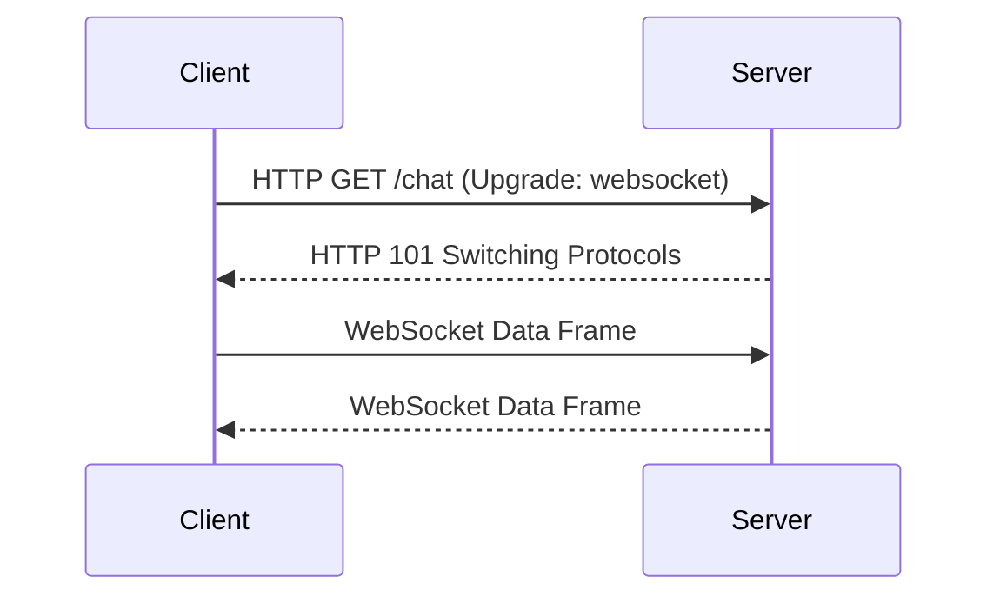

# WebSocket编程

WebSocket是一种在单个TCP连接上进行全双工通信的协议，允许客户端和服务器之间进行实时、双向的数据传输。与传统的HTTP请求-响应模式不同，WebSocket连接一旦建立，双方可以随时发送数据，非常适合需要实时更新的应用场景，如在线聊天、实时通知、多人游戏等。

## 什么是WebSocket？

WebSocket协议是HTML5的一部分，旨在解决HTTP协议在实时通信中的局限性。HTTP协议是无状态的，每次请求都需要重新建立连接，而WebSocket则允许在客户端和服务器之间建立一个持久的连接，双方可以随时发送数据。

:::note
WebSocket协议使用`ws://`（非加密）或`wss://`（加密）作为URL前缀。
:::

## WebSocket的工作原理

WebSocket连接的建立过程分为两个阶段：

1. **握手阶段**：客户端通过HTTP协议发送一个特殊的请求（称为“握手请求”），请求升级到WebSocket协议。如果服务器支持WebSocket，它会返回一个响应，确认协议升级。

2. **数据传输阶段**：一旦握手成功，连接就从HTTP协议升级为WebSocket协议，客户端和服务器可以通过该连接发送和接收数据。



## WebSocket API

在JavaScript中，WebSocket API提供了创建和管理WebSocket连接的功能。以下是一个简单的WebSocket客户端示例：

```javascript
// 创建一个WebSocket连接
const socket = new WebSocket('ws://example.com/socket');

// 连接成功时触发
socket.onopen = function(event) {
    console.log('WebSocket连接已打开');
    // 发送一条消息到服务器
    socket.send('Hello Server!');
};

// 接收到消息时触发
socket.onmessage = function(event) {
    console.log('收到消息: ' + event.data);
};

// 连接关闭时触发
socket.onclose = function(event) {
    console.log('WebSocket连接已关闭');
};

// 发生错误时触发
socket.onerror = function(error) {
    console.error('WebSocket错误: ' + error);
};
```

### 服务器端实现

在服务器端，可以使用多种编程语言和框架来实现WebSocket服务器。以下是使用Node.js和`ws`库的示例：

```javascript
const WebSocket = require('ws');

// 创建一个WebSocket服务器
const wss = new WebSocket.Server({ port: 8080 });

// 监听连接事件
wss.on('connection', function connection(ws) {
    console.log('新的客户端连接');

    // 监听客户端发送的消息
    ws.on('message', function incoming(message) {
        console.log('收到消息: %s', message);

        // 向客户端发送消息
        ws.send('Hello Client!');
    });

    // 监听连接关闭事件
    ws.on('close', function close() {
        console.log('客户端断开连接');
    });
});
```

## 实际应用场景

WebSocket在许多实时应用中都有广泛的应用，以下是一些常见的场景：

1. **在线聊天**：WebSocket允许用户实时发送和接收消息，非常适合在线聊天应用。
2. **实时通知**：在社交媒体或新闻网站上，WebSocket可以用于实时推送通知。
3. **多人游戏**：WebSocket可以用于实时同步游戏状态，使多个玩家能够同时互动。
4. **股票交易**：在金融领域，WebSocket可以用于实时更新股票价格和交易信息。

## 总结

WebSocket是一种强大的协议，能够实现客户端和服务器之间的实时双向通信。通过WebSocket，开发者可以构建出更加动态和交互性强的Web应用。虽然WebSocket的使用场景非常广泛，但在实际开发中，也需要注意连接管理、错误处理等问题。

## 附加资源

- [MDN WebSocket文档](https://developer.mozilla.org/zh-CN/docs/Web/API/WebSocket)
- [WebSocket协议规范](https://tools.ietf.org/html/rfc6455)
- [Node.js WebSocket库](https://github.com/websockets/ws)

## 练习

1. 尝试使用WebSocket API创建一个简单的聊天应用，允许用户在页面上发送和接收消息。
2. 修改服务器端代码，使其能够广播消息给所有连接的客户端。
3. 研究如何在WebSocket连接中处理错误和重连机制。
